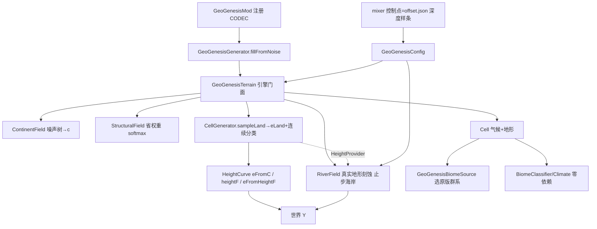

## 用户需求

整体推倒重建 GeoGenesis 地形管线：仅保留 `worldgen/noise/` 噪声节点库（27 个基元节点），其余 `terrain/`、`river/`、`climate/`、`generator/`、`config/GeoGenesisConfig`、`mixer/` 全部重写。目标范式对齐 TerraForged 0.3.x（噪声树产出大陆场 → 单条高度样条映射世界 Y → 河流由真实地形刻蚀），并严守 offset.json 铁律（大陆性 `c` 仅作样条坐标 x，深度/高度完全由控制点 value 决定，禁止把坐标当值二次映射，删除 HEIGHT_C/HEIGHT_E 中间层反模式）。

## 产品概述

重建一套确定性、跨区块无缝、地质过程驱动的 Minecraft 地形生成引擎。地形由噪声树生成大陆场 `c`，经单条 `HeightCurve` 样条映射为归一化高度 `e∈[-1,1]`，再映射为世界 Y；河流由真实 `eLand` 高度场驱动刻蚀并止步海岸。保留现有 11 图层预览与三页配置屏 UI，仅将 mixer 控制点重绑到新地质过程参数与 offset.json 深度样条。

## 核心特性

- 噪声树大陆场 `c`（沿用 `noise/` 库：Simplex/Ridge/Warp/Blend/Frequency 组合），输出连续 `c∈[-1,1]`，无硬边界、无椒盐。
- 单条 `HeightCurve` 高度样条：以 `c` 为 x 坐标、控制点 value 决定海洋深度/陆地高度；提供 `eFromC(c)` 与 `eFromHeightF(Y)` 单调反解（MC 地表用）。
- 地质过程地形形态（克拉通平原/造山山脉/高原方山/盆地）由 `StructuralField` 省权重加权合成 `eLand`，连续形态分类取代量化椒盐。
- 真实地形驱动的河流刻蚀（`RiverField` 世界坐标确定性、流量门控、止步海岸），与海陆同源、跨块无缝。
- 下游契约保留：BiomeClassifier/Climate 零依赖分类、GeoPalette 11 图层预览、mixer offset.json 深度样条控制点、HeightCurve 反解。
- 分阶段交付：先地形管线可编译+runClient 目检，再接河流，再重绑 mixer/配置屏，最后验证。

## 技术栈选择

- 语言/平台：Java 17 + Minecraft Forge 1.20.1（Gradle 运行需 Java 21），沿用现有 `forge-1.20.1-47.4.10-mdk` 工程骨架。
- 噪声基元：**仅复用** `worldgen/noise/` 现有 27 个节点（Simplex/Ridge/Warp/Terrace/Blend/Steps/Add/Multiply/Curve/Frequency/NoiseUtil/Noises 等），不新增、不修改。
- 预览/UI：保留 `client/preview/`（GeoPalette/PreviewColor/PreviewDisplay/TerrainPreview/ColorMap/GeoGenesisColorReloadListener）与 `client/`（GeoGenesisConfigScreen/ParamSlider/GeoGenesisClient/GeoGenesisForgeEvents），仅重绑 mixer 与新 config。
- 配置：Forge `ModConfig` COMMON + `run/config/geogenesis-common.toml`（须同步默认值）。

## 实现思路（高层策略）

对齐 TerraForged 0.3.x 地形核心（`terrain/TerrainBlender`、`terrain/TerrainLevels`、`terrain/TerrainGenerator`、`terrain/StructureTerrain`、`terrain/TerrainData`；`noise/continent/ContinentNoise`、`ContinentGenerator`、`ContinentConfig`）的整体结构，用我们自有 `noise/` 库重建等价管线：

1. **大陆场 `c`**：`ContinentField` 用 `noise/` 组合低频 Simplex + Ridge + Warp + Blend，输出连续 `c∈[-1,1]`（海洋负、陆地正），海岸过渡带宽度由大陆噪声频率决定。
2. **单条高度样条 `HeightCurve`**（核心，offset.json 范式）：以 `c` 为 x 坐标，控制点 `(cPos, eValue)` 的 value 决定深度/高度。海洋段 `c<0` 控制点决定大陆架/深海/海沟深度；陆地段 `c>0` 控制点决定平原→山峰高度。**严禁 HEIGHT_C/HEIGHT_E 中间层样条把 c 二次映射为 e**。提供 `heightF(e)`(e→Y) 与 `eFromHeightF(y)`(Y→e 二分反解，MC 用，须单调)。
3. **地质过程形态**：`StructuralField` 用 4 个低频 Simplex→softmax 得连续省权重（克拉通/造山带/高原/盆地，和为1无硬边界）；`CellGenerator.sampleLand` 按各省过程形态（平原低幅 FBM、山脉 Ridge×Warp×proximity 包络、高原 Terrace 阶梯、盆地低填）加权合成 `eLand∈[0,1]`；`dominantTerrain` 从结果形态连续判定，彻底消除椒盐。
4. **河流**：`RiverField` 粗格点下坡汇流（世界坐标、±jitter、流量累积门控、坡度/density 门控）生成树枝状河网；`HydraulicErosion` 多级刻蚀（谷肩抬升+河床下切 U 形谷+谷壁扰动）把河床刻入 `eLand`；河流止步海岸（海洋 `h=NaN` 不注入侵蚀，无水下河道/河口湾）。
5. **装配**：`GeoGenesisGenerator.fillFromNoise` 每 chunk 调 `terrain.getChunkCells` + `terrain.sampleHeight`；`createState` 注入共享地形到 `GeoGenesisBiomeSource`。

**关键技术决策与权衡**

- 采用单条 `HeightCurve` 而非多层样条：根除"宽浅平台/海岸悬崖"反模式，符合 offset.json 铁律，且 `eFromHeightF` 反解简单稳定。
- 省权重用 softmax 软归一化：天然无硬边界，彻底解决旧 `Math.round` 椒盐；代价是每点需算 4 个 simplex，但低频且可缓存（TileCache 区域级 256 tiles / 30s TTL）。
- 河流与地形同一趟采样（`CellGenerator` 实现 `HeightProvider`）：保证河在谷中、跨块无缝、无 border 断点；少量额外采样换来确定性（无 tile 边界接缝）。

**性能与可靠性**

- 热路径：`sampleHeight` 每方块调用，内部 `sampleLand` 含 4 simplex + Ridge×Warp；用 `TileCache`（区域级 cell 网格缓存，30s TTL）跨 chunk 共享，避免重复计算。
- `RiverField` 用 `LongCache` 按粗格 tile 缓存河网，世界坐标确定性，无逐 chunk 重算。
- 复杂度：单点采样 O(常数噪声评估)，空间由缓存上限约束；瓶颈在 simplex 评估次数，靠缓存 + 低频缓解。
- 安全：禁止硬编码密钥；`Simplex` 构造后必须 `.seed(worldSeed, level)` 填充置换表（否则 NPE）；`Seed` 索引 `&511`。

## 实现要点（防回归）

- **配置同步铁律**：增删 config 字段须同步 6 处——`GeoGenesisConfig`(定义+BUILDER+preview 读取) + `TerrainParams`/`RiverSettings`(record+defaults) + `GeoGenesisGenerator`(configParams/configRiverSettings) + `GeoGenesisConfigScreen.buildParams` + `run/config/geogenesis-common.toml`。**改 Forge Config 默认值后必须同步已存在的 toml，否则用户看不到变化。**
- **下游契约保留**：`HeightCurve.eFromHeightF` 单调二分逆解；`RiverField` 世界坐标确定性侵蚀接口；`BiomeClassifier`/`Climate` 零依赖分类（不持颜色）；`GeoPalette` 11 图层枚举与图例；mixer 控制点 = offset.json 深度样条（x=c, y=深度，绝不可删/线性化）。
- **清理残留**：删除空目录 `worldgen/erosion/types/`（erosion 应已删）与 `client/screen/`（空），避免编译噪声。
- **日志**：复用现有 `LogManager.getLogger`，错误 actionable、不 dump 大数组；避免采样循环内日志刷屏。
- **向后兼容**：不改动 `noise/` 与 `client/preview/` 对外签名；BiomeSource/Generator CODEC id 保持不变，已存世界预设仍可加载。

## 架构设计



模块划分：`generator/`（装配+CODEC）、`terrain/`（大陆场/省权重/采样/样条/参数/Cell）、`river/`（河网+刻蚀+设置）、`climate/`（分类/气候带/纬度，保留接口重写内部）、`config/`（Forge 配置）、`client/preview/mixer/`（重绑）。

## 目录结构

```
forge-1.20.1-47.4.10-mdk/src/main/java/com/geogenesis/
├── GeoGenesisMod.java                    # [MODIFY] 重连 GeoGenesisGenerator/BiomeSource/Config CODEC 注册
├── config/
│   └── GeoGenesisConfig.java            # [NEW] Forge COMMON 配置：地质过程参数+河蚀几何+RiverSettings+海洋深度样条控制点+SPEC+preview 读取；同步6处
├── worldgen/
│   ├── generator/
│   │   ├── GeoGenesisGenerator.java     # [NEW] ChunkGenerator：fillFromNoise 入口、createState 注入、CODEC
│   │   └── GeoGenesisBiomeSource.java   # [NEW] BiomeSource：按 Cell 气候选原版群系、CODEC
│   ├── terrain/
│   │   ├── GeoGenesisTerrain.java       # [NEW] 引擎门面：组装噪声树→c→eLand→Y；TileCache 区域级缓存
│   │   ├── ContinentField.java          # [NEW] 大陆场 c（noise/ 组合），输出 c∈[-1,1]
│   │   ├── StructuralField.java         # [NEW] 4 低频 simplex→softmax 省权重（克拉通/造山带/高原/盆地）
│   │   ├── CellGenerator.java           # [NEW] 单点采样：sampleLand→eLand+省权重；实现 HeightProvider 供 RiverField；连续分类
│   │   ├── HeightCurve.java             # [NEW] 单条高度样条：eFromC(c→e)、heightF(e→Y)、eFromHeightF(Y→e 反解)
│   │   ├── TerrainParams.java           # [NEW] record + defaults（地质过程参数）
│   │   └── Cell.java                    # [NEW] 单点数据：c/eLand/dominantTerrain/terrainType/climate
│   ├── river/
│   │   ├── RiverField.java              # [NEW] 世界坐标确定性河网（粗格点下坡汇流+流量门控+jitter），保留契约
│   │   ├── HydraulicErosion.java        # [NEW] 多级刻蚀（谷肩抬升+河床下切+谷壁扰动），河流止步海岸
│   │   └── RiverSettings.java           # [NEW] record + defaults（河网几何）
│   └── climate/
│       ├── BiomeClassifier.java         # [NEW 保留接口] classify(Cell)→BiomeClass 枚举，零依赖不持颜色
│       ├── ClimateZone.java             # [NEW] Köppen 简版气候带 A/B/C/D/E
│       └── Latitude.java                # [NEW] latitude01(worldZ)
├── client/
│   └── GeoGenesisConfigScreen.java      # [MODIFY] 重绑 mixer + buildParams 到新 config（三页 UI 结构保留）
└── client/preview/mixer/
    ├── Factor.java                      # [NEW] 重绑到新 config 地质过程参数
    ├── ControlPoint.java                # [NEW] 可拖拽控制点（与 offset.json 深度样条控制点同源）
    ├── ConfigBinding.java               # [NEW] 控制点→新 config 参数绑定（含海洋深度样条 y=value）
    ├── FactorMixer.java                 # [NEW] loadFromConfig/applyToConfig
    ├── FactorCurveChart.java            # [NEW] 曲线可视化 + 控制点拖拽
    ├── MixerPanel.java                  # [NEW] 调音台面板容器（可折叠）
    └── FactorCategoryBar.java           # [NEW] 条件因素分类色条（温度/湿度/大陆性）
# 清理（删除空目录）：worldgen/erosion/types/ 、 client/screen/
```

## 关键代码结构

```java
// HeightCurve：单条高度样条核心（offset.json 范式，c 仅作 x 坐标）
public final class HeightCurve {
    /** c∈[-1,1] 为样条坐标 x；控制点 value 决定 e（海洋深度/陆地高度）。严禁二次映射 c→e。 */
    public double eFromC(double c);
    /** e∈[-1,1] → 世界 Y（单调）。 */
    public double heightF(double e);
    /** 世界 Y → e 反解（MC 地表用，二分，须单调）。 */
    public double eFromHeightF(double y);
}

// CellGenerator 实现 HeightProvider 供 RiverField 注入真实 eLand
public interface HeightProvider {
    double landHeight(int worldX, int worldZ); // eLand∈[0,1]，海洋返回 NaN
    void provinceWeights(int worldX, int worldZ, double[] out);
}
```

## 智能体扩展

### SubAgent

- **code-explorer**
- 用途：读透 `参考/sources/TerraForged-0.3.x/` 地形核心模块（`terrain/TerrainBlender`、`TerrainLevels`、`TerrainGenerator`、`StructureTerrain`、`TerrainData`；`noise/continent/ContinentNoise`、`ContinentGenerator`、`ContinentConfig`）以及 `docs/design/ocean-river-architecture.md`，提取可复用的包结构、大陆场装配、高度样条/层级映射、河流刻蚀契约。
- 预期结果：产出 TerraForged 0.3.x 地形管线结构清单与对我们 `noise/` 库的映射方案，作为阶段0技术方案的精确依据。