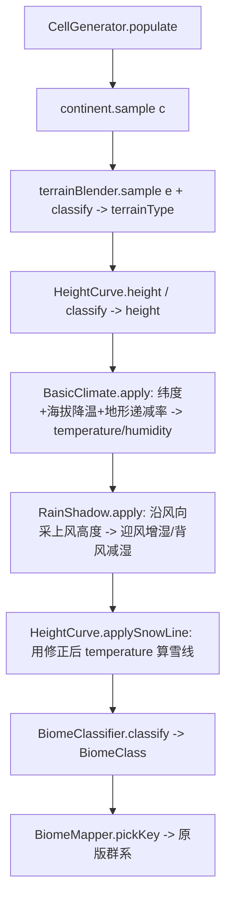

## 用户需求

1. **群系与地形一一对应**：以地形类型（TerrainClass）作为群系选择主键，每种地形各持一张独立的气候子表，气候仅在地形内部细分（保留温湿耦合）。
2. **采纳 ReTerraForged「温湿 5 档分级（LEVEL_0–4）」**：用温度 5 档 × 湿度 5 档替代现有 3 档阈值，让气候细分更细腻真实（边界采用 RTF 实测值）。
3. **修复 bug**：平原（PLAIN）因综合高度 `shape>0.35` 被误判为「热带草原高原」（`SAVANNA_PLATEAU`）群系，该群系应只属 `PLATEAU` 地形。
4. **扩展热带分支**：热带 + 半干旱的丘陵（HILLS）/ 山地（MOUNTAINS）输出稀树草原（`SAVANNA`）。
5. **气候层增强（本次「全做」）**：引入【海拔递减率 + 雨影】，让地形真正压低温湿，使「地形↔群系」贴合真实世界地理规律。

## 真实世界灵感（用户要求查地形/群系，非模组实现）

- Köppen 系统本就是「温度主型 + 降水亚型」，温×湿轴方向正确。
- Savanna = 热带 + 季节性干旱（赤道带）→ `SAVANNA = 热档(t3) × 半干旱(h0–2)`，收紧更准。
- 高原（青藏/安第斯）比同纬低地更冷更干 → 高原有独立「高寒」冷身份（`SNOWY_*`），非普通 `TAIGA`。
- 山地垂直带谱：低山阔叶 → 中山针叶 → 亚高山 → 高山苔原；湿润温带山地 = 云林/温带雨林 → `MOUNTAINS` 温湿档比 `HILLS` 更针叶/雨林化。
- 海拔递减率：山地/峰比同纬低地更冷（热带高山顶出冰川）→ 需地形分级强降温。
- 雨影：山脉迎风坡抬升致湿、背风坡干燥（foehn 微暖）→ 需方向性湿度调制。

## 核心功能

- 每种地形独立 5×5 气候表：`PLAIN`/`HILLS`/`MOUNTAINS`/`PLATEAU` 各持一张「温档 × 湿档 → 群系」映射，互不混用；`SAVANNA` 收紧到热带半干旱。
- `PLATEAU` 冷档改为高寒身份（`SNOWY_PLAINS`/`SNOWY_TAIGA`），热档统一出 `SAVANNA_PLATEAU`（台地不降级）。
- `MOUNTAINS` 比 `HILLS` 更针叶/云林化，体现垂直带谱。
- 气候层新增地形分级海拔递减率（PEAK/MOUNTAINS/PLATEAU/HILLS 依次强降温），使热带高山/峰自然落到针叶林/雪坡/冰峰。
- 新增雨影模块：沿风向取上风高度，迎风坡增湿、背风坡减湿并 foehn 微暖。
- 海洋/海滩/雪峰逻辑保持不变；`RIVER`/`LAKE`/`SNOW`/`BASIN`/default 回退 `plainClass`。

## 技术栈

- Java 17 / Minecraft Forge 1.20.1
- 零依赖纯 Java 分类器（`BiomeClassifier` 不 import `net.minecraft`，仅产出 `BiomeClass` 枚举），Swing 预览与 MC 游戏共用同一分类。
- 气候层（`BasicClimate` / 新增 `RainShadow`）均为零 MC 依赖纯计算。
- 无新依赖，仅重构 + 新增一个类。

## 实现方案

### 策略

分两层落地：① 重写 `BiomeClassifier.classify`，把每类地形分发到独立的 5×5 温湿分级表（地形作主键，气候在地形内细分，借鉴 RTF 的分级边界）；② 在气候生成层（地形类型已确定之后）注入两类真实地理修正——**地形分级海拔递减率**（写入 `temperature`）与**雨影**（`RainShadow` 沿风向采上风高度，调制 `humidity`/`temperature`）。两者都直接改写 `Cell.temperature`/`Cell.humidity`，预览温湿图层自动反映，且 `BiomeClassifier` 无需感知修正来源。

### 关键决策与权衡

- **地形分级降温叠加在物理高度降温之上**：`BasicClimate` 现有 `elevationCool`（基于 `height`，≤0.30）作为物理基础保留；新增 `terrainLapse(cell.terrainType)` 叠加身份降温（PEAK 0.45 / MOUNTAINS 0.28 / PLATEAU 0.15 / HILLS 0.08 / 其它 0）。既保留连续物理降温，又让台地/山地/峰拥有比同高平原更冷的稳定身份，使热带峰出苔原/冰峰。
- **雨影用方向性上风采样而非全局场**：`RainShadow` 持有 `heightSampler(x,z)→worldY` 与由 seed 派生的固定 `windAngle`。每陆地格沿 `-wind` 在步长 6/18/36 取 3 点上风高度，算出 `leeBlockage`（背风干燥）与 `windwardRise`（迎风湿润），`net=exposure-shadow` 调制湿度（系数 0.35）、foehn 微暖温度（系数 0.08）。方向固定保证世界一致性、可复现，免去每格随机风向的杂乱。
- **`CellGenerator` 抽取 `computeShape`/`heightAt`**：把 `populate` 内 `e` 计算抽出为 `computeShape(x,z)`，并新增 `heightAt(x,z)=heightCurve.height(computeShape(x,z))` 供雨影复用，避免重复噪声采样逻辑、保证雨影采样与生成同一条高度曲线（无断裂）。
- **`BiomeClassifier` 每地形独立方法 + 5×5 嵌套 switch**：可读、可独立调参、符合单一职责；每函数 ≤80 行；`oceanClass`/`beachClass`/`PEAK` 逻辑完全不动，防回归。
- **`RIVER`/`LAKE`/`SNOW`/`BASIN`/default 回退 `plainClass`**：水体本身为水方块，biome 仅影响岸缘植被，用平原群系作陆地回退合理，且消除原 `landClass` 的 `shape` 误判。

### 性能

- `BiomeClassifier` 分类为 O(1)（两次边界比较 + 二级 switch），零分配零遍历，无回归。
- `BasicClimate` 仅新增一次 `switch(terrainType)`（O(1)）。
- `RainShadow` 每陆地格 3 次 `heightSampler`（噪声采样），仅在 `isLand` 生效；worldgen 阶段可接受，且采样步长稀疏（6/18/36）开销低。海洋格跳过雨影。
- 雨影与气候层均在 `populate` 内顺序执行，无额外缓存/集合分配。

### 实现要点（防回归）

- `landClass` 重命名为 `plainClass`，**删除 `c.shape>0.35` 判断**（修复平原误判高原 bug）。
- 新增 `tempLevel(float)`/`humLevel(float)` 静态 helper（边界：温度 `[-0.45,-0.15,0.2,0.55]`、湿度 `[-0.35,-0.1,0.1,0.3]`，返回 0..4）。
- 新增 `hillsClass`/`mountainsClass`/`plateauClass`，各自 `switch(tempLevel)` 外层 / `switch(humLevel)` 内层；`hillsClass`/`mountainsClass` 开头 `if(c.isSnow) return SNOWY_SLOPES;`，`mountainsClass` 温湿档比 `hillsClass` 更针叶/云林化（垂直带谱）。
- `plateauClass` 冷档（t0）改为 `SNOWY_PLAINS`/`SNOWY_TAIGA`（高寒身份），热档（t3）全 `SAVANNA_PLATEAU`/`JUNGLE`（台地不降级普通 `SAVANNA`）。
- `BasicClimate.apply` 在现有 `landTemp` 计算后叠加 `terrainLapse`，clamp 后写入 `temperature`。
- `RainShadow` 在 `climate.apply` 之后、`applySnowLine` 之前调用（`applySnowLine` 依赖修正后的 `temperature`）。
- 不动 `BiomeClass` 枚举、`BiomeMapper`、预览渲染等模块。

## 架构设计

`BiomeClassifier` 是「地形类型 → 群系」唯一决策点；气候层（`BasicClimate` + `RainShadow`）是「温湿场」的生产者。本次把「地形身份如何影响温湿」从分类器前置到气候层，分类器只消费最终温湿，职责更清晰。



## 目录结构

```
forge-1.20.1-47.4.10-mdk/src/main/java/com/geogenesis/worldgen/
├── climate/
│   └── BiomeClassifier.java        # [MODIFY] 重写 classify：landClass→plainClass(去 shape 误判)；新增 tempLevel/humLevel 分级 helper；
│                                    #          新增 hillsClass/mountainsClass/plateauClass 独立 5×5 气候表；PLATEAU 冷档高寒、热档出台地；
│                                    #          MOUNTAINS 比 HILLS 更针叶/云林化；HILLS/MOUNTAINS 热带半干旱出 SAVANNA；
│                                    #          RIVER/LAKE/SNOW/BASIN/default 回退 plainClass；ocean/beach/PEAK 不动。
└── terrain/
    ├── BasicClimate.java           # [MODIFY] apply 中新增 terrainLapse(cell.terrainType) 地形分级降温，叠加至 elevationCool 后写入 temperature。
    ├── RainShadow.java             # [NEW] 雨影模块。构造持 heightSampler(x,z)->worldY 与 windAngle(由 seed 派生)；
    │                               #        apply(cell,x,z) 仅 isLand 生效：沿 -wind 在 6/18/36 步长采上风高度，
    │                               #        算 leeBlockage(背风干燥)/windwardRise(迎风湿润)，net 调制 humidity(×0.35)、foehn 微暖 temperature(×0.08)，clamp[-1,1]。
    └── CellGenerator.java          # [MODIFY] 抽取 computeShape(x,z)(原 populate 内 e 计算)；新增 heightAt(x,z)=heightCurve.height(computeShape(x,z))；
                                     #          构造 RainShadow(seed, this::heightAt, windAngle)；populate 中 climate.apply 之后、applySnowLine 之前调用 rainShadow.apply。

TERRAIN_TYPE_SCHEME.md              # [MODIFY] 更新 §4.7：每地形 5×5 温湿分级表 + 标注 SAVANNA_PLATEAU 仅属 PLATEAU、
                                    #          HILLS/MOUNTAINS 热带出 SAVANNA、PLATEAU 冷档高寒、气候层海拔递减率+雨影机制（知识沉淀）。
```

## 关键代码结构

```java
// RainShadow.java (新增)
public final class RainShadow {
    public RainShadow(long seed, DoubleBinaryOperator heightSampler, double windAngle) { /* ... */ }
    /** 仅陆地生效：沿风向采上风高度，迎风增湿/背风减湿 + foehn 微暖，直接改写 cell.humidity/temperature */
    public void apply(Cell cell, double x, double z) { /* ... */ }
}

// BasicClimate.java 内新增（地形分级递减率）
private static double terrainLapse(TerrainClass t) {
    switch (t) {
        case PEAK:       return 0.45;
        case MOUNTAINS:  return 0.28;
        case PLATEAU:    return 0.15;
        case HILLS:      return 0.08;
        default:         return 0.0;
    }
}
```

## 验证

- `gradlew.bat build` 编译通过。
- `runClient` 目检：①热带半干旱 HILLS/MOUNTAINS 出 `SAVANNA`；②高原热→`SAVANNA_PLATEAU`、冷→`SNOWY_*`（高寒）；③平原不再误显高原群系；④温带 HILLS 出 `WINDSWEPT_*`、MOUNTAINS 出针叶/云林；⑤热带高山/峰因递减率出 `TAIGA`/`SNOWY_SLOPES`/`FROZEN_PEAKS`（垂直带谱）；⑥山脉背风坡显著更干（沙漠/草原）、迎风坡更湿（森林）；⑦对照 `TERRAIN_TYPE` 图层与群系图层逐格一一对应；⑧温湿图层反映地形压低温湿。
- 调参：递减率/雨影常量在 `runClient` 中按观感微调（写进对应文件顶部常量）。