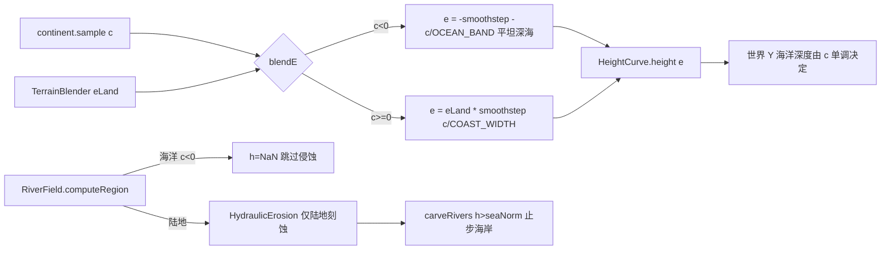

## 用户需求

用户对照备份项目（forge-1.20.1-47.4.10-mdk物理侵蚀-基本无断裂-河流还在开发中）的完整地形，确认两个明确方向：

1. **根除海岸"宽浅平台"视觉 bug**：禁用侵蚀后平台仍在，根因在地形层的海洋深度模型（独立噪声场 OceanField 让整片海洋随机波动在中度深度）。改为**备份的"大陆锚定"模型**——海洋深度完全由大陆性 c 单调决定，深海（c≤阈值）为恒定满深（平坦、无随机浅台），近岸仅在窄带内平滑上升；保留我们的地质过程陆地 eLand；**删除 OceanField**。
2. **河流止步海岸（回退河口入海）**：河流不刻入海洋，不生成水下河道/河口湾。回退此前所有的"侵蚀入海"改动（HydraulicErosion 的 COAST_SUB/estuary 逻辑、RiverField 的 NEAR_SHORE_LIMIT 注入、writeRiverFields/fillFromNoise 的近岸海洋写回）。

## 产品概述

重建海洋深度来源与河流边界，使近岸海域不再是一整片被独立噪声撑宽的浅台，河流从陆地自然入海后即终止（海岸为河流终点），游戏世界与预览共用同一结果。

## 核心特征

- 海洋深度由大陆性 c 单调锚定：深海平坦满深、近岸窄带 clean ramp，平台宽度由大陆梯度决定（对齐备份，用户已接受）。
- `blendE` 海岸为单条连续式（海洋侧纯 c 函数、陆地侧 eLand 乘 landW），无分段 if/else、无独立海洋噪声，根除悬崖/接缝/平台。
- 河流系统在海岸线处终止：仅陆地参与 droplet 侵蚀与河谷刻蚀，海洋格（h=NaN）完全跳过，水下河道/河口湾不再出现。
- 游戏内与预览共用同一海岸终点结果，湖泊（闭流洼地）解算不受影响。

## 技术栈

- 纯 Java，零 MC 依赖核心（`CellGenerator` / `HeightCurve` / `TerrainParams` / `HydraulicErosion` / `RiverField` / `RiverSettings` 不 import MC）。
- 复用既有 `NoiseUtil.smoothstep` / `NoiseUtil.clamp` / `CellGenerator.fractal` 等公共工具，不引入新依赖。
- 沿用既有 `HeightCurve.eFromHeightF` 二分反解、`RiverField` 的世界坐标确定性侵蚀契约。

## 实现方案（核心思路）

**Goal 1（大陆锚定海洋，删除 OceanField）**：把"海洋深度 = 独立 OceanField 噪声场 × offshore(c)"改为"海洋深度 = c 的单调函数"。深海（c≤-OCEAN_BAND）恒为 e=-1（平坦满深），近岸（c∈[-OCEAN_BAND,0]）平滑上升到 e=0。陆地侧 eLand×landW 从海平面升起。HeightCurve 海洋分支从 4 段 spline 简化为线性 `depth = clamp(-e,0,1)*trenchDepth`，彻底消除任何由控制点/独立噪声撑出的宽浅平台。

**Goal 2（河流止步海岸，回退河口入海）**：撤销此前所有把海洋纳入侵蚀的改动——`HydraulicErosion.apply` 水滴门槛回退到 `baseH ≤ seaNorm`（仅陆地生成水滴），`carveRivers` 仅当 `h > seaNorm` 雕刻且河床下限钳制到 seaNorm（不刻入海）；`RiverField.computeRegion` 海洋格 `h=NaN` 不再注入；`GeoGenesisTerrain.writeRiverFields` 与 `GeoGenesisGenerator.fillFromNoise` 仅陆地写刻蚀高度/河流字段；删除 `RiverSettings.estuaryDepth` 及所有引用。

### 关键设计决策

1. **blendE 连续式（大陆锚定）**：

- 海洋侧：`e = -smoothstep(clamp(-c / OCEAN_BAND, 0, 1))`，OCEAN_BAND=0.40（对齐备份大陆带 [-0.4,0.4] 的海洋半宽）。c≤-OCEAN_BAND → e=-1（平坦深海满深）；c∈[-OCEAN_BAND,0] → 平滑到 0。
- 陆地侧：`e = eLand * smoothstep(clamp(c / COAST_WIDTH, 0, 1))`，COAST_WIDTH=0.30（已调好防悬崖）。c=0 两侧均取 0，海岸连续无悬崖。
- 移除 `coastSinkE`（`coastSink` 下沉海岸机制，备份无此，且会制造近岸下沉带），移除 `OceanField` 成员与 `OCEAN_COAST_WIDTH`/`OCEAN_DEPTH_SCALE` 常量。

2. **HeightCurve 海洋线性化**：删 `oceanShelfFraction/oceanSlopeFraction/oceanTrenchOnset` 三字段；`height/heightF` 海洋分支 `depth = NoiseUtil.clamp(-e,0,1) * trenchDepth`。`classify` 仍按 `shelfDepth/deepOceanDepth` 阈值分 3 类海洋（按真实深度，不变）。保留 `shelfDepth/deepOceanDepth/trenchDepth` 供分类与深度缩放。
3. **TerrainParams 重排**：删 `oceanShelfFraction/oceanSlopeFraction/oceanTrenchOnset/coastSink/oceanFieldFrequency` 五字段；`defaults()` 同步去五参。**必须同步四处构造调用**：`TerrainParams.defaults()`、`GeoGenesisConfig.previewParams()`、`GeoGenesisGenerator.configParams()`、`GeoGenesisConfigScreen.buildParams()`。
4. **GeoGenesisConfig 同步**：删 `OCEAN_SHELF_FRACTION/OCEAN_SLOPE_FRACTION/OCEAN_TRENCH_ONSET/OCEAN_FIELD_FREQUENCY/COAST_SINK` 定义+注释+`previewParams` 读取；删 `ESTUARY_DEPTH` 定义+`previewRiverSettings` 读取。保留 `SHELF_DEPTH/DEEP_OCEAN_DEPTH/TRENCH_DEPTH`。
5. **HydraulicErosion 回退**：移 `COAST_SUB/ESTUARY_T_REF` 常量与 `aboveSeaFactor` 的 COAST_SUB 依赖；`apply` 水滴门槛 `baseH <= seaNorm` 跳过、`simulateDrop` 在 `h0 < seaNorm` 停；`carveRivers` 签名去 `estuaryMax`，仅 `h > seaNorm` 雕刻，河床 `nh < seaNorm → nh = seaNorm`（止步海岸）。
6. **RiverField 回退**：删 `NEAR_SHORE_LIMIT`；`computeRegion` 海洋格 `h[j][i]=Float.NaN`（baseE=baseShape、landMask=false），不注入近岸海洋；`carveRivers` 调用去 `estuaryDepth()*heightScale` 参数。`RiverSettings` 删 `estuaryDepth` 字段+默认；同步 `previewRiverSettings`/`configRiverSettings` 两处构造。
7. **装配回退**：`writeRiverFields` 改 `if (!reg.land[lj][li]) return;`（仅陆地写高度/河流字段）；`fillFromNoise` 高度取 `陆地 && !NaN(carvedE)` 否则 baseE，`isRiver` 限 `reg.land[lj][li] && reg.riverMask[lj][li]`。
8. **toml 同步**：`run/config/geogenesis-common.toml` 删除 `oceanFieldFrequency/oceanShelfFraction/oceanSlopeFraction/oceanTrenchOnset/coastSink/estuaryDepth` 六个 key（核心经验：改 Forge Config 字段必须同步 toml，否则残留孤 key 解析报错或用户看不到变化）。

### 性能与可靠性

- `blendE` 删除一次 `OceanField.sample`（4 倍频分形），改为一次 `smoothstep`+乘法，**更省**；无新循环/分配。
- Goal 2 回退使 `carveRivers`/`apply` 跳过全部海洋格，**计算量下降**；深海 h=NaN 由既有跳过条件隔离，无新遍历。
- 下游契约全部不变：`HeightCurve.eFromHeightF`（e∈[-1,1] 单调二分反解）、`RiverField` 依赖 `heightF(0.0)`/`eFromHeightF`、`CellGenerator.landHeight` 海洋 `c<0→NaN`、`TileLakeSolver` 闭流湖解算、`BiomeClassifier`/预览着色。
- 编译粒度：TerrainParams/RiverSettings 为 record，删字段后四处构造必须同批更新，否则编译失败——已列入同一任务。

## 架构设计

数据流向（海洋锚定后）：



## 目录结构与改动点

```
forge-1.20.1-47.4.10-mdk/src/main/java/com/geogenesis/worldgen/terrain/
├── OceanField.java          # [DELETE] 独立海洋深度噪声场，整文件删除（根因：制造宽浅平台）。
├── CellGenerator.java       # [MODIFY] 删 oceanField 成员/coastSinkE 字段与反算；blendE 重写为大陆锚定连续式；删 OCEAN_COAST_WIDTH/OCEAN_DEPTH_SCALE，加 OCEAN_BAND=0.40；类注释去 OceanField/coastSink 叙事。
├── HeightCurve.java         # [MODIFY] 删 oceanShelfFraction/oceanSlopeFraction/oceanTrenchOnset 三字段与构造读取；height/heightF 海洋分支改线性 depth=-e*trenchDepth；清理 classify 注释。
└── TerrainParams.java       # [MODIFY] record 删 5 字段（oceanShelf*×3/coastSink/oceanFieldFrequency）；defaults() 去五参、重排。
forge-1.20.1-47.4.10-mdk/src/main/java/com/geogenesis/worldgen/river/
├── HydraulicErosion.java    # [MODIFY] 移除 COAST_SUB/ESTUARY_T_REF/aboveSeaFactor 的 COAST_SUB 依赖；apply 门槛回 seaNorm；carveRivers 去 estuaryMax、仅陆地雕刻、河床止步 seaNorm。
├── RiverField.java          # [MODIFY] 删 NEAR_SHORE_LIMIT；computeRegion 海洋格 h=NaN 不再注入；carveRivers 调用去 estuaryDepth 参数。
└── RiverSettings.java       # [MODIFY] 删 estuaryDepth 字段与默认值；字段顺序与两处构造调用一致。
forge-1.20.1-47.4.10-mdk/src/main/java/com/geogenesis/worldgen/terrain/
└── GeoGenesisTerrain.java   # [MODIFY] writeRiverFields 改 if(!reg.land) return，仅陆地写高度/河流字段。
forge-1.20.1-47.4.10-mdk/src/main/java/com/geogenesis/worldgen/generator/
└── GeoGenesisGenerator.java # [MODIFY] configParams 的 new TerrainParams 按新字段顺序重排；configRiverSettings 去 ESTUARY_DEPTH 参；fillFromNoise 高度回退 baseE/陆地 carvedE、isRiver 限陆地。
forge-1.20.1-47.4.10-mdk/src/main/java/com/geogenesis/config/
└── GeoGenesisConfig.java    # [MODIFY] 删 OCEAN_SHELF_FRACTION/OCEAN_SLOPE_FRACTION/OCEAN_TRENCH_ONSET/OCEAN_FIELD_FREQUENCY/COAST_SINK 定义+注释+previewParams 读取；删 ESTUARY_DEPTH 定义+previewRiverSettings 读取；同步两处 new TerrainParams/new RiverSettings 调用。
forge-1.20.1-47.4.10-mdk/src/main/java/com/geogenesis/client/
└── GeoGenesisConfigScreen.java # [MODIFY] buildParams 的 new TerrainParams 按新字段顺序重排。
forge-1.20.1-47.4.10-mdk/run/config/
└── geogenesis-common.toml   # [MODIFY] 删 oceanFieldFrequency/oceanShelfFraction/oceanSlopeFraction/oceanTrenchOnset/coastSink/estuaryDepth 六个 key。
```

## 关键代码结构（接口级）

```java
// CellGenerator.blendE：大陆锚定海洋（无独立噪声场）
private double blendE(double c, double eLand, double worldX, double worldZ) {
    if (c < 0.0) {
        double t = smoothstep(NoiseUtil.clamp(-c / OCEAN_BAND, 0.0, 1.0)); // 深海 c≤-OCEAN_BAND → t=1 平坦满深
        return -t;                                                         // e ∈ [-1, 0]
    } else {
        double landW = smoothstep(NoiseUtil.clamp(c / COAST_WIDTH, 0.0, 1.0));
        return eLand * landW;                                             // 海岸从 0 平滑升入 eLand
    }
}

// HydraulicErosion.carveRivers：仅陆地雕刻，河床止步海岸（回退签名）
public void carveRivers(float[][] h, float[][] dis, int gsz, int ox, int oz,
                        float seaNorm, float valleyDepth, float erodeMul) {
    // 仅 h[j][i] > seaNorm 的陆地格参与；河床 nh < seaNorm → nh = seaNorm（不入海）
}
```