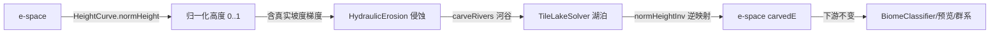

## 用户需求

1. 修复海岸"平台"bug：海洋中存在平缓台阶状裸平台，侵蚀（河流沟壑/水滴纹理）到此戛然而止，缺少自然入海口。
2. 用户实测备份版本（物理侵蚀-基本无断裂-河流还在开发中）无此问题：侵蚀延伸入海、有自然河口。
3. **核心架构原则（强约束）**：整个地形核心必须脱离 MC，不受 MC 方块世界坐标（minY/maxY）机制限制。纯计算核心（RiverField / HydraulicErosion / TileLakeSolver）不得注入任何 MC 方块坐标。

## 根因（已对比备份确认）

- 备份 ErosionEngine 在**真实地形高度空间**上运行，高度已含大陆架坡度梯度，水滴可感知下坡方向，自然流经整个 shelf。
- 当前 RiverField 在 **e-space** 上运行：海洋格 `h ≈ c`（大陆性坐标，近乎平坦、无坡度），水滴无重力梯度无法移动；且 `COAST_SUB=0.15` 将水滴截断在 shelf 中部，外半段（e∈[-0.20,-0.15]）完全无侵蚀纹理 → 裸平台。
- 大陆性/温度等是**条件噪声**，不负责 Y 坐标（对齐 MC offset.json：高度由控制点样条映射），故不能"让幅度更大"治水，必须在**映射后的真实高度空间**做侵蚀。

## 修复核心思路

在侵蚀核心内引入**归一化抽象高度空间 [0,1]**（与 MC 方块坐标无关，仅由 HeightCurve 在边界处换算）。RiverField 把 e 经 `normHeight(e)` 转成 [0,1] 后再传入侵蚀；侵蚀/河谷雕刻/湖泊解算全程在 [0,1] 空间完成；结束后用 `normHeightInv()` 逆映射回 e-space。下游（BiomeClassifier/预览/群系）完全基于 e-space 契约，零改动。

## 技术栈

- 纯 Java，零 MC 依赖核心（RiverField / HydraulicErosion / TileLakeSolver 保持不 import MC）。
- HeightCurve 作为 e ↔ 抽象高度 的唯一边界映射器（其内部仍持有 minY/maxY 用于最终 MC Y 输出，属允许边界）。

## 实现方案

### 架构数据流（归一化空间）

### 1. HeightCurve 新增归一化映射（边界层）

文件：`src/main/java/com/geogenesis/worldgen/terrain/HeightCurve.java`

- `double normHeight(double e)`：`clamp((height(e)-minY)/(maxY-minY), 0, 1)`。
- `double normHeightInv(double normY)`：因 `normHeight(e)` 在 e∈[-1,1] 单调递增，二分反查（40 次迭代，精度远优于 block 级）。
- `double normSeaLevel()`：`normHeight(0.0)`（≈0.33）。
- `double normVerticalRange()`：`max(1.0, maxY-minY)`（MC block 跨度，仅供阈值换算使用）。

### 2. HeightProvider 接口扩展 + CellGenerator 实现

文件：`src/main/java/com/geogenesis/worldgen/river/HeightProvider.java`、`.../terrain/CellGenerator.java`

- 接口新增 4 个方法：`toNormHeight(e)`、`fromNormHeight(normY)`、`normSeaLevel()`、`normVerticalRange()`。
- CellGenerator 全部委托内部 `heightCurve` 实现（不新增 MC 逻辑）。RiverField 仅依赖 HeightProvider 接口，不 import HeightCurve 类，保持解耦。

### 3. RiverField.computeRegion 双空间转换（核心改造）

文件：`src/main/java/com/geogenesis/worldgen/river/RiverField.java`

- 构造器：删除 `int worldHeightBlocks` 参数（不再收 MC 方块坐标），保留 `HeightProvider land`。
- 高度场填充循环：陆地 `h=e`、近岸海洋 `h=base` 均改为 `h = (float) land.toNormHeight(value)`，深海仍为 NaN。
- `float seaNorm = (float) land.normSeaLevel();` 传给 HydraulicErosion / carveRivers。
- 计算归一化阈值（基于 e-space 常量换算，避免硬编码 MC 单位）：
- `coastSubNorm = seaNorm - land.toNormHeight(-COAST_SUB_E)`（COAST_SUB_E=0.15 保留作语义常量）
- `smoothBandNorm = (float)(SMOOTH_BAND_BLOCKS / land.normVerticalRange())`（SMOOTH_BAND_BLOCKS≈12.5）
- `estuaryMaxNorm = (float)(settings.estuaryDepth() / land.normVerticalRange())`
- `lakeDepthNorm = (float)(settings.lakeDepthThreshold() / land.normVerticalRange())`
- 侵蚀+carveRivers+lake 全部用归一化 h[][]。
- 收尾：`carvedE[j][i] = (float) land.fromNormHeight(h[j][i]);`，`lakeLevel` 同样逆映射回 e-space；`baseE` 保持 e-space 不动。

### 4. HydraulicErosion 阈值适配归一化空间

文件：`src/main/java/com/geogenesis/worldgen/river/HydraulicErosion.java`

- `apply()` 新增参数 `float seaNorm, float coastSubNorm, float smoothBandNorm`，删除 `seaNorm=0f` 硬编码。
- `simulateDrop()`：停止条件 `if (h0 < seaNorm - coastSubNorm) return;`；`aboveSeaFactor` 用 `coastSubNorm` 计算。
- `carveRivers()` 新增参数 `float seaNorm, float estuaryMaxNorm`，跳过条件改为 `h ≤ seaNorm - estuaryMaxNorm`。
- `smoothErosionResult()` 用 `smoothBandNorm` 替代 `SMOOTH_DEPTH_BAND` 常量。
- 常量 `COAST_SUB`/`SMOOTH_DEPTH_BAND` 移除（改为调用方传参，保持算法纯几何、无 MC 单位）。

### 5. TileLakeSolver 改为归一化空间

文件：`src/main/java/com/geogenesis/worldgen/river/TileLakeSolver.java`

- `solve()` 签名移除 `int worldHeightBlocks`，新增 `double lakeDepthThresholdNorm`。
- 深度计算 `depth = filled - height`（已是 [0,1] 归一化单位，不再乘 worldHeightBlocks）。
- `eps = 1e-4`（归一化容差，替代 `0.5/worldHeightBlocks`）。
- 文档注释更新：输入为归一化 [0,1] 刻蚀高度。

### 6. GeoGenesisTerrain 接线 + Check.java 适配

文件：`src/main/java/com/geogenesis/worldgen/terrain/GeoGenesisTerrain.java`、`river_check/Check.java`

- RiverField 构造去掉 `params.maxY()-params.minY()` 参数（HeightProvider 已内建归一化能力）。
- `writeRiverFields` 不变（`carvedE` 已逆映射回 e-space，`landToWorld(carvedE)` 仍经 HeightCurve 出 MC Y）。
- Check.java 中 RiverField 构造调用同步去掉 worldHeightBlocks 参数。

## 兼容性

- 下游 e-space 契约（carvedE/baseE/landMask/dis/riverMask/lakeMask/lakeLevel）完全不变。
- 核心三件套（RiverField/HydraulicErosion/TileLakeSolver）零 MC import 不变。
- 性能：每格增加 1 次 `normHeight` + 1 次 `normHeightInv`（40 次二分），256×256 region 约 5ms 内，可接受。

## 验证

- 编译：`gradlew.bat build` 通过。
- 目检：`runPreview --args=种子` 看海岸 shelf 是否全段有侵蚀纹理、入海口自然连续；`runClient` 实机确认无裸平台、无海底侵蚀伪影。