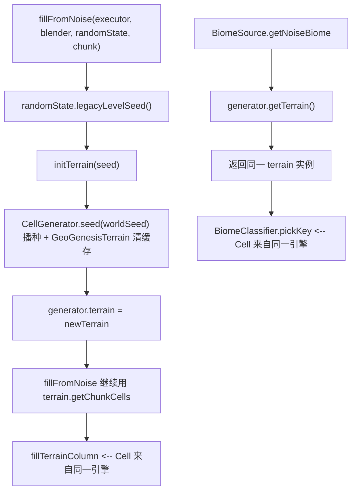

修复地形和群系着色不一致问题。经代码追踪确认根因为：`GeoGenesisGenerator` 和 `GeoGenesisBiomeSource` 通过静态 `sharedTerrain` + `worldSeed` 共享地形引擎，但在 Forge 世界加载的时序下存在种子不同步的竞态窗口，导致两端可能使用不同的 `GeoGenesisTerrain` 实例，从而使地形方块填充和群系着色使用不同种子生成的噪声场，图案完全无关。

修复目标：彻底移除静态共享模式，改为 Generator 实例持有自己的 terrain 引擎，BiomeSource 通过 Generator 引用获取 terrain，消除所有种子竞态窗口。

## 技术方案

### 技术栈

- Minecraft Forge 1.20.1 (Java 17+)
- 修改文件：3 个核心文件 + 1 个删除文件

### 方案概要

移除静态 `sharedTerrain` + `worldSeed` 模式，改为 Generator 实例字段持有 terrain 引擎，BiomeSource 通过 Generator 引用获取 terrain。

### 数据流重设计

```
现状（有 bug）:
  LevelEvent.Load → setWorldSeed(seed) → worldSeed = seed, sharedTerrain = null
  BiomeSource.getNoiseBiome → getOrInitTerrain() → 用 worldSeed 创建 sharedTerrain
  Generator.fillFromNoise → ensureEngine(seed) → getOrInitTerrain() → 返回/重建 sharedTerrain
  → 竞态: gbs.terrain 指向旧实例, fillFromNoise 重建新实例 → 两端不一致
  
修复后:
  Generator 构造 → biomeSource.setGenerator(this) → 注入引用
  fillFromNoise(exec, blender, randomState, chunk) → randomState.legacyLevelSeed() → initTerrain(seed)
  BiomeSource.getNoiseBiome → generator.getTerrain() → 返回同一实例
  → 单源真理: 一个 Generator 实例 = 一个 terrain 引擎 = 一个种子
```

### 种子传递路径



### 实现细节

#### 修改 GeoGenesisGenerator.java

1. 删除 `static volatile GeoGenesisTerrain sharedTerrain` (line 75)
2. 删除 `static GeoGenesisTerrain getOrInitTerrain()` (line 87-100)
3. 删除 `static volatile long worldSeed = 12345L` (line 119)
4. 删除 `public static void setWorldSeed(long seed)` (line 121-126)
5. 改为实例字段 `private GeoGenesisTerrain terrain` (非静态)
6. 新增 `private long terrainSeed = Long.MIN_VALUE` 字段跟踪种子
7. 重写 `ensureEngine(long seed)`: 用 seed 参数真正播种 CellGenerator（`gen.seed(seed)`），创建新的 `GeoGenesisTerrain`，注入 BiomeSource
8. 新增 `public GeoGenesisTerrain getTerrain()` 方法供 BiomeSource 获取
9. 注入 `this` 引用给 BiomeSource: `gbs.setGenerator(this)` 在构造器或 ensureEngine 中

#### 修改 GeoGenesisBiomeSource.java

1. 删除 `private GeoGenesisTerrain terrain` 字段
2. 删除 `public void setTerrain(GeoGenesisTerrain terrain)` 方法
3. 新增 `private GeoGenesisGenerator generator` 字段
4. 新增 `public void setGenerator(GeoGenesisGenerator g)` 方法
5. `getNoiseBiome` 改为:

```java
GeoGenesisTerrain t = (generator != null) ? generator.getTerrain() : null;
if (t == null) return fallbackBiome();
Cell cell = t.sampleCell(QuartPos.toBlock(x), QuartPos.toBlock(z));
```

6. 删除所有对 `GeoGenesisGenerator.getOrInitTerrain()` 的调用

#### 删除 GeoGenesisServerEvents.java

不再需要 LevelEvent.Load 监听器——种子来自 `fillFromNoise` 的 `RandomState` 参数。

### 性能影响

- 消除静态锁争用（synchronized block in getOrInitTerrain）
- 每次 fillFromNoise 检查 seed 是否变更（Long 比较，O(1)）
- 种子不变时直接复用已创建 terrain，零额外开销

### 风险与兼容性

- `PreviewDisplay` 和 `TerrainPreview`（独立预览）不受影响——它们直接创建 CellGenerator+GeoGenesisTerrain
- `GeoGenesisConfigScreen.rebuildPreview()` 也不受影响——同样直接创建
- 需要确保 `GeoGenesisMod.java` 的事件注册中移除了对 `GeoGenesisServerEvents` 的引用（如未显式注册则 Forge 自动扫描 `@Mod.EventBusSubscriber` 注解，不用手动改）

# Agent Extensions

无需 Agent Extensions 辅助。