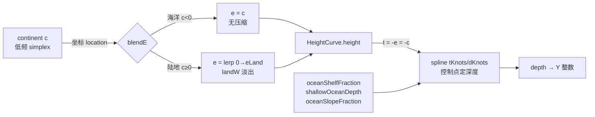
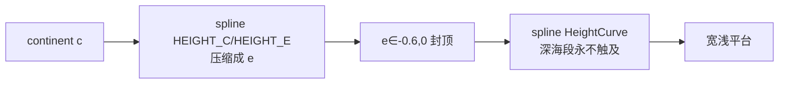

## 用户需求（纠正版）

用户指出一个**根本性的架构理解错误**：大陆性噪声（continent）只用于判断海陆 + 决定各深度控制点的 xz 坐标位置，**与 y（高度/深度）完全无关**。高度/深度完全由控制点（control points）的 value 决定，正如原版 `offset.json` 的 `spline(continents)` —— continent 只是样条的 `location`（坐标），深度由 `points[].value` 决定。

当前代码的错误：把 continent 连续值先经 `HEIGHT_C/HEIGHT_E` 样条压缩成中间量 `e`，再把 `e` 喂给 `HeightCurve` 的 `e→depth` 样条。这是**两次样条串联**（continent→e 压缩 + e→depth），且 `e∈[-0.6,0]` 永远触不到 `HeightCurve` 深海段控制点（需要 `t≥0.9`），导致近岸 shelf 又宽（c∈[-0.20,0]≈333格）又浅（仅 18 格）→ 平台感。

## 核心修复目标

- 海洋深度改为**单条样条**：continent `c` 仅作坐标，深度完全由 `HeightCurve` 控制点（`tKnots/dKnots` = shelf/slope/abyss/trench）决定，对齐 `offset.json`。
- 近岸 167 格处深度从 ~7 格提升到 ≥25 格，消除平台感与阶梯伪影。
- 陆地侧（地质过程 `eLand`）、海岸过渡、河流/湖泊系统不受影响。

## 技术栈

沿用现有 Forge 1.20.1 + Java 21 模组架构，纯 Java 数学管线修改，无新依赖、无 UI 变更。

## 实现方案

### 核心决策：移除 `HEIGHT_C/HEIGHT_E` 中间样条

原版 `offset.json` 的 `spline(continents)` 是**单条样条**：`location = continent 值`（坐标），`value = Y 偏移`（深度/高度，由控制点定义）。continent 本身不携带高度。

我们错误地串联了两层样条：

```
c ──spline(HEIGHT_C/HEIGHT_E)──▶ e ──spline(HeightCurve)──▶ depth
```

`e` 最大仅 -0.6，导致 `HeightCurve` 的 `tKnots` 深海段（t≥0.5 对应 c≤-0.5）几乎不被触及；近岸 `e` 被 `HEIGHT_E` 斜率（0.75）压扁 → shelf 又宽又浅。

**正确做法（对齐 offset.json）**：

```
c（坐标）──▶ HeightCurve 单条样条 ──▶ depth（控制点决定）
```

- 海洋侧：`blendE` 直接 `e = c`（continent 仅作坐标，无压缩）。
- `HeightCurve.height()` 海洋分支：`t = -e = -c = |continent|`，控制点 `tKnots/dKnots` 是深度的**唯一权威**，跨度覆盖完整 c∈[-1,0]。
- 陆地侧：`eLand`（地质过程）不变，`landW` 海岸淡出权重不变。

### 关键数值校验（e=c，tKnots={0,0.10,0.50,0.90,1.0}，dKnots={0,25,60,60,85}）

| 离岸距离 | c 值 | t=-c | depth | Y |
| --- | --- | --- | --- | --- |
| 0 格（海岸） | 0 | 0 | 0 | 63 |
| 50 格 | -0.03 | 0.03 | 7.5 | 55 |
| 83 格 | -0.05 | 0.05 | 12.5 | 50 |
| **167 格** | **-0.10** | **0.10** | **25** | **38** |
| 333 格 | -0.20 | 0.20 | 33.8 | 29 |
| 500 格 | -0.30 | 0.30 | 42.5 | 20 |
| 833 格 | -0.50 | 0.50 | 60 | 3 |


**167 格处深度 7→25 格（×3.5），shelf 宽度 333→167 格（收窄一半）。** 平台感与阶梯伪影应基本消除。

### 实现要点

1. **`CellGenerator.blendE` 重写**：删除 `HEIGHT_C/HEIGHT_E` 常量；海洋分支 `e = c + OCEAN_DETAIL*d*saturate(-c)`；陆地分支 `e = lerp(0.0, eLand, landW)`（海岸从海平面 e=0 平滑升入 `eLand`，消除 c 作高度的语义错误）。
2. **`HeightCurve` 无需结构改动**：其 `tKnots` 生成逻辑（`sf/slopeEnd/to`）已正确，仅喂入的默认值需收紧。
3. **配置默认值**：`oceanShelfFraction` 0.20→**0.10**（窄 shelf），`shallowOceanDepth` 18→**25**，`oceanSlopeFraction` 0.30→**0.40**（宽缓坡）。
4. **`OCEAN_DETAIL`** 0.03→**0.05**：增强海床细节噪声，打破残余阶梯的规律性（仍受 `saturate(-c)` 近岸收敛，不影响海岸线）。

## 实现备注

- **性能**：零新增计算，仅常量与默认值变更；`blendE` 海洋分支从样条求值降为直接赋值，反而略快。
- **日志**：无需新增。
- **爆炸半径控制**：
- 陆地侧 `eLand`/`landW`/`COAST_WIDTH` 完全不变 → 陆地地形、海岸悬崖修复无回归。
- `HeightCurve.classify()` 用 `depth=seaLevel-y` 判定海陆类型，Y 算对后类型自动正确。
- 河流/湖泊：`landHeight()` 对 `c<-0.30` 返回 NaN 的门控不变，与海洋深度映射解耦，无回归。
- 预览 `shapeE`→`heightCurve.height()` 链路天然兼容（e=c 后 `height()` 一致）。
- **配置文件**：修改默认值后必须删除 `run/config/geogenesis-common.toml` 让 Forge 重新生成（否则旧 toml 的 `oceanShelfFraction=0.2` 覆盖新默认值，用户看不到变化——历史教训）。

## 架构设计

修正后的海洋深度管线（单条样条，continent 仅作坐标）：



对比旧架构（双层串联，错误）：



## 目录结构（修改文件）

```
forge-1.20.1-47.4.10-mdk/src/main/java/com/geogenesis/worldgen/terrain/
├── CellGenerator.java   # [MODIFY] 删除 HEIGHT_C/HEIGHT_E 常量；重写 blendE（海洋 e=c，陆地 lerp(0,eLand,landW)）；OCEAN_DETAIL 0.03→0.05；更新类/方法注释
├── HeightCurve.java     # [NO CHANGE] tKnots 生成逻辑正确，仅需确认注释（t=-e=-c 即 continent 绝对值）已对齐
└── TerrainParams.java  # [MODIFY] defaults() 同步 oceanShelfFraction 0.20→0.10、shallowOceanDepth 18→25、oceanSlopeFraction 0.30→0.40

forge-1.20.1-47.4.10-mdk/src/main/java/com/geogenesis/config/
└── GeoGenesisConfig.java  # [MODIFY] SHALLOW_OCEAN_DEPTH 默认值 18→25；OCEAN_SHELF_FRACTION 0.20→0.10；OCEAN_SLOPE_FRACTION 0.30→0.40

forge-1.20.1-47.4.10-mdk/run/config/
└── geogenesis-common.toml  # [DELETE] 删除让 Forge 用新默认值重新生成
```

## 关键代码结构

`CellGenerator.blendE` 重写后的核心逻辑（单函数 ≤50 行）：

```java
private double blendE(double c, double eLand, double worldX, double worldZ) {
    double d = detail.compute(worldX, worldZ);
    double e;
    if (c < 0.0) {
        // 海洋侧：continent c 仅作深度样条坐标（控制点定深度），e=c 线性映射，无中间压缩
        e = c + OCEAN_DETAIL * d * NoiseUtil.saturate(-c);
    } else {
        // 陆地侧：地形由地质过程 eLand 决定；continent 只控制海岸淡出权重 landW
        double landW = smoothstep(NoiseUtil.clamp(c / COAST_WIDTH, 0.0, 1.0));
        e = NoiseUtil.lerp(0.0, eLand, landW); // 海岸从海平面 e=0 平滑升入 eLand
    }
    return NoiseUtil.clamp(e, -1.0, 1.0);
}
```

`HeightCurve.height()` 海洋分支（结构不变，仅默认值收紧后 tKnots 自动变窄）：

```java
// sf=0.10, slopeEnd=0.50, to=0.90 → tKnots={0,0.10,0.50,0.90,1.0}
// dKnots={0, shelfDepth(25), deepDepth(60), deepDepth(60), trenchDepth(85)}
double depth = NoiseUtil.spline(t, tKnots, dKnots); // 单条样条，控制点定深度
```