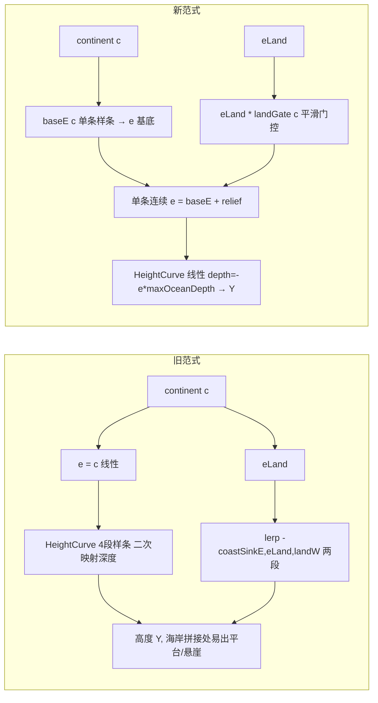

## 用户需求

- 根除海岸"宽浅平台"视觉 bug：禁用侵蚀后平台仍在，确认根因在地形层（海洋深度模型），而非侵蚀系统。
- 用户明确否决"继续修修补补"与"海陆两段衔接"旧范式：当前 `oceanShelfFraction/shelfDepth/oceanSlopeFraction/oceanTrenchOnset/coastSink` 五个参数相互耦合，调一个崩一个，已反复修过无数次悬崖/平台/台阶。
- 采用**单条基底样条 `baseE(c)`** 从根源重构海洋深度：c∈[-1,1] 为 X 轴、e 为 Y 轴，深度形状由控制点直接定义，不再有"大陆噪声频率 × 海洋参数"与"二次样条再压缩"两层间接推导。
- 海洋层次（海沟/深海/大陆坡/大陆架）保留，并作为同一条样条的控制点（Y 值）体现，而非拆成 4 个独立耦合参数。
- 海岸过渡为单条连续表达式，无海陆两段 if/else 衔接，根除接缝/悬崖/平台。

## 核心特征

- 海洋深度完全由 `baseE(c)` 一条连续样条决定（控制点直接给出深度剖面），`HeightCurve.height(e<0)` 简化为 `depth = -e * maxOceanDepth` 线性映射，消除二次样条。
- 陆地地形 = `baseE(c)` 陆地基底（恒 0） + 地质过程 `eLand` 起伏，由 `landGate(c)` 平滑门控（海洋 0、内陆 1），基底共用同一函数，无分段拼接。
- 删除 `oceanShelfFraction/oceanSlopeFraction/oceanTrenchOnset/coastSink` 四个耦合参数；保留 `shelfDepth/deepOceanDepth/trenchDepth`（`trenchDepth` 作最大海深驱动线性映射，`shelfDepth/deepOceanDepth` 仅作分类阈值）。
- 海岸自海平面 e=0 平滑升起，无下沉、无悬崖；河流/湖泊/气候/预览下游契约（e 空间语义）完全不变。

## 技术栈

- 纯 Java，零 MC 依赖核心（`CellGenerator` / `HeightCurve` / `TerrainParams` 保持不 import MC）。
- `HeightCurve` 继续作为 e↔世界高度的唯一边界映射器（持有 `baseE` 样条与线性海洋映射）。
- 复用既有 `NoiseUtil.spline` / `NoiseUtil.smoothstep` / `NoiseUtil.clamp` / `NoiseUtil.saturate` 工具，不引入新依赖。

## 实现方案（核心思路）

把"海洋 `e=c` 线性 + `HeightCurve` 4 段样条二次映射"的双层间接，替换为**单条基底样条 `baseE(c)`**：continent 坐标 c 直接映射为抽象高度 e，海洋深度剖面（海沟→深海→大陆坡→大陆架→海岸）由控制点 Y 值一次定义；陆地起伏 `eLand` 作为叠加项经 `landGate(c)` 平滑门控长在这条基底上。`HeightCurve.height(e<0)` 退化为线性 `depth = -e * trenchDepth`，层次感来自 `baseE(c)` 控制点的"平缓/陡峭"分布而非二次样条。

### 关键设计决策

1. **`baseE(c)` 单条样条（在 `HeightCurve` 内静态方法）**：控制点 `(c, e)` 直接编码深度形状，`c>0.30` 钳到 0（陆地基底水平，杜绝海底平台）。这是"层次写进样条"的落地。
2. **`blendE` 重写为单条连续表达式**：`e = baseE(c) + eLand * landGate(c)`，海洋细节仅在 `c<0` 叠加。`landGate = smoothstep(clamp(c/COAST_WIDTH,0,1))` 保证海洋侧为 0、内陆为 1、海岸平滑，免去 `coastSink` 下沉逻辑与两段 lerp。
3. **`HeightCurve.height(e<0)` 线性化**：`depth = -e * trenchDepth`，移除 `tKnots/dKnots` 4 段样条。`eFromHeightF` 二分反解仍有效（映射在 [-1,1] 单调，e=0 处陆地/海洋同取海平面）。
4. **分类解耦**：`classify` 仍按真实深度 `seaLevel - y` 与 `shelfDepth`/`deepOceanDepth` 阈值分 `SHALLOW_OCEAN/CONTINENTAL_SHELF/DEEP_OCEAN`；这两个阈值仅作分类用，不再进高度样条，消除耦合。

### 性能与可靠性

- `baseE` 每采样点一次 `NoiseUtil.spline`（O(1) 控制点数），`blendE` 仅增加一次 smoothstep + 一次乘法，无新循环/新对象分配，性能与原实现持平。
- 下游 `RiverField`（依赖 `HeightCurve.heightF(0.0)` 取 `seaNormY`、`eFromHeightF` 还原 e 空间）、`HydraulicErosion`、`landHeight`（`c<0` 仍返回 NaN）契约全部不变。
- 删除 4 参数后需同步 `TerrainParams` / `GeoGenesisConfig` / `GeoGenesisGenerator` / `GeoGenesisConfigScreen` / 运行时 toml，避免构造器参数错位与陈旧 key 干扰。

## 实现要点

- `baseE(c)` 控制点经前期目检经验选取：大陆架段 c∈[-0.30,-0.10] 对应 e 从 -0.45→-0.18（深度 38→15 方块，斜坡较陡，消除宽浅平台）；深海段 c∈[-0.80,-0.55] 平缓（abyss 近平）；海沟 c=-1.0 最深。控制点集中配置为命名常量，便于后续微调。
- `COAST_WIDTH=0.30` 保留为平滑门控宽度；`OCEAN_DETAIL=0.05` 海床细节仅海洋生效。
- 移除 `CellGenerator` 的 `coastSinkE` 字段与构造期反算；类注释更新为"单条基底样条范式"。
- 注释清理：`HeightCurve.classify` 中关于 `coastSink` 致下沉海岸的注释删除。

## 架构设计

重构前后数据流对比：



单条 `baseE(c)` 是连续函数，海洋基底与陆地基底同源，海岸处无分段跳跃；海洋"层次"由控制点形状体现，参数不再耦合。

## 目录结构

```
forge-1.20.1-47.4.10-mdk/src/main/java/com/geogenesis/
├── worldgen/terrain/
│   ├── HeightCurve.java        # [MODIFY] 新增静态 baseE(c) 样条 + 控制点常量；删 oceanShelfFraction/oceanSlopeFraction/oceanTrenchOnset 字段；
│   │                           #         height()/heightF() 海洋分支改线性 depth=-e*trenchDepth；classify 注释清理（去 coastSink）。
│   ├── CellGenerator.java      # [MODIFY] 删 coastSinkE 字段与反算；blendE 重写为 baseE(c)+eLand*landGate(c)+海洋detail 单条连续式；类注释更新。
│   └── TerrainParams.java      # [MODIFY] 删 oceanShelfFraction/oceanSlopeFraction/oceanTrenchOnset/coastSink 四字段及其 defaults 对应值。
├── config/
│   └── GeoGenesisConfig.java   # [MODIFY] 删 OCEAN_SHELF_FRACTION/OCEAN_SLOPE_FRACTION/OCEAN_TRENCH_ONSET/COAST_SINK 定义；
│                               #         configParams() 与 toml 解析移除四参。
├── worldgen/generator/
│   └── GeoGenesisGenerator.java# [MODIFY] configParams() 的 TerrainParams 构造移除四参。
└── client/
    └── GeoGenesisConfigScreen.java # [MODIFY] buildParams() 的 TerrainParams 构造移除四参。

forge-1.20.1-47.4.10-mdk/run/config/geogenesis-common.toml # [MODIFY] 删 oceanShelfFraction/oceanSlopeFraction/oceanTrenchOnset/coastSink 四个陈旧 key。
```

## 关键代码结构

```java
// HeightCurve.java —— 单条基底样条（深度剖面 + 海岸 + 陆地基底，层次写进控制点 Y 值）
private static final double[] BASE_C = {-1.00, -0.80, -0.55, -0.30, -0.10, 0.00, 0.30};
private static final double[] BASE_E = {-1.00, -0.82, -0.68, -0.45, -0.18, 0.00, 0.00};

/** continent c∈[-1,1] → 抽象高度 e∈[-1,1]，单条连续样条，c>0.30 钳到 0（陆地基底水平）。 */
public static double baseE(double c) {
    return NoiseUtil.spline(NoiseUtil.clamp(c, -1.0, 0.30), BASE_C, BASE_E);
}

// CellGenerator.java —— blendE 重写为单条连续表达式，无海陆两段 if/else
private double blendE(double c, double eLand, double worldX, double worldZ) {
    double d = detail.compute(worldX, worldZ);
    double landGate = smoothstep(NoiseUtil.clamp(c / COAST_WIDTH, 0.0, 1.0)); // 海洋 0、内陆 1
    double e = HeightCurve.baseE(c) + eLand * landGate;                       // 基底 + 地质起伏
    if (c < 0.0) e += OCEAN_DETAIL * d * NoiseUtil.saturate(-c);             // 海床细节仅海洋
    return NoiseUtil.clamp(e, -1.0, 1.0);
}
```