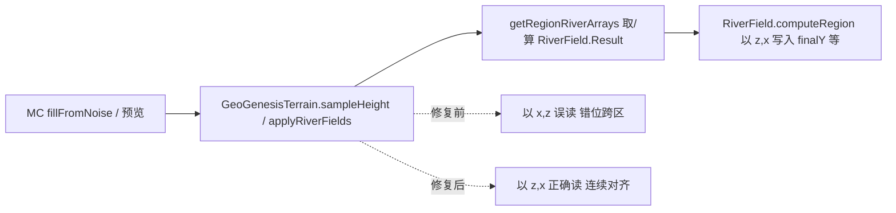

## 用户需求

修复 Minecraft Forge 1.20.1 模组 GeoGenesis 世界生成中出现的 512-block region 棋盘式地形断裂：相邻 region 呈现完全不同的地形（一侧深海+山脉，另一侧平坦陆地），交界处呈直线跳变。用户确认该断裂是在引入 RiverField/HydraulicErosion 侵蚀内容后才出现的，此前直接走 `shapeE` 地质高度场时是连续正常地形。

## 核心特征

- 断裂沿 512×512 block 网格正交分布，呈棋盘状
- 边界处地形"啪"地整体跳变（整块区域变成另一处地形），而非局部河谷刻蚀差异
- 修复目标：让河流/侵蚀结果在世界坐标上正确对齐，消除 region 间地形错位，恢复全局连续地形

## 技术栈

- 语言/平台：Java 17 + Minecraft Forge 1.20.1 模组（Gradle 构建，入口 `gradlew.bat build` / `compileJava`）
- 零 MC 依赖核心：`GeoGenesisTerrain`（地形引擎入口）、`RiverField`（region 级河流/侵蚀计算）、`HydraulicErosion`（droplet 侵蚀）

## 根因（已代码核实）

`RiverField.computeRegion` 把所有 Result 数组以 **`[j][i]` = `[z偏移][x偏移]`** 写入，语义约定为：`finalY[j][i]` 对应世界点 `(obx + i, obz + j)`（即数组第一维是 z、第二维是 x）。

`GeoGenesisTerrain` 读取端却以 **`[i][j]` = `[x偏移][z偏移]`** 访问：

- `sampleHeight` L95：`return r.finalY[i][j];`
- `applyRiverFields` L164-175：`finalY[i][j]`、`dis[i][j]`、`riverMask[i][j]`、`lakeMask[i][j]`、`lakeLevelY[i][j]`

错位机制：`finalY[a][b]` 实际存的是世界 `(obx+b, obz+a)`，而读取用 `i=wx-obx, j=wz-obz` 取 `finalY[i][j]`，返回的却是世界 `(obx+(wz-obz), obz+(wx-obx))` 的地形——X/Z 对调且带 ±500+ block 错位。在 512 边界处，该错位直接跨到相邻 region 的数据，造成边界处地形硬跳变，整图呈 512×512 棋盘。修复后读取 `finalY[j][i]` 恰好命中世界 `(wx, wz)`，地形连续且坐标正确。

## 实现方案

**策略**：仅修正 `GeoGenesisTerrain` 的 7 处读取索引，使其与 `RiverField` 既有的 `[z][x]` 存储约定对齐。不改动 `RiverField` 的写入端，避免大范围重构引入新风险。

**关键决策**：

1. **只改读取端、不改存储端**：`RiverField` 的 `[z][x]` 约定在 `computeRegion` 内高度自洽（所有内部数组 `h/geoE/land/dis/precip/eCarved/eFull/isLand` 均为 `[z][x]`），改动读取端是最小、最低风险、最不影响其他调用方的修复。
2. **局部、自洽**：已核实 Result 数组仅被本文件两处消费者使用（`sampleHeight` 供 MC `fillFromNoise`/`sampleCell`；`applyRiverFields` 供 `getChunkCells`/`getRegionCells` 预览），无外部直接读数组者，修复后即全链路自洽。

## 实施注意

- 仅替换索引顺序，不调整任何数值、坐标或 erosion 逻辑，blast radius 控制在本文件内。
- 错位修复后，世界坐标与地形正确对应，原"棋盘断裂"立即消失；侵蚀/河流的形态逻辑本身无需改动。
- 编译后用 `runPreview --args=12345` 或 `runClient` 目检边界连续性（非阻塞验证步骤）。

## 架构与数据流



## 目录结构

```
forge-1.20.1-47.4.10-mdk/src/main/java/com/geogenesis/worldgen/terrain/
└── GeoGenesisTerrain.java   # [MODIFY] 修正 7 处 Result 数组读取索引 [i][j] -> [j][i]，对齐 RiverField 的 [z][x] 存储约定。涉及 sampleHeight(L95) 与 applyRiverFields(L164-175)。
```

## 关键代码约定

`RiverField.Result` 数组索引约定（写入端，保持不变）：

- `finalY[j][i]`、`disIn[j][i]`、`riverMask[j][i]`、`lakeMask[j][i]`、`lakeLevelY[j][i]`
- 数组第一维 = z 偏移，第二维 = x 偏移；`[j][i]` 对应世界 `(obx + i, obz + j)`
- 修复后 `GeoGenesisTerrain` 读取端必须统一使用 `r.finalY[j][i]` 形式以匹配该约定