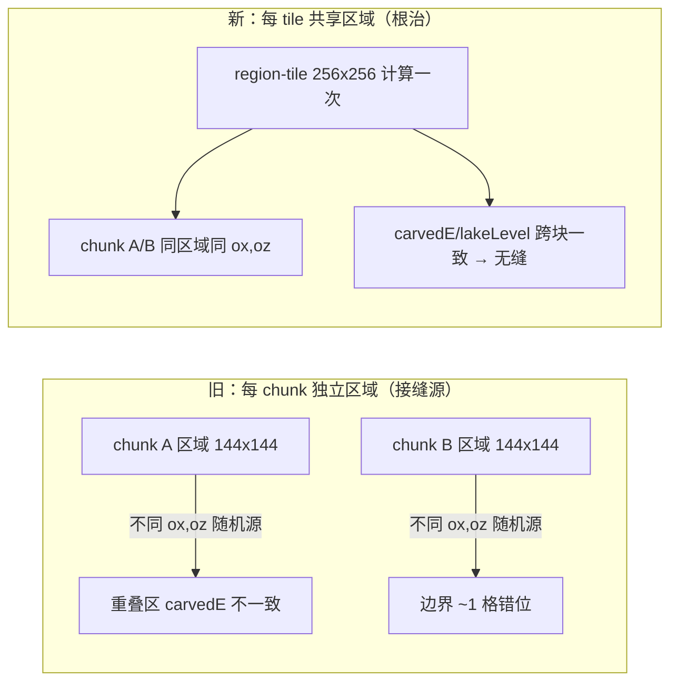

## 用户需求

修复 GeoGenesis 地形生成器的游戏内问题，依据用户 2026-07-11 在 plan 模式下的两项确认方向推进。

## 核心问题与目标

- **Bug 4 海岸平台期（海洋抬升 + 海岸断裂）**：根因为上一轮修复把 `coastRamp` 从 `c/0.30` 改为 `c/0.50`，并用 `lm = c/1.0` 乘法把近岸海洋/陆地都压向海平面（e≈0），形成平台且产生海岸断裂。原版 MC `offset.json` 用「加法样条 + 恒定深海 + 窄陡海岸」而非乘法 ramps。已确认方向：**移除 `coastRamp` 乘法 + 陡 `lm` + 抬高 `landShape` 低 e 斜率**，根除平台。
- **Bug 3 湖泊区块接缝（1 格错位 + 大湖没水）**：大湖没水已由 `wetCount<=32000` 修复；但 **1 格错位接缝**根因为 `GeoGenesisTerrain.getChunkRegion` 对**每个 chunk 单独**跑 `RiverField.computeRegion`，而 `HydraulicErosion` 的 droplet 随机源按区域原点 `(ox,oz)` 派生 → 相邻 chunk 区域原点不同 → 重叠区侵蚀序列不同 → `carvedE`/`lakeLevel` 边界差 ~1 格。已确认方向：**让 RiverField 跨 chunk 共享缓存（按更大 tile 计算一次）**，根治接缝。
- **Bug 1（同方向伪影）/ Bug 2（河岸硬路基）**：上一轮已落地（`warpZ` 频率 `beltFreq*1.3`、`belowSea`→`aboveSeaFactor`），本次仅复核参数，不再改逻辑。

## 验证方式

`gradlew runPreview --args=种子` 看地形分布；`gradlew runClient` 目检海岸/湖泊接缝与群系过渡。

## 技术栈

- 项目：Minecraft Forge 1.20.1 模组（Java 17+），纯 Java 地形引擎（零 MC 依赖），Gradle 构建。
- 改动文件：仅 `CellGenerator`、`HeightCurve`、`GeoGenesisTerrain` 三个文件；`Bug1/Bug2` 参数已落地不回退。

## 实现方案

### Bug 4：仿原版根除海岸平台（CellGenerator + HeightCurve）

**核心决策**：用「加法 + 陡岸」替代「乘法 ramps」。

1. **海洋**：移除 `coastRamp` 乘法，`shapeE` 海洋分支直接 `e = c + 0.03*d`（c 即深度坐标）。深度剖面交给 `HeightCurve` 已有的 shelf/slope/deep 节点（e 越小越浅、e→-1 越深），天然单调下降、无海平面平台。近岸 e 小→浅大陆架（正确），深海 e→-1→深渊。
2. **陆地**：抽取私有静态 helper `landCoastFactor(c) = smooth(clamp(c / COAST_LAND_BAND))`，`COAST_LAND_BAND=0.25`（原 1.0 → 窄陡海岸）。`computeShape`/`shapeE`/陆地`landHeight` 三处 `lm` 统一改用该 helper，保证三套采样入口海岸基准完全一致（消除之前三处可能漂移的隐患）。
3. **连续性**：c=0 处海洋 `e→0`、陆地 `e=eLand*lm→0`，两侧均趋于 0 → `HeightCurve.height(0)=seaLevel` 连续无断裂。
4. **HeightCurve.landShape 样条**：抬高低 e 段斜率（近岸陆地不再被二次压平），与陡 `lm` 协调避免「海岸墙」。控制点改为 `XS={0,0.04,0.28,0.52,0.78,1.00}` / `YS={0,0.06,0.22,0.46,0.75,1.00}`（具体数值以 runPreview 微调为准）。

### Bug 3：跨 chunk 共享 RiverRegion 缓存（GeoGenesisTerrain）

**核心决策**：把 river/lake 区域从「每 chunk 计算」改为「每 tile 计算一次并跨 chunk 共享」，所有落在同 tile 的 chunk 读同一份区域 → 同一 `(ox,oz)` 随机源 → `carvedE`/`lakeLevel` 跨块一致，接缝消除。Cell 网格（群系/气候）本就逐世界点确定性、无接缝，保持每 chunk 缓存不变。

- 新增常量 `RIVER_TILE_CHUNKS = 8`（tile 内块 128，区域 `128 + 2*PAD = 256`）。
- 拆分 `tileCache`（存 `Cell[][]`）与新增 `regionCache`（存 `RiverField.RiverRegion`，键为 region-tile 坐标）。`getChunkRegion` 先 `floorDiv(chunkX,8)` 求 tile，再 `regionCache.get(rtx,rtz, ::computeRegionTile)`；`computeRegionTile` 按 tile 原点 `rtx*128-PAD`、尺寸 `256` 调 `riverField.computeRegion`，每 tile 仅算一次（侵蚀开销较旧每 chunk 方案约降为 1/64）。
- `getChunkCells`：取每 chunk Cell 网格后，从**共享** region 调 `writeRiverFields` 写入 river/lake 字段（ biome/预览一致、无接缝）。`fillFromNoise` 按 `(wx - reg.ox)` 索引逻辑不变（共享区域覆盖 chunk 全块，索引恒在界内）。
- 预览 `getRegionCells` 自身单次大区域已无缝，保持原样。
- 内存：单区域 256²×~11 数组≈2.9MB，缓存容量 64、TTL 30s，且实际仅加载玩家周边少量 tile，与旧每 chunk 缓存量级相当。

## 性能与可靠性

- 侵蚀总计算量大幅下降（按 tile 而非 chunk）；仅增加一次 `writeRiverFields` 轻量循环（O(256)）。
- 确定性保持：同 seed+坐标→同结果；随机源 `(ox,oz)` 现按 tile 固定，跨块稳定。
- 不破坏气候/群系/预览链路；`aboveSeaFactor`/`COAST_SUB`/`COAST_RANGE` 沿用已验证值。

## 架构设计



## 目录结构

```
forge-1.20.1-47.4.10-mdk/src/main/java/com/geogenesis/worldgen/
├── terrain/
│   ├── CellGenerator.java        # [MODIFY] 移除 coastRamp 乘法；新增 landCoastFactor(c) helper；computeShape/shapeE/landHeight 三处 lm 统一改用该 helper（海洋分支 e=c+0.03*d）
│   ├── HeightCurve.java          # [MODIFY] landShape 控制点 XS/YS 抬高近岸陆地低 e 斜率（根除陆地平台，配合陡 lm）
│   └── GeoGenesisTerrain.java    # [MODIFY] 拆 cellCache 与 regionCache；新增 RIVER_TILE_CHUNKS 常量 + computeRegionTile(rtx,rtz)；getChunkRegion 按 tile 共享；getChunkCells 从共享 region 写 river/lake 字段
└── river/
    └── RiverField.java           # [引用] computeRegion / pad() 接口不变，被 GeoGenesisTerrain 以 tile 粒度调用
```

## 关键代码结构

```java
// CellGenerator.java —— 海岸过渡统一入口（避免三处 lm 漂移）
private static final double COAST_LAND_BAND = 0.25;
private static double landCoastFactor(double c) {
    return NoiseUtil.smooth(NoiseUtil.clamp(c / COAST_LAND_BAND, 0.0, 1.0));
}

// GeoGenesisTerrain.java —— 跨 chunk 共享河流区域
private static final int RIVER_TILE_CHUNKS = 8;
private RiverField.RiverRegion computeRegionTile(int rtx, int rtz) {
    int pad = RiverField.pad();
    int tileBlocks = RIVER_TILE_CHUNKS * 16;
    return riverField.computeRegion(rtx * tileBlocks - pad, rtz * tileBlocks - pad, tileBlocks + 2 * pad);
}
```