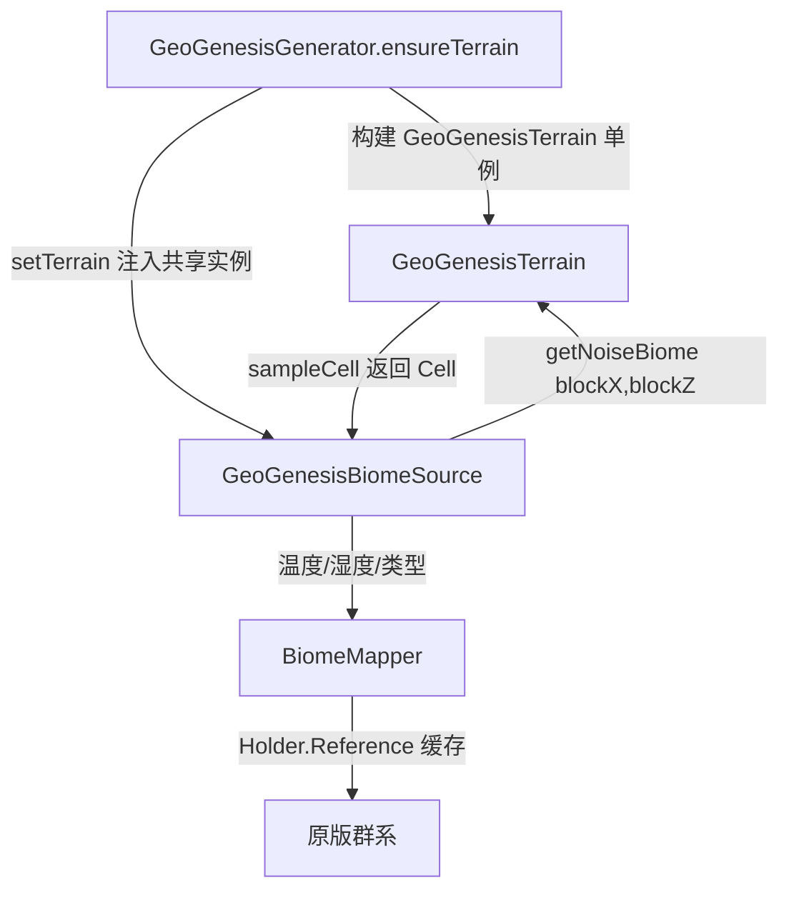

> **状态（2026-07-09）**：本计划全部工作已完成。侵蚀包 `worldgen/erosion/` 已于 2026-07-08 删除（未进游戏地形，删除无功能回归）；气候→群系已接游戏，世界按纬度温度×大陆性湿度×海洋/山峰标记分布多种原版群系（runClient 目检 OK）。详见 `AGENTS.md`。本文件作废，保留仅作历史参考。

## 用户需求

用户确认开发优先级反转：暂停侵蚀系统，优先把已建好的气候系统接进游戏，使世界按气候分布出不同生物群系；同时删除未接入游戏、仅用于预览的侵蚀包，保持代码干净。

## 产品概述

把 `BasicClimate` 已计算的温度（纬度）与湿度（大陆性 + 噪声）真正用起来——驱动 `GeoGenesisBiomeSource` 在世界生成时按气候与地形类型选择对应原版生物群系，让世界从"单一群系"变成"海洋/海滩/平原/沙漠/森林/针叶林/雪原/雪峰"等按气候合理分布。同步彻底移除 `worldgen/erosion/` 包及其在地形引擎、配置、预览窗口中的全部引用。

## 核心特性

- 生物群系按气候分布：海洋/海滩按类型标记特判；陆地按温度带 × 湿度带映射到对应原版群系；雪峰/山峰按高度与低温特判。
- 地形引擎与群系选择共用同一份 `GeoGenesisTerrain`（同种子），保证群系与高度/河流一致。
- 侵蚀系统整体删除：移除侵蚀包、地形引擎中的侵蚀调用与 `applyErosion` 分支、Forge 配置中的侵蚀项、预览窗口的 `E`/`X` 键与侵蚀叠层。
- 预览窗口回归单一渲染路径（高度/类型/河流），不再有侵蚀叠加。

## 技术栈

- Java 21 + Minecraft Forge 1.20.1（沿用现有工程，无新增依赖）
- 现有零 MC 依赖地形引擎 `worldgen/terrain/`（Cell / CellGenerator / BasicClimate / GeoGenesisTerrain）
- 原版生物群系通过 `BuiltInRegistries.BIOME.getHolder(ResourceLocation)` 引用，不重新注册

## 实现方案

### 核心策略

把已算好的 `Cell.temperature / Cell.humidity / 类型标记` 作为群系选择依据。`GeoGenesisBiomeSource` 复用 `GeoGenesisGenerator` 已构建的同一份 `GeoGenesisTerrain`（通过 setter 注入，保证种子完全一致、不重复构建），在 `getNoiseBiome` 中把 biome 坐标转 block 坐标后 `sampleCell`，经新增的 `BiomeMapper` 映射到 `Holder<Biome>`。

### 关键技术决策与权衡

1. **共享 terrain 而非各自构建**：`BiomeSource` 无 `RandomState`、无法自行派生地形种子（种子由 Generator 经 `randomState.getOrCreateRandomFactory("terrain")` 派生）。让 Generator 把已构建的 terrain 注入共享的 BiomeSource 实例，是种子一致性与零重复构建的唯一干净做法。
2. **null 安全回退**：`getNoiseBiome` 在 terrain 尚未注入时（罕见的前置窗口），由 Generator 预置的种子惰性自建一份 terrain，避免空指针；并以一次性日志告警。实现阶段需 `runClient` 目检首块群系与地形是否对齐（F3 调试已显示类型/温度/湿度）。
3. **引用原版群系而非自建**：用 `BuiltInRegistries.BIOME` 解析 `minecraft:ocean/beach/plains/desert/forest/taiga/snowy_taiga/snowy_plains/snowy_mountains` 等，首次解析后缓存到 `Map`，避免热路径反复查找（O(1) 命中）。
4. **CODEC 收敛**：移除 BiomeSource CODEC 中无用的单 `biome` 字段，同步更新 `world_preset/geogenesis.json`，保持数据包可加载。

### 性能与可靠性

- `sampleCell` 仅做低频噪声采样（纬度 0.0016、湿度 0.002），开销极低，适合每列群系查询。
- 群系 `Holder` 解析一次性缓存，热路径无注册表查找、无新对象分配。
- 侵蚀删除后 `getChunkCells`/`getRegionCells` 去掉 `erode` 步骤，渲染与生成均提速、代码更简单。

## 实现注意事项

- 删除侵蚀时务必 `grep -ri erosion` 确认零残留，否则 `compileJava` 会因悬空 import/字段失败。
- `GeoGenesisTerrain` 构造器与 `getChunkCells`、`getRegionCells` 的 `applyErosion`/`erosionDrops` 重载链需整体简化为单一签名，预览调用点（`TerrainPreview`）同步改为无侵蚀参数。
- `world_preset/geogenesis.json` 的 `biome_source` 段若含 `"biome"` 字段须删除，否则反序列化失败导致世界无法创建。
- `Cell.java` 中 `sediment/discharge/momentumX/momentumZ` 侵蚀字段可一并移除（P2 预留，已无用）。
- 保留 `GeoGenesisConfig` 其余配置项不动，仅删 `ENABLE_EROSION` 与 Erosion Weights 整段。

## 架构设计



## 目录结构

```
forge-1.20.1-47.4.10-mdk/src/main/java/com/geogenesis/
├── worldgen/
│   ├── erosion/                         # [DELETE] 整个目录：ErosionEngine/ErosionSettings/
│   │                                     #   ErosionWeights/SlopeCalculator/CoastlineHandler/
│   │                                     #   types/*（Hydraulic/Wind/Thermal/Glacial 及 params/*）
│   ├── terrain/
│   │   ├── GeoGenesisTerrain.java       # [MODIFY] 删除 ErosionEngine import/字段/构造器调用；
│   │   │                                 #   删除 getChunkCells 中 erode 调用；
│   │   │                                 #   getRegionCells 简化为单一签名、去掉 applyErosion 分支
│   │   └── Cell.java                     # [MODIFY] 可选移除 sediment/discharge/momentumX/momentumZ 侵蚀字段
│   └── generator/
│       ├── GeoGenesisBiomeSource.java   # [MODIFY] 移除单 biome 字段；新增 terrain 引用 + setter；
│       │                                 #   getNoiseBiome 按气候经 BiomeMapper 选群系；null 安全回退
│       ├── GeoGenesisGenerator.java      # [MODIFY] ensureTerrain 构建后向共享 BiomeSource 注入 terrain
│       └── BiomeMapper.java              # [NEW] 温度带×湿度带×地形类型 → 原版群系映射，缓存 Holder
├── config/
│   └── GeoGenesisConfig.java            # [MODIFY] 删除 ENABLE_EROSION 与 Erosion Weights 整段声明与定义
└── client/
    ├── preview/TerrainPreview.java      # [MODIFY] 删除 showErosion/applyErosion/erosionDrops、
    │                                     #   E/X 键、侵蚀叠层渲染、getRegionCells 的侵蚀参数调用
    └── screen/PreviewDisplay.java       # [MODIFY] 移除侵蚀叠加渲染分支
        screen/PreviewColor.java         # [MODIFY] 移除侵蚀相关配色/叠层

forge-1.20.1-47.4.10-mdk/src/main/resources/data/geogenesis/worldgen/world_preset/
└── geogenesis.json                      # [MODIFY] biome_source 段移除 "biome" 字段（如有）
```

## 关键代码结构

```java
// BiomeMapper.java —— 群系映射（缓存原版群系 Holder，O(1) 命中）
public final class BiomeMapper {
    /** 陆地：温度带 × 湿度带 → 原版群系；海洋/海滩/雪峰按类型标记特判。 */
    public Holder<Biome> biomeFor(Cell cell);
}

// GeoGenesisBiomeSource.java —— 接线核心
public class GeoGenesisBiomeSource extends BiomeSource {
    private GeoGenesisTerrain terrain;            // 由 Generator 注入，或惰性自建
    public void setTerrain(GeoGenesisTerrain t);  // Generator.ensureTerrain 调用
    @Override
    public Holder<Biome> getNoiseBiome(int x, int y, int z, Climate.Sampler sampler);
}
```
