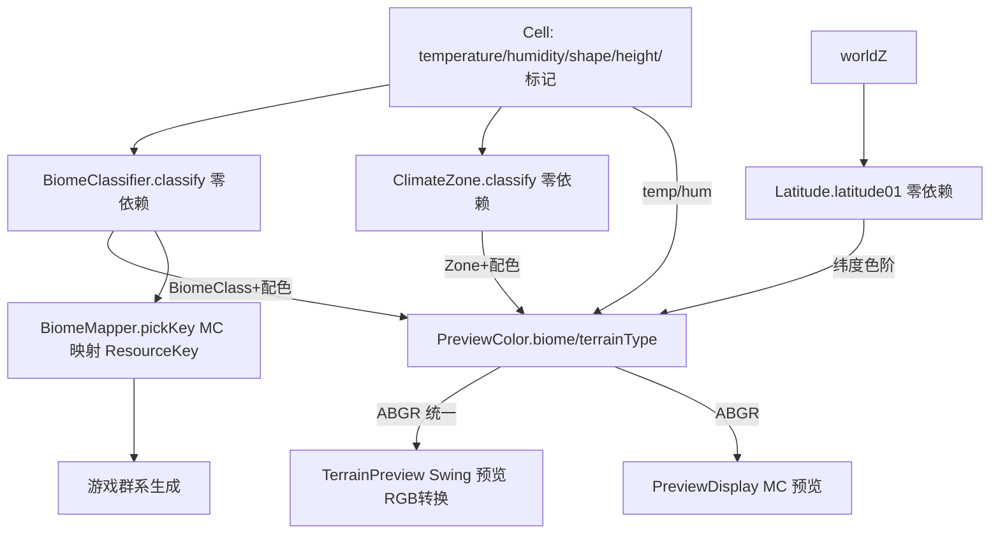

> **状态（2026-07-09）**：本计划全部工作已完成，且被正式完成版 `preview-enhancement-geo-layers_a5b27bc5.md` 取代（后者进一步升级为 11 图层 + 数据驱动配色中枢）。本早期草案作废，保留仅作历史参考。

## 用户需求

- 原始诉求：预览功能不完善，讨论完善。
- 第一轮确认范围（全面完善）：群系视图 + 抽公共渲染逻辑消除两套重复 + 修 MC 拖拽卡顿/加类型图例 + 补 Swing 气候视图/修快捷键语义。
- 本轮补充诉求（verbatim）："视图类型有点少，温度、湿度等等这些怎么不加呢？按地理的标准来"。

## 产品概述

把现有两套预览（独立 Swing 窗口 `TerrainPreview`、MC 内 `PreviewDisplay`/`GeoGenesisConfigScreen`）统一升级为**地理标准图层集**：高程 / 温度 / 湿度 / 纬度带 / 气候带 / 群系 / 地形类型 / 海陆，外加可叠加的水文层。温度与湿度从"合成气候色谱"拆成**独立连续图层**，并新增纬度带（纯几何带，区别于含噪声的温度）、Köppen 简版气候带等，使预览成为逐项校验气候/地形模型的工具，且与游戏实际生成完全一致。

## 核心特性

- **8 个地理标准图层**共用同一套零依赖着色/分类规则：

1. ELEVATION 高程（保留现有高质量 Lab LUT）
2. TEMPERATURE 温度（独立连续色阶 冷蓝→暖红，用 `cell.temperature`）
3. HUMIDITY 湿度/降水（独立连续色阶 干棕→湿蓝绿，用 `cell.humidity`）
4. LATITUDE 纬度带（纯几何 `|z|*latScale`，两极→赤道，与温度区分）
5. CLIMATE_ZONE 气候带（Köppen 简版 A/B/C/D/E 离散分类）
6. BIOME 群系（零依赖 `BiomeClassifier`，复用 `BiomeMapper` 规则，预览群系==游戏群系）
7. TERRAIN_TYPE 地形类型（对齐游戏布尔标记 isOcean/isBeach/isSnow/isPeak/isMountain，不再用 shape 自适应）
8. LAND_OCEAN 海陆（海洋/陆地二分 + 湖/河叠加）

- **水文叠加层**（R 键）：河/湖/河谷，可叠加于任意图层。
- **MC 预览修复**：拖拽改视图缓存 + 旧纹理仿射映射重绘 + 仅重算暴露区，消除卡顿；离散图层（群系/气候带/地形类型）加图例。
- **Swing 预览完善**：扩到 8 图层视图、修正 H/T 快捷键语义、加 biome/zone/type 活图例、tooltip 增加纬度与气候带。
- **公共逻辑抽离**：`BiomeClassifier`/`ClimateZone`/`Latitude` 零依赖纯函数 + `PreviewColor` 统一 8 图层着色，两套预览共用。

## 技术栈

- Java 21 + Minecraft Forge 1.20.1（沿用现有工程，无新增依赖）
- 现有零依赖地形引擎 `worldgen/terrain/`（Cell / GeoGenesisTerrain / BasicClimate）
- 现有零依赖着色 `client/screen/PreviewColor.java`（仅 import Cell，输出 NativeImage ABGR `0xAABBGGRR`）

## 实现方案

### 核心策略

把"按地理标准分层"的能力拆成**零依赖图层着色/分类模块**，两套预览（Swing RGB / MC ABGR）共用同一套规则，仅"像素格式写入"与"交互壳"因框架差异各自保留。

1. 新增零依赖分类器：

- `BiomeClassifier`（worldgen/terrain）：`classify(Cell) → BiomeClass` 枚举 + 每群系固定 RGB 配色，规则从 `BiomeMapper.pickKey` 迁入（ocean 按 temp 选变体 + `shape<-0.55` 判 deep；beach/peak/mountain/snow 特判；陆地 temp×humidity 带）。`BiomeMapper.pickKey` 改为先 `classify` 再映射回 `ResourceKey<Biome>`，**游戏行为完全不变**。
- `ClimateZone`（worldgen/terrain）：Köppen 简版零依赖，`classify(Cell) → Zone{A/B/C/D/E}`（t<0.2 极地 E；t<0.4 寒带 D；h<0.33 干旱 B；t>0.66 热带 A；其余温带 C；可加干湿亚型用于图例）。
- `Latitude`（worldgen/terrain）：`latitude01(double worldZ)`，用 `BasicClimate` 同款 `latScale=0.0016` 算纯几何纬度带 `[0,1]`（赤道 0 / 两极 1），不含噪声，区别于 `cell.temperature`。

2. 扩展 `PreviewColor`（ABGR）：新增 `temperature/humidity/latitude/climateZone/biome/terrainType/landOcean` 静态方法 + 保留 `heightmap`/`landWater`，统一输出 ABGR。Swing 侧加一处 ABGR→RGB 转换，图层着色逻辑共用。
3. 两套预览各自把 `viewMode/mode` 整数扩到 8 个图层，switch 分发到 `PreviewColor`；水文叠加独立于图层（R 键/开关）。

### 关键技术决策与权衡

1. **零依赖分类器是消除重复与"预览==游戏"的前提**：Swing 不可 import `net.minecraft`，`BiomeMapper` 因 MC 依赖不可达。`BiomeClassifier` 放 terrain 包（零依赖），是让预览与游戏共用同一映射规则、避免双份规则漂移的唯一干净做法。
2. **温度/湿度拆独立图层**：原 `PreviewColor.climate` 把 temp+humidity 合成 RGB，无法逐项校验气候模型。拆成独立连续色阶后，温度/湿度/纬度三张独立图可直观核对 BasicClimate 输出。
3. **纬度与温度区分**：温度含噪声（`1-|z|*0.0016+噪声`），纬度是纯几何带。新增 `Latitude` 独立算，避免"纬度带图"和"温度图"看起来一样而误导。
4. **地形类型对齐游戏布尔标记**：原 Swing 类型视图用 `cell.shape` 百分位自适应分 Hill/Mountain/Peak，与游戏 `isPeak/isMountain/isSnow` 不一致；改用 `terrainType` 着色（与游戏相同判定），并移除 `A` 自适应阈值逻辑（或保留作其他用途，本方案移除）。
5. **MC 拖拽卡顿修复**：`mouseDragged` 当前每次 `requestResample()` 全量重算 256×256。改为缓存上一纹理与视口，拖拽时先用旧纹理仿射变换重绘、仅后台重算新暴露区（与 Swing 的 `lastFrame` 映射一致），交互顺滑。
6. **MC 模式 UI 网格化**：原 3 按钮（250px 宽放不下 8 个）。改为紧凑网格按钮（如 2 行×4 列），图层名本地化到 `lang/en_us.json` 与 `lang/zh_cn.json`。

### 性能与可靠性

- `BiomeClassifier`/`ClimateZone`/`Latitude`/`PreviewColor.*` 均为 O(1) 纯函数，无对象分配，热路径零开销。
- MC 视图缓存把拖拽从"每像素移动全量重算"降为"旧帧变换 + 增量重算"，卡顿消除；内存仅多持一份 256×256 纹理（可忽略）。
- `BiomeMapper` 重构仅迁移规则，`allKeys()` 与映射结果集合不变，`runClient` 目检群系分布应与原结果一致（回归安全）。

## 架构设计



## 目录结构

```
forge-1.20.1-47.4.10-mdk/src/main/java/com/geogenesis/
├── worldgen/
│   ├── terrain/
│   │   ├── BiomeClassifier.java   # [NEW] 零依赖：Cell → BiomeClass 枚举 + 每群系固定 RGB 配色；复用 BiomeMapper 规则
│   │   ├── ClimateZone.java       # [NEW] 零依赖：Köppen 简版 classify(Cell)→Zone{A/B/C/D/E}+配色
│   │   └── Latitude.java          # [NEW] 零依赖：latitude01(worldZ) 用 latScale=0.0016 算纯几何纬度带
│   └── generator/
│       └── BiomeMapper.java        # [MODIFY] pickKey 先 classify 再映射 ResourceKey，游戏行为不变；删除内联 oceanKey/landKey
├── client/
│   ├── screen/
│   │   ├── PreviewColor.java       # [MODIFY] 扩展 8 图层 + 水文叠加零依赖着色；保持 ABGR，统一供两套预览
│   │   ├── PreviewDisplay.java     # [MODIFY] mode 扩到 8；加视图缓存消除拖拽卡顿；离散图层图例
│   │   └── GeoGenesisConfigScreen.java # [MODIFY] 模式按钮改紧凑网格(2×4)；图层名本地化
│   └── preview/
│       └── TerrainPreview.java     # [MODIFY] 8 图层视图；修正 H/T 等快捷键；地形类型对齐游戏；加 biome/zone/type 图例
└── resources/.../lang/
    ├── en_us.json                  # [MODIFY] 新增 geogenesis.layer.* 图层名
    └── zh_cn.json                  # [MODIFY] 同上中文本地化
（文档）AGENTS.md / ARCHITECTURE.md / .codebuddy/memory/HANDOFF.md  # [MODIFY] 更新图层与快捷键说明
```

## 关键代码结构

```java
// worldgen/terrain/BiomeClassifier.java —— 零依赖群系分类（不 import net.minecraft）
public enum BiomeClass {
    OCEAN, DEEP_OCEAN, COLD_OCEAN, /* ... 覆盖 BiomeMapper.allKeys 全部 ... */ SWAMP;
    public int color(); // 每群系固定 RGB 配色
}
public final class BiomeClassifier {
    public static BiomeClass classify(Cell c); // O(1) 纯函数
}

// worldgen/terrain/ClimateZone.java —— 零依赖 Köppen 简版
public enum ClimateZone { A_TROPICAL, B_ARID, C_TEMPERATE, D_BOREAL, E_POLAR;
    public int color();
}
public final class ClimateZone {
    public static ClimateZone classify(Cell c);
}

// worldgen/terrain/Latitude.java
public final class Latitude {
    public static double latitude01(double worldZ); // |z|*0.0016 clamp[0,1]
}

// client/screen/PreviewColor.java —— 扩展零依赖公共着色（输出 ABGR）
public final class PreviewColor {
    public static int temperature(Cell c);
    public static int humidity(Cell c);
    public static int latitude(Cell c, double worldZ);
    public static int climateZone(Cell c);
    public static int biome(Cell c);        // 查 BiomeClassifier 配色
    public static int terrainType(Cell c);  // 按布尔标记分类配色（对齐游戏）
    public static int landOcean(Cell c, int seaLevel, int snowLine, int maxY, int minY);
}
```
