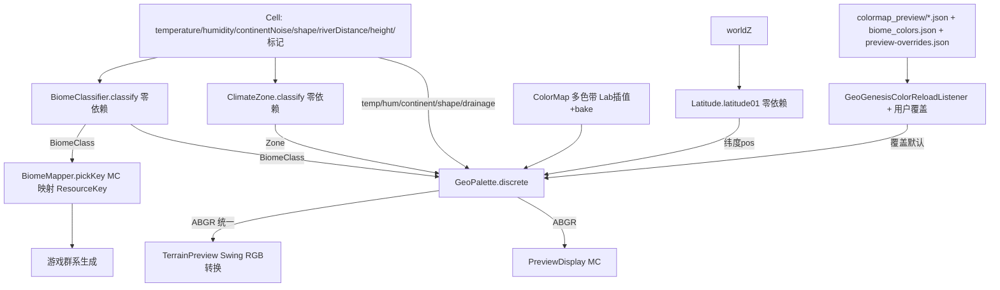

## 决策（2026-07-08，用户授权"你决定吧"）

采用 **方案 1：严格对齐 PLAN.md §2/§7 包结构**。

- `client/screen/PreviewColor` `PreviewDisplay` → 迁入 `client/preview/`
- `client/screen/GeoGenesisConfigScreen` `ParamSlider` → 迁入 `client/`（配置 GUI）
- 删除空包 `client/screen/`
- 同步更新 `GeoGenesisClient` / `GeoGenesisForgeEvents` 的 import

## 用户需求

在已确认"全面完善预览 + 按地理标准补图层 + 配色数据驱动"的基础上，第四轮确认：应把 `World-Preview-TFC` 参考项目的**整套范式**都借鉴，而非只看配色。用户明确认可该模组"非常合适"。

## 产品概述

将 GeoGenesis 两套预览（独立 Swing `TerrainPreview`、MC 内 `PreviewDisplay`/`GeoGenesisConfigScreen`）统一升级为一套**地理标准图层集**（高程/温度/湿度/大陆性/地形起伏/水文场/纬度/气候带/群系/地形类型/海陆 + 水文叠加）。配色采用 TFC 式**数据驱动**（`ColorMap` 色带 + 多内置调色板 + JSON 资源/用户覆盖），分类逻辑与配色彻底解耦。同时借鉴 TFC 的**图层注册表、数据驱动图例侧栏（含搜索）、分辨率/质量切换、用户覆盖文件 + 缺失映射报告**等范式，并修复 MC 拖拽卡顿。

## 核心特性

- **11 个地理标准图层 + 水文叠加**，两套预览共用同一套零依赖着色/分类规则：

1. ELEVATION 高程（height，min/max 自动缩放，色带可选）
2. TEMPERATURE 温度（cell.temperature）
3. HUMIDITY 湿度（cell.humidity）
4. CONTINENTALITY 大陆性（cell.continentNoise [-1,1]，对应 TFC continentalness）
5. RELIEF 地形起伏（cell.shape [-1,1]，erosion 类比）
6. DRAINAGE 水文场（cell.riverDistance [0,1]，河/湖掩码叠加）
7. LATITUDE 纬度带（worldZ 现算 `|z|*0.0016`）
8. CLIMATE_ZONE 气候带（Köppen 简版 A/B/C/D/E）
9. BIOME 群系（零依赖 `BiomeClassifier`，复用 `BiomeMapper` 规则）
10. TERRAIN_TYPE 地形类型（对齐游戏布尔标记）
11. LAND_OCEAN 海陆底图（海洋/陆地 + 湖/河）

- HYDROLOGY 水文叠加层（R 键，可叠加任意图层）

- **数据驱动配色（用户纠偏核心，对齐 TFC）**：移植 TFC `ColorMap`（停靠点 + Lab 插值 + `bake()` LUT）；内置多套色带（inferno/viridis/plasma/magma/cividis/grayscale + 语义色带）；`GeoPalette` 集中持有所有默认色，MC 侧经 `colormap_preview/*.json` + `biome_colors.json` 资源与 `config/geogenesis/preview-overrides.json` 用户文件覆盖；Swing 仅用内置默认。无任何图层/群系 RGB 散落硬编码。

- **图层注册表（对齐 TFC RenderMode）**：`GeoPalette.PreviewLayer` 枚举携带元数据（连续/离散、labelKey、默认色带 key、是否进图例、默认可见、分组），取代裸 switch。

- **数据驱动图例侧栏（对齐 TFC BiomesList）**：离散图层图例从 `GeoPalette` 离散映射（color + name）生成，支持名称搜索/过滤；MC 侧栏 + Swing 图例面板共用数据。

- **分辨率/质量切换（对齐 TFC pixelsPerChunk）**：两套预览加采样分辨率切换，影响采样密度与性能。

- **分类与配色解耦**：`BiomeClassifier`/`ClimateZone`/`Latitude` 仅 O(1) 分类、不持颜色；颜色全经 `GeoPalette` 查表；`BiomeMapper` 委托同一分类器，游戏群系行为不变。

- **MC 拖拽卡顿修复**：视图缓存 + 旧帧仿射重映射 + 增量重算暴露区 + early-abort（沿用原方案，参考 TFC early-abort 思路，不照搬完整 WorkManager 异步体系）。

## 技术栈

- Java 21 + Minecraft Forge 1.20.1（沿用现有工程，无新增依赖）
- 现有零依赖地形引擎 `worldgen/terrain/`（Cell / GeoGenesisTerrain / BasicClimate）
- 现有零依赖着色 `PreviewColor`（当前在 `client/screen/`，本任务迁至 `client/preview/`，仅 import Cell，输出 NativeImage ABGR `0xAABBGGRR`）
- 参考 `World-Preview-TFC-main` 的 `ColorMap` / `ColormapReloadListener` / `BiomeColorMapReloadListener` / `PreviewMappingData` / `RenderSettings.RenderMode` 数据驱动范式

## 实现方案

### 核心策略

把"地理标准分层 + 数据驱动配色 + 图层注册表"拆成**零依赖分类器**、**零依赖配色中枢（含多色带与图层注册表）**、**零依赖着色外观**三层，两套预览（Swing RGB / MC ABGR）共用，仅"像素格式写入"与"交互壳"因框架差异各自保留。

1. **零依赖分类器（仅分类，不持颜色）**

- `BiomeClassifier`（`worldgen/climate`）：`classify(Cell)→BiomeClass` 枚举，规则从 `BiomeMapper.pickKey` 迁入（ocean 按 temp + `shape<-0.55` 判 deep；beach/peak/mountain/snow 特判；陆地 temp×humidity 带）。枚举**不带 color 字段**。
- `ClimateZone`（`worldgen/climate`）：Köppen 简版 `classify(Cell)→Zone{A/B/C/D/E+亚型}`（temp<0.2 极地 E；t<0.4 寒带 D；h<0.33 干旱 B；t>0.66 热带 A；其余温带 C）。
- `Latitude`（`worldgen/climate`）：`latitude01(worldZ)=clamp(|z|*0.0016,0,1)` 纯几何带。
- `Continentality`/`Relief`/`Drainage` 仅对 `Cell` 字段取值（无需新类）。
- `BiomeMapper.pickKey` 改为先 `BiomeClassifier.classify` 再 switch 映射回 `ResourceKey<Biome>`，**游戏行为完全不变**。

2. **零依赖配色中枢（取代硬编码，对齐 TFC）**

- 移植 `ColorMap`（`client/preview`，纯 Java，不 import MC）：停靠点 `[R,G,B]`（归一化 [0,1]）+ **Lab 空间插值** + `bake()` 预热 LUT。用于连续图层。
- 内置多套色带：inferno/viridis/plasma/magma/cividis/grayscale + 语义色带 temperature/humidity/continentality/relief/drainage/latitude/elevation（格式 `{name, data:[[r,g,b]...]}`）。
- 新增 `GeoPalette`（`client/preview`，零依赖）：
    - `PreviewLayer` 注册表枚举：每个图层含 `{ kind(CONTINUOUS/DISCRETE), labelKey, defaultColormapKey, legendable, defaultVisible, group }`。
    - 连续色带：各图层绑定 ColorMap；高程支持 `setElevationRange(min,max)` 自动缩放。
    - 离散映射：`biome`(BiomeClass→色)/`climateZone`(Zone→色)/`terrainType`/`landOcean` 的 key→色。
    - 接口：`continuous(Layer,pos)→ABGR` 与 `discrete(Layer,id)→ABGR`。
    - 内置默认值结构化常量（Swing 零依赖直接可用）；MC 侧额外支持 JSON 资源覆盖 + config 目录用户覆盖文件。

3. **MC 侧资源/用户覆盖（对齐 TFC）**

- 新增 `colormap_preview/geogenesis.json`（多色带停靠点）与 `biome_colors.json`（离散类→色）默认资源。
- 新增 `GeoGenesisColorReloadListener`（继承 MC 资源 reload 基类）覆盖 `GeoPalette` 内置默认；在 `AddReloadListenerEvent` 注册。
- ★ 新增 `config/geogenesis/preview-overrides.json` 用户覆盖文件（无需资源包即可重着色）；可选 `missing-mappings.json` 调试报告。
- Swing 侧不读 MC 资源/配置，仅用内置默认。

4. **扩展 PreviewColor（ABGR 统一）**

- 改为委托 `GeoPalette`：`temperature/humidity/continentality/relief/drainage/latitude/climateZone/biome/terrainType/landOcean` 静态方法；保留 `heightmap`（改用 elevation 色带自动缩放）/ `landWater`。Swing 侧加一处 ABGR→RGB 转换，逻辑共用。

5. **两套预览各扩到 11 图层 + 叠加 + 交互**

- MC `PreviewDisplay`：mode 0..10；视图缓存 + early-abort 消除拖拽卡顿；离散图层图例查 `GeoPalette`；★ 分辨率/质量切换；★ 高程色带选择。
- MC `GeoGenesisConfigScreen`：图层按钮网格化（3×4）；图层名本地化 `lang/en_us.json` + `lang/zh_cn.json`；★ 色带/分辨率控件。
- Swing `TerrainPreview`：数字键 1–11 选图层 + 字母别名（H/T/B/C/L…）；修 H/T 语义；类型对齐游戏布尔标记；★ 图例面板（从 `GeoPalette` 离散映射生成，含名称搜索过滤）；tooltip 加纬度/气候带/大陆性/起伏；★ 分辨率切换。
- 水文叠加层（R 键）独立于图层，可叠加任意图层。

### 关键技术决策与权衡

1. **数据驱动配色是用户明确纠偏点**：TFC 逻辑里无群系 RGB 硬编码，全部来自 `ColorMap` 色带 JSON + `biome_colors.json` + 用户覆盖。本项目严格对齐——`ColorMap` 原样移植思路，`GeoPalette` 集中所有默认色，MC 侧提供资源 + config 覆盖通道，杜绝枚举写死颜色。
2. **图层注册表（对齐 TFC RenderMode）**：用带元数据的 `PreviewLayer` 枚举取代裸 `switch(mode)`，新增图层只需加枚举项 + 注册默认色带/离散映射，符合开闭原则。
3. **分类与配色解耦**：分类器零依赖无色，配色全在 `GeoPalette` 查表；新增/改配色不需动分类逻辑；Swing（零 MC 依赖）也能用同一套配色。
4. **温度/湿度/大陆性/起伏/水文场拆独立图层**：原 `climate` 把 temp+humidity 合成 RGB 无法逐项校验气候模型。拆成独立连续色带后，可直观核对 BasicClimate/地形引擎输出。
5. **纬度与温度区分**：温度含噪声，纬度是纯几何带，独立成层避免误导。
6. **地形类型对齐游戏布尔标记**：Swing 原类型视图用 `cell.shape` 百分位自适应分 Hill/Mountain/Peak，与游戏 `isPeak/isMountain/isSnow` 不一致；改用 `terrainType` 着色，移除 `A` 自适应逻辑。
7. **MC 拖拽卡顿修复**：`mouseDragged` 当前每次 `requestResample()` 全量重算 256×256。改为缓存上一纹理与视口 + early-abort，拖拽时用旧帧仿射重映射、仅后台重算新暴露区，交互顺滑。
8. **像素格式差异**：`PreviewColor` 输出 ABGR，Swing 用 `0xRRGGBB`，Swing 侧加一处统一 ABGR→RGB 转换。
9. **性能范围控制**：不照搬 TFC 的 Dummy Minecraft Server 采样与完整 WorkManager（本项目用自有零依赖地形引擎，确定性且便宜），仅借鉴 early-abort 与视图缓存思路，避免大规模架构改动与回归风险。
10. **"不做"边界**：不实现群系搜索/种子保存 UI（除非后续要求）；不实现结构叠加（GeoGenesis 预览不含结构生成）。

### 性能与可靠性

- `BiomeClassifier`/`ClimateZone`/`Latitude` 均为 O(1) 纯函数，无对象分配，热路径零开销。
- `ColorMap` 在 `GeoPalette` 初始化时 `bake()` 预热整条 LUT（每图层一组 int[]），渲染时按 position 直接查表，无运行期插值分配。
- MC 视图缓存 + early-abort 把拖拽从"每像素移动全量重算"降为"旧帧变换 + 增量重算"，卡顿消除；内存仅多持一份 256×256 纹理（可忽略）。
- `BiomeMapper` 重构仅迁移规则，`allKeys()` 与映射结果集合不变，`runClient` 目检群系分布应与原结果一致（回归安全）。

## 架构设计



## 目录结构（对齐 PLAN.md §2 包结构 / §7 preview 成员）

```
forge-1.20.1-47.4.10-mdk/src/main/java/com/geogenesis/
├── worldgen/
│   ├── climate/                          # [PKG] 对齐 PLAN.md §2：climate 包（BasicClimate/ClimateSystem/ClimateSettings 同处）
│   │   ├── BiomeClassifier.java          # [NEW] 零依赖 classify(Cell)→BiomeClass 枚举（无 color 字段）；规则迁自 BiomeMapper
│   │   ├── ClimateZone.java              # [NEW] 零依赖 Köppen 简版 classify(Cell)→Zone{A/B/C/D/E+亚型}
│   │   └── Latitude.java                 # [NEW] 零依赖 latitude01(worldZ)=clamp(|z|*0.0016,0,1)
│   ├── generator/
│   │   ├── GeoGenesisGenerator.java      # [EXIST] 不动
│   │   ├── GeoGenesisBiomeSource.java    # [EXIST] 不动
│   │   └── BiomeMapper.java             # [MODIFY] pickKey 先 classify 再映射 ResourceKey，游戏行为不变；删除内联 oceanKey/landKey
│   └── config/GeoGenesisConfig.java      # [EXIST] 不动
└── client/
    ├── GeoGenesisConfigScreen.java       # [RELOCATE] 从 client/screen/ 移入，对齐 PLAN.md §2（配置 GUI）
    └── preview/                          # [PKG] 对齐 PLAN.md §2/§7：渲染/热力图/叠加/控制面板
        ├── TerrainPreview.java           # [MODIFY] 11 图层视图；修 H/T 等快捷键；地形类型对齐游戏；图例面板(搜索过滤)；分辨率切换
        ├── PreviewDisplay.java           # [RELOCATE] 从 client/screen/ 移入（游戏内预览 overlay）
        ├── PreviewColor.java             # [RELOCATE+MODIFY] 从 client/screen/ 移入；委托 GeoPalette 输出 11 图层 ABGR；保留 heightmap/landWater
        ├── ColorMap.java                 # [NEW] 零依赖色带（移植 TFC）：停靠点+Lab插值+bake LUT；不 import MC
        ├── GeoPalette.java               # [NEW] 零依赖配色中枢：PreviewLayer 注册表 + 多内置色带 + 离散映射 + 用户覆盖接口
        └── GeoGenesisColorReloadListener.java # [NEW] MC 资源 reload 覆盖 GeoPalette（对齐 TFC）
        # PLAN.md §7 预留同包成员（本任务不新建，仅标注归属）：
        #   HeatmapRenderer.java  Cell[][]→2D 热力图渲染
        #   LayerOverlay.java     图层叠加（riverDistance/坡度/气候/discharge）
        #   ControlPanel.java     参数滑块面板（后期）

（资源）src/main/resources/
    ├── lang/en_us.json + zh_cn.json       # [MODIFY] 新增 geogenesis.layer.* / geogenesis.colormap.* 等
    ├── colormap_preview/geogenesis.json   # [NEW] 多色带停靠点（覆盖 GeoPalette 默认）
    └── biome_colors.json                  # [NEW] 群系/类型离散色映射（覆盖 GeoPalette 默认）
    # config/geogenesis/preview-overrides.json 运行时由代码写入（用户覆盖，无需资源包）

（文档）AGENTS.md / ARCHITECTURE.md / .codebuddy/memory/HANDOFF.md  # [MODIFY] 更新图层、数据驱动配色、图例与快捷键
```

## 关键代码结构

```java
// client/preview/ColorMap.java —— 零依赖色带（移植自 TFC，不 import net.minecraft）
public final class ColorMap {
    public ColorMap(String name, float[][] stops);          // 归一化 [R,G,B]∈[0,1] 停靠点
    public int getARGB(float position);                      // 单点查询（NativeImage ABGR）
    public int[] bake(int numValues);                        // 预热整条 LUT，渲染热路径零分配
}

// client/preview/GeoPalette.java —— 零依赖配色中枢（内置默认 + 可被 MC 资源/用户覆盖）
public final class GeoPalette {
    public enum Kind { CONTINUOUS, DISCRETE }
    public enum PreviewLayer {
        ELEVATION(Kind.CONTINUOUS, "geogenesis.layer.elevation", "elevation", true, true),
        TEMPERATURE(Kind.CONTINUOUS, "geogenesis.layer.temperature", "temperature", true, true),
        HUMIDITY(Kind.CONTINUOUS, "geogenesis.layer.humidity", "humidity", true, true),
        CONTINENTALITY(Kind.CONTINUOUS, "geogenesis.layer.continentality", "continentality", true, false),
        RELIEF(Kind.CONTINUOUS, "geogenesis.layer.relief", "relief", true, false),
        DRAINAGE(Kind.CONTINUOUS, "geogenesis.layer.drainage", "drainage", true, false),
        LATITUDE(Kind.CONTINUOUS, "geogenesis.layer.latitude", "latitude", true, false),
        CLIMATE_ZONE(Kind.DISCRETE, "geogenesis.layer.climate_zone", "climateZone", true, true),
        BIOME(Kind.DISCRETE, "geogenesis.layer.biome", "biome", true, true),
        TERRAIN_TYPE(Kind.DISCRETE, "geogenesis.layer.terrain_type", "terrainType", true, true),
        LAND_OCEAN(Kind.DISCRETE, "geogenesis.layer.land_ocean", "landOcean", true, true);
        public final Kind kind; public final String labelKey; public final String colormapKey;
        public final boolean legendable; public final boolean defaultVisible;
    }
    public static int continuous(PreviewLayer layer, double pos);  // pos∈[0,1] → ABGR
    public static int discrete(PreviewLayer layer, int id);        // id（枚举 ordinal 或类型键）→ ABGR
    public static void setElevationRange(int min, int max);        // 高程自动缩放
    public static void applyOverrides(/* parsed json */);          // MC 资源/用户覆盖
}

// worldgen/climate/BiomeClassifier.java —— 零依赖群系分类（不 import net.minecraft，无色字段）
public enum BiomeClass { OCEAN, DEEP_OCEAN, COLD_OCEAN, /* ... 覆盖 BiomeMapper.allKeys 全部 ... */ SWAMP }
public final class BiomeClassifier {
    public static BiomeClass classify(Cell c); // O(1) 纯函数
}
```