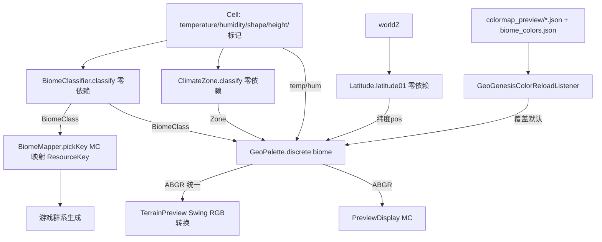

> **状态（2026-07-09）**：本计划全部工作已完成，且被正式完成版 `preview-enhancement-geo-layers_a5b27bc5.md` 取代（后者即本数据驱动配色方案的最终落地版）。本早期草案作废，保留仅作历史参考。

## 用户需求

用户要求完善 GeoGenesis 的两套地形预览（独立 Swing 窗口 `TerrainPreview`、MC 内 `PreviewDisplay`/`GeoGenesisConfigScreen`）。在先前确认"全面完善"与"按地理标准补充图层（温度/湿度/纬度/气候带等）"的基础上，用户第三轮纠偏指出：**配色不能硬编码**，必须像参考项目 `World-Preview-TFC` 那样**数据驱动**——通过 `ColorMap` 色带 + JSON 资源 + 运行时 reload + 用户覆盖自动配置，而非在群系枚举里写死 RGB。

## 产品概述

把两套预览统一升级为一套按地理标准组织的图层集（高程/温度/湿度/纬度/气候带/群系/地形类型/海陆 + 水文叠加）。核心是建立**零依赖、数据驱动的配色中枢**：移植 TFC 的 `ColorMap`（停靠点 + Lab 插值 + LUT 烘焙），集中到 `GeoPalette`（内置结构化默认 + MC 侧 JSON 资源可覆盖），所有图层着色与图例查表取色，彻底消除硬编码。分类逻辑（群系/气候带/纬度）抽成零依赖纯函数，与配色解耦，且 `BiomeMapper` 委托同一分类器保证"预览群系 == 游戏群系"。

## 核心特性

- **8 个地理标准图层 + 水文叠加**，两套预览共用同一套零依赖着色/分类规则：

1. ELEVATION 高程（保留高质量 Lab LUT 色带）
2. TEMPERATURE 温度（独立连续色带 冷蓝→暖红，用 `cell.temperature`）
3. HUMIDITY 湿度/降水（独立连续色带 干棕→湿蓝绿，用 `cell.humidity`）
4. LATITUDE 纬度带（纯几何 `|z|*0.0016`，与含噪温度区分）
5. CLIMATE_ZONE 气候带（Köppen 简版 A/B/C/D/E 离散分类）
6. BIOME 群系（零依赖 `BiomeClassifier`，复用 `BiomeMapper` 规则）
7. TERRAIN_TYPE 地形类型（对齐游戏布尔标记，不再用 shape 自适应）
8. LAND_OCEAN 海陆底图（海洋/陆地 + 湖/河）

- HYDROLOGY 水文叠加层（R 键），可叠加任意图层。
- **数据驱动配色（用户纠偏核心）**：移植 TFC `ColorMap` 机制，配色集中在 `GeoPalette`，内置结构化默认；MC 侧通过 `colormap_preview/*.json` 与 `biome_colors.json` 资源 + reload listener 覆盖，Swing 仅用内置默认。无任何群系/图层 RGB 散落硬编码。
- **分类与配色解耦**：`BiomeClassifier`/`ClimateZone`/`Latitude` 仅做 O(1) 分类、不持颜色；颜色全部经 `GeoPalette` 查表。
- **MC 预览修复**：拖拽改视图缓存 + 旧纹理仿射映射重绘 + 仅重算暴露区，消除卡顿；离散图层（群系/气候带/类型）加图例（图例色查 `GeoPalette`）。
- **Swing 预览完善**：扩到 8 图层视图、修正 H/T 快捷键语义、加 biome/zone/type 活图例、tooltip 增加纬度与气候带。
- **公共逻辑抽离**：两套预览共用 `GeoPalette` 与分类器，仅"像素格式写入（ABGR/RGB）"与"交互壳"因框架差异各自保留。

## 技术栈

- Java 21 + Minecraft Forge 1.20.1（沿用现有工程，无新增依赖）
- 现有零依赖地形引擎 `worldgen/terrain/`（Cell / GeoGenesisTerrain / BasicClimate）
- 现有零依赖着色 `client/screen/PreviewColor.java`（仅 import Cell，输出 NativeImage ABGR `0xAABBGGRR`）
- 参考 `World-Preview-TFC-main` 的 `ColorMap` / `ColormapReloadListener` / `BiomeColorMapReloadListener` 数据驱动配色范式

## 实现方案

### 核心策略

把"按地理标准分层 + 数据驱动配色"拆成**零依赖分类器**与**零依赖配色中枢**两层，两套预览（Swing RGB / MC ABGR）共用，仅"像素格式写入"与"交互壳"因框架差异各自保留。

1. **零依赖分类器（仅分类，不持颜色）**

- `BiomeClassifier`（`worldgen/terrain`）：`classify(Cell)→BiomeClass` 枚举，规则从 `BiomeMapper.pickKey` 迁入（ocean 按 temp 选变体 + `shape<-0.55` 判 deep；beach/peak/mountain/snow 特判；陆地 temp×humidity 带）。**枚举不带 color 字段**。
- `ClimateZone`（`worldgen/terrain`）：Köppen 简版 `classify(Cell)→Zone{A/B/C/D/E+亚型}`（temp<0.2 极地 E；t<0.4 寒带 D；h<0.33 干旱 B；t>0.66 热带 A；其余温带 C）。
- `Latitude`（`worldgen/terrain`）：`latitude01(worldZ)` 用 `latScale=0.0016` 算纯几何纬度带 `[0,1]`（赤道 0 / 两极 1），不含噪声。
- `BiomeMapper.pickKey` 改为先 `BiomeClassifier.classify` 再 switch 映射回 `ResourceKey<Biome>`，**游戏行为完全不变**。

2. **零依赖配色中枢（取代硬编码，对齐 TFC）**

- 移植 `ColorMap`（`client/screen`，纯 Java，不 import MC）：停靠点 `[R,G,B]` 数组 + **Lab 空间插值** + `bake()` 预热 LUT。用于连续图层。
- 新增 `GeoPalette`（`client/screen`，零依赖）：集中持有所有图层配色数据
    - 连续色带：`elevation/temperature/humidity/latitude` 各一组停靠点（ColorMap）。
    - 离散映射：`biome`(BiomeClass→色)、`climateZone`(Zone→色)、`terrainType`、`landOcean` 的 key→色。
    - 接口：`continuous(LayerKey,pos)→ABGR` 与 `discrete(LayerKey,id)→ABGR`。
    - **默认配色内嵌为结构化 Java 常量**（Swing 零依赖可直接用，不依赖文件 IO）；**MC 侧额外支持从 JSON 资源覆盖**（见第 3 点），对齐 TFC「内置默认 + 资源/用户覆盖」精神。

3. **MC 侧资源覆盖（对齐 TFC）**

- 新增 `colormap_preview/geogenesis.json`（连续色带停靠点）与 `biome_colors.json`（离散类→色）默认资源。
- 新增 `GeoGenesisColorReloadListener`（参照 TFC 两个 listener，继承 MC 资源 reload 基类），在资源 reload 时解析 JSON 覆盖 `GeoPalette` 内置默认；在 `AddReloadListenerEvent` 注册。Swing 侧不读 MC 资源，仅用内置默认。

4. **扩展 PreviewColor（ABGR 统一）**

- 改为委托 `GeoPalette`：`temperature/humidity/latitude/climateZone/biome/terrainType/landOcean` 静态方法；保留 `heightmap`（改用 elevation 色带）/ `landWater`。Swing 侧加一处 ABGR→RGB 转换，图层着色逻辑共用。

5. **两套预览各扩到 8 图层 + 水文叠加**

- MC `PreviewDisplay`：mode 0..7；加视图缓存消除拖拽卡顿；离散图层（biome/zone/terrainType）加图例（图例颜色查 GeoPalette）。
- MC `GeoGenesisConfigScreen`：模式按钮网格化（2×4）；图层名本地化到 `lang/en_us.json` 与 `lang/zh_cn.json`。
- Swing `TerrainPreview`：数字键 1–8 选图层 + 字母别名（H/T/B/C）；修 H/T 语义；类型配色对齐游戏布尔标记；biome/zone/type 活图例（查 GeoPalette）；tooltip 加纬度/气候带。
- 水文叠加层（R 键）独立于图层，可叠加任意图层。

### 关键技术决策与权衡

1. **数据驱动配色是用户明确纠偏点**：TFC 的逻辑里无任何群系 RGB 硬编码，全部来自 `ColorMap` 色带 JSON + `biome_colors.json` + 用户覆盖。本项目严格对齐——`ColorMap` 原样移植思路，`GeoPalette` 集中所有默认色，MC 侧提供 JSON 覆盖通道，Swing 仅用内置默认。杜绝"在枚举里写死颜色"。
2. **分类与配色解耦**：分类器零依赖且无色，配色全在 `GeoPalette` 查表。好处：新增/改配色不需动分类逻辑；预览与游戏共用同一分类器保证一致；Swing（零 MC 依赖）也能用同一套配色。
3. **温度/湿度拆独立图层**：原 `PreviewColor.climate` 把 temp+humidity 合成 RGB，无法逐项校验气候模型。拆成独立连续色带后，温度/湿度/纬度三张独立图可直观核对 BasicClimate 输出。
4. **纬度与温度区分**：温度含噪声（`1-|z|*0.0016+噪声`），纬度是纯几何带。新增 `Latitude` 独立算，避免"纬度带图"和"温度图"混淆误导。
5. **地形类型对齐游戏布尔标记**：原 Swing 类型视图用 `cell.shape` 百分位自适应分 Hill/Mountain/Peak，与游戏 `isPeak/isMountain/isSnow` 不一致；改用 `terrainType` 着色（与游戏相同判定），移除 `A` 自适应逻辑。
6. **MC 拖拽卡顿修复**：`mouseDragged` 当前每次 `requestResample()` 全量重算 256×256。改为缓存上一纹理与视口，拖拽时先用旧纹理仿射变换重绘、仅后台重算新暴露区（与 Swing 的 `lastFrame` 映射一致），交互顺滑。
7. **像素格式差异**：`PreviewColor` 输出 NativeImage ABGR，Swing 用 `0xRRGGBB`，Swing 侧加一处统一 ABGR→RGB 转换，图层着色逻辑共用。
8. **MC 资源覆盖不波及 Swing**：Swing 是独立 JVM（`runPreview`），不加载 MC 资源；JSON 覆盖仅在 MC 客户端生效，保证一致性同时不破坏零依赖预览。

### 性能与可靠性

- `BiomeClassifier`/`ClimateZone`/`Latitude` 均为 O(1) 纯函数，无对象分配，热路径零开销。
- `ColorMap` 在 `GeoPalette` 初始化时 `bake()` 预热整条 LUT（每图层一组 int[]），渲染时按 position 直接查表，无运行期插值分配。
- MC 视图缓存把拖拽从"每像素移动全量重算"降为"旧帧变换 + 增量重算"，卡顿消除；内存仅多持一份 256×256 纹理（可忽略）。
- `BiomeMapper` 重构仅迁移规则，`allKeys()` 与映射结果集合不变，`runClient` 目检群系分布应与原结果一致（回归安全）。

## 架构设计



## 目录结构

```
forge-1.20.1-47.4.10-mdk/src/main/java/com/geogenesis/
├── worldgen/
│   ├── terrain/
│   │   ├── BiomeClassifier.java   # [NEW] 零依赖：classify(Cell)→BiomeClass 枚举（无 color 字段）；规则迁自 BiomeMapper
│   │   ├── ClimateZone.java       # [NEW] 零依赖：Köppen 简版 classify(Cell)→Zone{A/B/C/D/E+亚型}
│   │   └── Latitude.java          # [NEW] 零依赖：latitude01(worldZ)=clamp(|z|*0.0016,0,1) 纯几何带
│   └── generator/
│       └── BiomeMapper.java        # [MODIFY] pickKey 先 classify 再映射 ResourceKey，游戏行为不变；删除内联 oceanKey/landKey
├── client/
│   ├── screen/
│   │   ├── ColorMap.java           # [NEW] 零依赖色带（移植 TFC）：停靠点+Lab插值+bake LUT；不 import MC
│   │   ├── GeoPalette.java         # [NEW] 零依赖配色中枢：内置默认色带/离散映射；continuous/discrete→ABGR
│   │   ├── GeoGenesisColorReloadListener.java # [NEW] MC 资源 reload 覆盖 GeoPalette（对齐 TFC）
│   │   ├── PreviewColor.java       # [MODIFY] 委托 GeoPalette 输出 8 图层 ABGR；保留 heightmap/landWater
│   │   ├── PreviewDisplay.java     # [MODIFY] mode 扩到 8；视图缓存消拖拽卡顿；离散图层图例查 GeoPalette
│   │   └── GeoGenesisConfigScreen.java # [MODIFY] 模式按钮网格 2×4；图层名本地化
│   └── preview/
│       └── TerrainPreview.java     # [MODIFY] 8 图层视图；修 H/T 等快捷键；地形类型对齐游戏；活图例查 GeoPalette；tooltip 加纬度/气候带
└── resources/.../
    ├── lang/en_us.json + zh_cn.json   # [MODIFY] 新增 geogenesis.layer.* 图层名
    ├── colormap_preview/geogenesis.json  # [NEW] 连续色带停靠点（覆盖 GeoPalette 默认）
    └── biome_colors.json                # [NEW] 群系/类型离散色映射（覆盖 GeoPalette 默认）

（文档）AGENTS.md / ARCHITECTURE.md / .codebuddy/memory/HANDOFF.md  # [MODIFY] 更新图层、配色数据驱动说明与快捷键
```

## 关键代码结构

```java
// client/screen/ColorMap.java —— 零依赖色带（移植自 TFC，不 import net.minecraft）
public final class ColorMap {
    /** 停靠点为归一化 [R,G,B]∈[0,1]；position∈[0,1] 在停靠点间 Lab 插值。 */
    public ColorMap(String name, float[][] stops);
    public int getARGB(float position);      // 单点查询（NativeImage ABGR）
    public int[] bake(int numValues);        // 预热整条 LUT，渲染热路径零分配
}

// client/screen/GeoPalette.java —— 零依赖配色中枢（内置默认 + 可被 MC 资源覆盖）
public final class GeoPalette {
    public enum Layer { ELEVATION, TEMPERATURE, HUMIDITY, LATITUDE, CLIMATE_ZONE, BIOME, TERRAIN_TYPE, LAND_OCEAN }
    /** 连续色带查表：pos∈[0,1] → ABGR。 */
    public static int continuous(Layer layer, double pos);
    /** 离散映射查表：id（枚举 ordinal 或类型键）→ ABGR。 */
    public static int discrete(Layer layer, int id);
    /** MC 资源 reload 时调用，用 JSON 停靠点/映射覆盖内置默认。 */
    public static void applyOverrides(/* parsed json */);
}

// worldgen/terrain/BiomeClassifier.java —— 零依赖群系分类（不 import net.minecraft，无色字段）
public enum BiomeClass { OCEAN, DEEP_OCEAN, COLD_OCEAN, /* ... 覆盖 BiomeMapper.allKeys 全部 ... */ SWAMP }
public final class BiomeClassifier {
    /** Cell → 群系分类：温度带 × 湿度带 × 地形标记（海洋/海滩/雪峰/山坡特判）。O(1) 纯函数。 */
    public static BiomeClass classify(Cell c);
}
```
