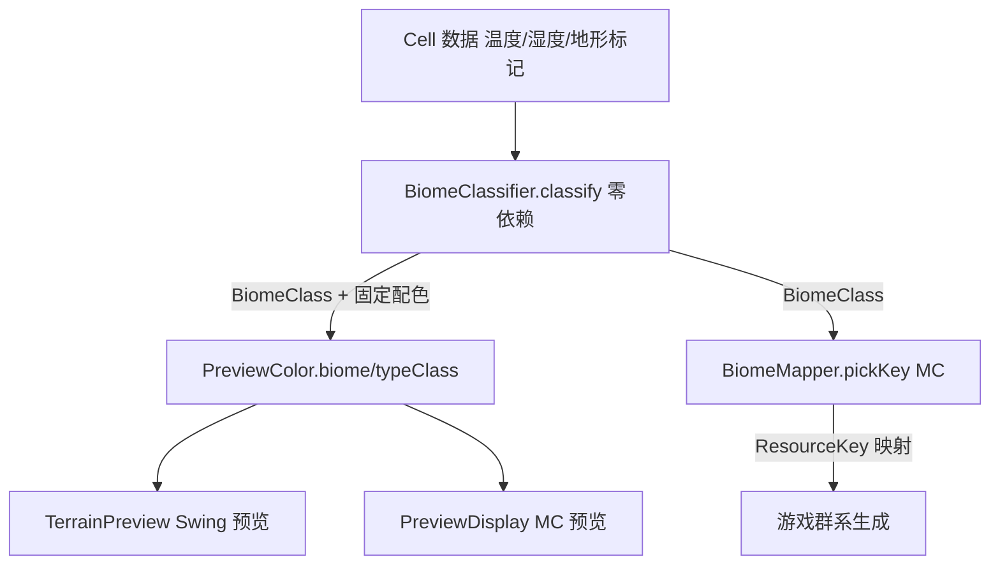

> **状态（2026-07-09）**：本计划全部工作已完成，且与 `preview-enhancement-geo-layers_a5b27bc5.md` 内容重合（后者为正式完成版，且进一步升级为 11 图层 + 数据驱动配色）。其中配置屏 UI 修复（WorldHeightBar 重叠 / 底部空白 / 滚动裁剪）已落地，详见 `DEV_REPORT.md` §7.8。本文件作废，保留仅作历史参考。

## 用户需求

用户确认预览功能需**全面完善**，范围为：群系视图 + 抽公共渲染逻辑消除两套重复 + 修 MC 拖拽卡顿/加类型图例 + 补 Swing 气候视图/修快捷键语义。

## 产品概述

项目现有两套预览（独立 Swing 窗口 `TerrainPreview` 与 MC 内 `PreviewDisplay`/`GeoGenesisConfigScreen`）并存且能力不对称。本次在刚完成的 P5「气候→群系」基础上，让两套预览都能按"游戏实际群系"着色验证映射结果，并消除重复、补齐缺口、修复卡顿。

## 核心特性

- **群系视图（biome）**：两套预览新增 biome 模式，复用同一套"Cell → 群系分类"零依赖规则，预览显示的群系与游戏生成的群系完全一致，可直接验证气候→群系映射。
- **公共渲染逻辑**：把"着色"与"群系分类"抽成零依赖模块，两套预览共用，消除坐标/着色重复实现。
- **Swing 补齐**：新增 climate 着色视图、biome 视图与 biome 活图例；修正 H/T 快捷键语义（H=高度、T=类型、B=群系、C=气候）；类型视图配色对齐游戏判定（isPeak/isMountain/isSnow），不再用 shape 自适应阈值。
- **MC 补齐**：新增 biome/typeClass 模式；拖拽改为视图缓存 + 旧帧变换重绘 + 仅重算暴露区，消除每帧全量重算卡顿；新增类型/群系图例；配置屏模式按钮增到 5 个。

## 技术栈

- Java 21 + Minecraft Forge 1.20.1（沿用现有工程，无新增依赖）
- 现有零依赖地形引擎 `worldgen/terrain/`（Cell / GeoGenesisTerrain）
- 现有零依赖着色 `client/screen/PreviewColor.java`（仅 import Cell）

## 实现方案

### 核心策略

把"Cell → 群系分类"的规则从 `BiomeMapper`（依赖 net.minecraft，Swing 不可用）迁出一个**零依赖**的 `BiomeClassifier`（`worldgen/terrain/`，不 import MC），输出 `BiomeClass` 枚举 + 固定配色。两处预览与 `BiomeMapper` 都委托它：`BiomeMapper.pickKey` 先 `classify` 再映射回 `ResourceKey<Biome>`（游戏行为不变）；Swing 直接读 `BiomeClass` 配色。着色支点 `PreviewColor` 扩展 `biome()`/`typeClass()` 静态方法，两套预览共用，实现"预览群系 == 游戏群系"且消除重复。

### 关键技术决策与权衡

1. **零依赖分类器是消除重复的前提**：Swing 预览零 MC 依赖，`BiomeMapper` 因 import `net.minecraft` 不可达。抽 `BiomeClassifier` 到 terrain 包（零依赖），是让"预览与游戏共用同一映射规则"的唯一干净做法，避免双份规则日后漂移。
2. **PreviewColor 作为着色支点**：已确认仅 import Cell（零依赖），Swing 与 MC 均可调用。扩展 `biome`/`typeClass` 后，两套预览的"按模式上色"统一，仅"写入像素/交互壳"因 Swing vs MC AbstractWidget 框架差异各自保留。
3. **类型视图对齐游戏判定**：原 Swing 类型视图用 `cell.shape` 百分位自适应分 Hill/Mountain/Peak，与游戏 `isPeak/isMountain/isSnow` 布尔标记不一致。`typeClass` 改用与游戏相同的布尔标记判定，保证预览类型 == 游戏地形类型。
4. **MC 拖拽卡顿修复**：当前 `mouseDragged` 每次 `requestResample()` 全量重算 256×256 上色 + terrain 采样。改为缓存上一纹理与视口，拖拽时先用旧纹理按仿射变换重绘、仅后台重算新暴露区（与 Swing 的 lastFrame 映射思路一致），交互顺滑且不丢帧。
5. **快捷键语义修正（Swing）**：原 H/T 是同一 toggle 的两个别名（误导）。改为 H=高度、T=类型、B=群系、C=气候；类型"取消选择"改为点击图例项 toggle（再点同项即取消），释放 C 给气候视图。

### 性能与可靠性

- `BiomeClassifier.classify` / `PreviewColor.biome`/`typeClass` 均为 O(1) 纯函数，无对象分配，热路径零开销。
- MC 视图缓存把拖拽从"每像素移动全量重算"降为"旧帧变换 + 增量重算"，卡顿消除，内存仅多持一份 256×256 纹理（可忽略）。
- `BiomeMapper` 重构仅迁移规则，映射结果集合与 `allKeys()` 不变，`runClient` 目检群系分布应与原结果一致（回归安全）。

## 实现注意事项

- `BiomeClassifier` 必须零依赖：严禁 import `net.minecraft.*`；配色用 RGB int 常量。
- `BiomeMapper.pickKey` 委托 `BiomeClassifier.classify` 后 switch 映射回 `ResourceKey<Biome>`，务必逐分支核对与现有 `oceanKey`/`landKey` 输出完全一致（含 deep 判定 `c.shape < -0.55`）。
- MC 视图缓存需处理 `done`/`computing` 竞态：拖拽中重算完成前用旧纹理，完成后切新纹理，避免闪烁/撕裂。
- Swing 的 height 视图保留现有 Lab LUT（视觉优于 `PreviewColor.heightmap` 三段硬切），仅 biome/climate/type 改用公共 `PreviewColor`，不退化现有高度渲染质量。
- 改完务必 `gradlew build` 编译验证，再 `runClient`（G 键打开配置屏切各模式）+ `runPreview`（各快捷键）目检群系/气候/类型一致性。

## 架构设计



## 目录结构

```
forge-1.20.1-47.4.10-mdk/src/main/java/com/geogenesis/
├── worldgen/
│   ├── terrain/
│   │   └── BiomeClassifier.java    # [NEW] 零依赖：Cell → BiomeClass 枚举 + 每群系固定配色；
│   │                              #   classify(Cell) 复用原 BiomeMapper 的温度带×湿度带×地形标记规则
│   └── generator/
│       └── BiomeMapper.java        # [MODIFY] pickKey 先 classify 再映射 ResourceKey，游戏行为不变；
│                                  #   删除内联 oceanKey/landKey，委托 BiomeClassifier
├── client/
│   ├── screen/
│   │   ├── PreviewColor.java       # [MODIFY] 扩展 biome(Cell)/typeClass(Cell) 静态着色（查 BiomeClassifier 配色）；
│   │                              #   保持零依赖，统一供 Swing 与 MC 共用
│   │   ├── PreviewDisplay.java     # [MODIFY] 新增 biome(3)/typeClass(4) 模式；加视图缓存消除拖拽卡顿；
│   │                              #   新增类型/群系图例绘制
│   │   └── GeoGenesisConfigScreen.java # [MODIFY] 模式按钮由 3 增到 5（height/land/climate/biome/type）
│   └── preview/
│       └── TerrainPreview.java     # [MODIFY] 新增 biome/climate 视图与 biome 活图例；
│                                  #   快捷键 H=高度/T=类型/B=群系/C=气候；类型配色改用 PreviewColor.typeClass
└── （文档）
    ├── AGENTS.md / ARCHITECTURE.md / .codebuddy/memory/HANDOFF.md  # [MODIFY] 更新预览模式与快捷键说明
```

## 关键代码结构

```java
// worldgen/terrain/BiomeClassifier.java —— 零依赖群系分类（不 import net.minecraft）
public enum BiomeClass {
    OCEAN, DEEP_OCEAN, COLD_OCEAN, /* ... 覆盖 BiomeMapper.allKeys 全部 ... */ SWAMP;
    public int color(); // 每群系固定 RGB 配色
}

public final class BiomeClassifier {
    /** Cell → 群系分类：温度带 × 湿度带 × 地形标记（海洋/海滩/雪峰/山坡特判）。O(1) 纯函数。 */
    public static BiomeClass classify(Cell c);
}

// client/screen/PreviewColor.java —— 扩展零依赖公共着色（仅 import Cell）
public final class PreviewColor {
    public static int biome(Cell c);     // 查 BiomeClassifier 配色
    public static int typeClass(Cell c); // 按 isOcean/isBeach/isSnow/isPeak/isMountain 分类配色（与游戏一致）
}
```
