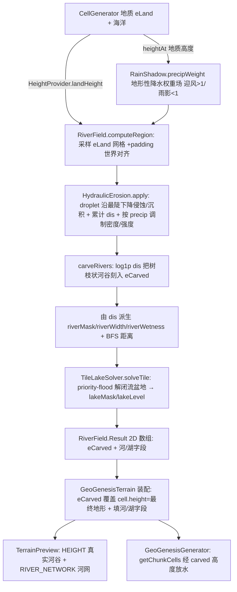

## 用户需求

河流系统从「D8 拓扑妥协（只标 riverMask 不刻地形）」整体重构为**物理正确的 droplet 水力侵蚀**，并实现「侵蚀=地形=河流」一体化。

## 核心特性

- **水滴沿坡侵蚀刻河谷**：每个 region 在地质 `eLand` 高度场上撒水滴，沿最陡下降（双线性梯度）流动，沿途侵蚀/沉积并累计 `dis` 流量场；`carveRivers` 按 `log1p(dis)` 把树枝状河谷刻入 `eLand`。流向完全由地形梯度决定，河流形态自然涌现。
- **刻蚀后 eLand 即最终地形（预览与 MC 共用）**：不再把侵蚀隔离为"预览专用覆盖层"。region 装配阶段产出 `eCarved` 网格，直接作为 `cell.height` 的最终来源，预览与 MC 真实世界走同一条采样路径。
- **雨影作为侵蚀输入（因果正向）**：地形（山脉）→ 迎风抬升多雨/背风雨影少雨（RainShadow 地形性降水）→ 降水权重场 → 调制 droplet 的 spawn 密度与侵蚀强度（迎风水多刻深、雨影坡水少刻浅）。droplet 侵蚀本质即模拟降水沿坡流动，雨影是侵蚀的条件而非输出。
- **闭流盆地成湖**：`TileLakeSolver` 在侵蚀后高度上 priority-flood 填洼，按深度/面积阈值提取湖泊（mask + 水面高度）。
- **确定性 + 跨区无缝**：region 级一次计算并缓存；统一世界↔网格坐标约定 + padding 对称外扩，相邻 region 共享边界世界坐标 → 无接缝。修复备份"xz 局部错位"根因（h 网格原点 / dis 缓冲偏移 / carveRivers 读索引三者不一致）。
- **预览物理可见**：加 `RIVER_NETWORK` 图层（按 `riverNetDischarge` 上色）直接看到河网；HEIGHT 图层看到真实河谷。

## 技术栈

- Java 17 / Forge 1.20.1；零 MC 依赖纯 Java 引擎（`worldgen/river`、`worldgen/terrain`），与 `TerrainBlender`/`StructuralField`/`RainShadow` 同层。
- 复用 `CellGenerator`（实现 `HeightProvider`：`landHeight` 返回未刻蚀地质 `eLand`、海洋 `NaN`）作为侵蚀基网格采样入口；复用 `GeoGenesisTerrain` 的 512-block region 缓存与 `computeChunkCells`/`getRegionCells` 装配链。
- 下游沿用 `GeoPalette.PreviewLayer` 枚举、`TerrainPreview`、`GeoGenesisGenerator`（放水）、`BiomeSource`（气候选群系，不变）。

## 实现方案

### 策略

把河流生成从「D8 拓扑标签」替换为 **droplet 水力侵蚀刻河谷 + priority-flood 填湖**，并将侵蚀提升为地形产线的一等公民：region 装配时先由 `HeightProvider` 采样确定性地质 `eLand` 网格（+padding 世界对齐），叠加由 `RainShadow.precipWeight` 算出的地形性降水权重场，在其上跑 `HydraulicErosion`（沿最陡下降侵蚀/沉积 + 累计 `dis` + `carveRivers` 下切），再 `TileLakeSolver` 解闭流盆地。结果以 **2D 网格数组**（`eCarved`/`dis`/`riverMask`/`riverWidth`/`riverWetness`/`lakeMask`/`lakeLevel`）形式缓存；装配阶段用 `eCarved` 覆盖 `cell.height`（即最终地形），并把河/湖字段写入 `Cell`。预览与 MC 经 `getChunkCells`/`getRegionCells` 共用同一份结果。

### 关键技术决策

1. **droplet 侵蚀 > D8 拓扑（已确认）**：D8 只算拓扑不刻地形，河流只是蓝线标签；droplet 天然产出 `dis` 流量场并以物理正确的「最陡下降」为流向，河谷随流量由浅到深、有机不规则，河流形态完全涌现，无需额外河网雕刻系统。
2. **侵蚀与地形一体（选项 A，用户纠正）**：刻蚀后 `eLand` 直接成为 `cell.height` 的最终来源，移除"先预览后 MC"的割裂。代价仅是侵蚀在 region 装配时多跑一次（已缓存），但换来真实河谷进入 MC 世界与预览一致。
3. **雨影为侵蚀输入（因果正向，用户纠正）**：新增 `RainShadow.precipWeight(x,z)` 复用既有上风采样逻辑返回降水乘子（迎风>1、雨影<1），作为 `HydraulicErosion.apply` 的 `precip[][]` 参数，调制每格水滴 spawn 概率与 `erodeMul`/`deposit` 强度。降水由地质地形（山脉）驱动，侵蚀在降水之后——因果不倒置。
4. **网格结果取代线段结果**：`RiverField.Result` 改为持有 2D 数组，与现有 `RegionRiverArrays`（本就是 2D 数组）契合，删除 `RiverNetwork.Seg` 线段结构与线段栅格化。
5. **xz 错位修复（必做）**：统一坐标约定——`h[i][j]`/`dis[i][j]` 同尺寸同索引，对应世界 `(ox + i*step, oz + j*step)`；padding 对称外扩，相邻 region 在共享边界取相同世界坐标 → 侵蚀/河谷跨区无接缝。开发期（GEO_RIVER_DEBUG）加 region 接缝一致性自检（相邻 region 边界 `eCarved` 应相等）。
6. **coord 与 coast fade**：装配阶段对陆地 cell 取 `eCarved`（海洋为 NaN 则保留地质高度），`cell.height = cellGen.heightFromELand(clamp(eCarved,0,1) * lm)`，`lm` 由 `cell.continentNoise` 复算（`smooth(clamp(c/0.75))`），保证海岸淡出一致。分类（`dominantTerrain`/`terrainType`）暂维持地质 `eLand` 以控制改动面，河谷类型由 `riverMask` 驱动（已知限制，留 follow-up）。

### 性能与可靠性

- 复杂度 ≈ `O(drops × lifetime)` + `O(n)`（carveRivers/TileLakeSolver/BFS），n=cell 数；按 512-block region 缓存（`regionRiverCache`，512 上限清空），跨 chunk 零重复。
- 预防备份"山地刻出过深沟壑"：用 `carveRivers` 近海平面 `damp` + `smoothErosionResult`/`smoothDepositionZones` 后处理；阈值（`riverMinDischarge`/`erosionErodeMul`/`erosionDropsMul`）留作可调旋钮。
- `dis`/`precip` 缓冲按 region 分配、计算完即弃；`RegionRiverArrays` 仅存展示所需 2D 数组，内存可控。

### 防回归

- `Cell.riverMask` 布尔语义（放水/预览蓝/RIVER 类型）必须保留；`riverWetness`/`lakeMask`/`lakeLevel` 保留；`HeightProvider.landHeight` 仍返回地质 `eLand`（供侵蚀基与雨影采样）。
- 删除 `RiverNetwork` 与旧 D8/Seg 栅格化逻辑；`RiverField` 重写为 droplet 驱动器，避免双份河网。
- `GeoGenesisGenerator` 放水逻辑仅消费 `riverMask`(布尔)/`riverWetness`，因语义不变，改后仍需 [subagent:code-explorer] 核对消费点。
- 删除 `rasterizeRiver`/`rasterizeLakes`/`segDist` 等线段栅格化代码，避免死路径。

## 架构设计



## 目录结构

```
forge-1.20.1-47.4.10-mdk/src/main/java/com/geogenesis/worldgen/river/
├── HeightProvider.java   # [KEEP] 函数式接口：landHeight 返回未刻蚀地质 eLand（海洋 NaN）+ provinceWeights + landToWorld。供侵蚀采样与 RainShadow。
├── HydraulicErosion.java # [NEW] droplet 水力侵蚀引擎：apply(h,dis,sz,ox,oz,seaNorm,str,dropsMul,erodeMul,precip) + simulateDrop（最陡下降+cap erode/deposit+addD）+ carveRivers（log1p(dis) 下切，近海平面 damp）+ 后处理 smooth*；零 MC；统一坐标约定 + 接缝自检。
├── TileLakeSolver.java   # [NEW] 移植备份：solveTile(heights,ox,oz,size,worldHeightBlocks) priority-flood 填洼解闭流盆地 → PatchResult(lakeLevelNorm,mask)。
├── RiverField.java       # [MODIFY] 重写为 region 驱动器：采样 eLand 网格(+padding)→HydraulicErosion.apply(含 precip)→carveRivers→dis 派生 riverMask/Width/Wetness+BFS 距离→TileLakeSolver→返回 2D 数组 Result（取代 RiverNetwork.Seg）。
├── RiverNetwork.java     # [DELETE] Seg 线段结构，被 RiverField.Result 的 2D 数组取代。
├── RiverSettings.java    # [MODIFY] 改写为 droplet 参数：erosionDropsMul/erosionErodeMul/riverCarveStrength/riverMinDischarge/riverValleyDepth/lakeMinArea/lakeDepthThreshold/precipStrength + enableRivers/enableLakes。
└── RiverSample.java      # [KEEP] 运行期采样载体，暂未使用。

forge-1.20.1-47.4.10-mdk/src/main/java/com/geogenesis/worldgen/terrain/
├── RainShadow.java       # [MODIFY] 抽取私有 orographic(x,z) 返回 {upwindMax,upwindMin,local}；apply 复用之调温湿；新增 public precipWeight(x,z) 返回降水乘子（迎风>1/雨影<1），供侵蚀采样。
├── CellGenerator.java    # [MODIFY] 新增 public precipWeightAt(x,z) 委托 rainShadow.precipWeight；新增 public heightFromELand(e) 委托 heightCurve.height；HeightProvider.landHeight 保持地质 eLand；注释更新（河网由 HydraulicErosion 刻蚀产出、雨影为侵蚀输入）。
├── GeoGenesisTerrain.java# [MODIFY] region 装配跑侵蚀（地质 eLand→precip 网格(RainShadow)→HydraulicErosion→carveRivers→解湖），eCarved 覆盖 cell.height（=最终地形）并填河/湖字段；删除 rasterizeRiver/rasterizeLakes/segDist；RegionRiverArrays 改存新数组；sampleHeight/sampleCell 经 getChunkCells 缓存保证 carved 一致；接缝一致性自检。
├── Cell.java              # [MODIFY] riverNet* 注释改 erosion/dis 语义；字段结构保留。
└── TerrainParams.java    # [KEEP] 不变。

forge-1.20.1-47.4.10-mdk/src/main/java/com/geogenesis/client/preview/
├── GeoPalette.java        # [MODIFY] PreviewLayer 枚举加 RIVER_NETWORK（Group.WATER）；color() switch 加 case：按 riverNetDischarge(log1p 归一) 上色，流量大色深。
└── TerrainPreview.java    # [KEEP] 自动经 values().length 遍历、getRegionCells 取 Cell；加枚举即显示新图层。

forge-1.20.1-47.4.10-mdk/src/main/java/com/geogenesis/
├── config/GeoGenesisConfig.java            # [MODIFY] COMMON 暴露 RiverSettings droplet 字段（"River Network" 段）。
└── worldgen/generator/GeoGenesisGenerator.java # [MODIFY] 核对放水逻辑：riverMask(布尔) 照旧；riverWetness 平滑河湖边缘；MC 高度经 carved eLand 自动生效。
```

## 关键代码结构（接口级）

```java
// droplet 水力侵蚀：确定性、零 MC 依赖；h/dis 同尺寸同索引 [i][j]↔世界(ox+i*step, oz+j*step)
public final class HydraulicErosion {
    /** 在 h[0..sz-1][0..sz-1]（归一化 [0,1]，海洋=NaN）原地跑水滴侵蚀 + 累计 dis 流量场 +
     *  carveRivers 把树枝状河谷刻入 h。precip[i][j] 为地形性降水乘子（RainShadow 提供），
     *  调制每格 spawn 概率与侵蚀强度。ox/oz 为世界对齐原点（padding 边界），用于确定性种子与无缝。 */
    public void apply(float[][] h, float[][] dis, int sz, int ox, int oz,
                      float seaNorm, float str, int erosionDropsMul, float erodeMul,
                      float[][] precip);
}

// 地形性降水权重：迎风抬升多雨(>1) / 背风雨影少雨(<1)，作为侵蚀输入
public final class RainShadow {
    /** 复用上风采样逻辑返回降水乘子（建议范围 ~[0.3,1.8]）。 */
    public double precipWeight(double x, double z);
}

// RiverField 计算结果：region 级 2D 数组，直接喂 Cell 展示字段与最终高度
public final class RiverField {
    public static final class Result {
        public final float[][] eCarved;     // 侵蚀后 eLand（真实河谷；海洋=NaN）
        public final float[][] dis;          // 流量场（→ riverMask/Width/Discharge）
        public final boolean[][] riverMask;
        public final float[][] riverWidth;   // 河宽代理（∝ √dis）
        public final float[][] riverWetness;
        public final boolean[][] lakeMask;
        public final float[][] lakeLevel;    // 湖面 eLand
    }
    public Result computeRegion(int obx, int obz, int sizeBX, int sizeBZ, int pad);
}
```

## Agent Extensions

### SubAgent

- **code-explorer**
- Purpose: 在收尾阶段跨文件核对 MC 下游契约——`GeoGenesisGenerator` 放水、`GeoGenesisTerrain` 字段拷贝、`PreviewColor`/`GeoPalette`/`PreviewDisplay`/`TerrainPreview` 对 `riverMask`/`riverWetness`/`lakeMask`/`riverNet*` 的消费点，确认布尔语义保留、无遗漏死路径。
- Expected outcome: 输出受影响消费点清单与需同步字段，避免破坏既有放水/预览/RIVER 类型契约；并确认 `GeoGenesisGenerator` 经 carved 高度放水无需额外改动。