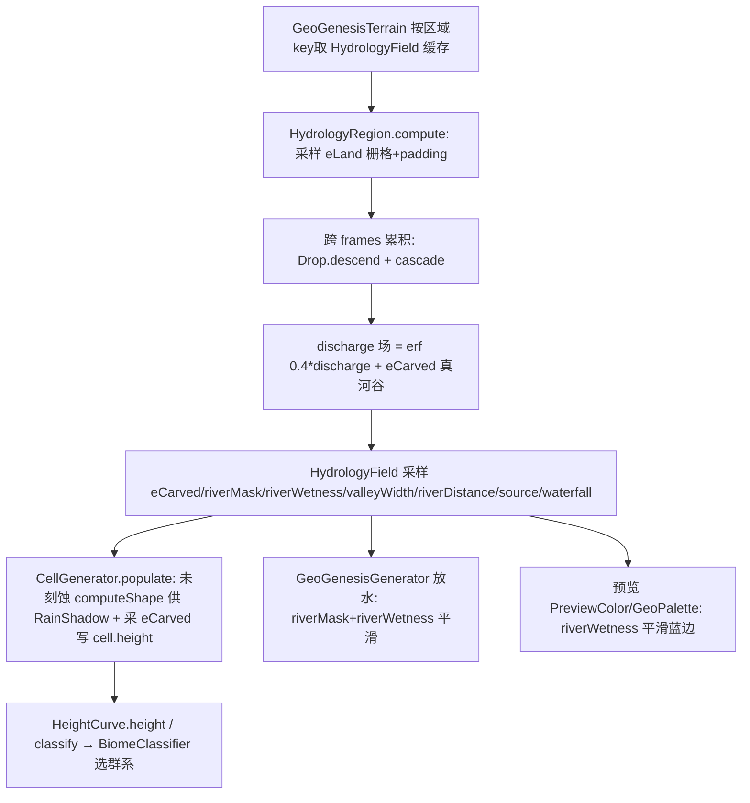

## 用户需求

用户否决了"粗格点 D8 下坡汇流"的妥协方案，要求**完整、不妥协地实现真实河流**。核心思路已确认：把重型计算彻底留在独立纯 Java 引擎（对齐 `参考/sources/SimpleHydrology`），按**原版 C++ 逻辑忠实移植水滴水力侵蚀（含跨帧/跨迭代累积）**；计算产物（刻蚀后的 `eCarved` 高度场 + `discharge` 河网场）是确定性的，仅把这些确定性结果**映射回 MC**（对齐 `参考/sources/novoatlas-ref` 的范式：确定性外部数据在生成期作为世界坐标的纯函数注入 MC 原生管线，运行期不重算）。

## 产品概述

在 GeoGenesis 地形引擎中接入一套区域级水滴水力侵蚀系统：对每个地形区域栅格运行忠实于 SimpleHydrology 原版的水滴下降 + 沉积物级联算法，累积出连续 `discharge` 河网场并真实刻蚀出 3D 河谷；区域结果按区域 key 确定性缓存，运行期被 MC 地形生成、生物群系、放水与预览作为纯函数采样。河流真正由新地质过程地形 `eLand` 的高度场驱动，顺地形排水入海，与海陆同源。

## 核心特性

- 河网 = `discharge` 连续场（原版 `erf(0.4*discharge)`），自然长出树枝状干流/支流，流量越大刻蚀越深。
- 真实 3D 河谷：水滴侵蚀把 U 形谷、谷肩刻入 `eLand`，产出 `eCarved`（河在谷中）。
- 河流 meander：原版动量场传递让河道自我增强、自然蜿蜒。
- 连续河流遮罩 `riverWetness`（平滑河湖蓝边）+ 布尔 `riverMask`（放水/预览蓝/RIVER 类型）+ `valleyWidth`/`riverDistance`（DRAINAGE 图层与河谷标签）。
- 海洋裁剪（河不入海、不穿海）、源头（溪源/山泉/源湖）与瀑布跌水潭分型。
- 跨区域无缝：区域外扩 padding + 边界不杀滴 + 确定性 PRNG（区域 seed 派生），对齐已验证的 padding 无缝范式。

## 技术栈

- Java 17 / Forge 1.20.1；零 MC 依赖纯 Java 引擎（`worldgen/river`、`worldgen/terrain`），与现有 `TerrainBlender`/`StructuralField` 同层。
- 复用 `terrainBlender.sampleLand` 产出确定性 `eLand∈[0,1]`；`CellGenerator` 已实现 `HeightProvider`（返回未刻蚀 `eLand`、海洋 `NaN`）。
- 下游 MC 映射沿用现有 `GeoGenesisTerrain`(TileCache 区域缓存) / `GeoGenesisGenerator`(放水) / `BiomeSource`(气候选群系，不变) / 预览 `PreviewColor`/`GeoPalette`。

## 实现方案

### 策略

将"河流生成"从当前的粗格点 D8 妥协，整体替换为**区域栅格水滴水力侵蚀**：对每区域（对齐 `TileCache` tile，含 padding）先采样确定性 `eLand` 栅格，再忠实移植 SimpleHydrology 的 `Drop::descend` + `World::cascade`，跨多个 frame 累积 `discharge`/`momentum` 直到河网收敛（复刻原版交互式跨帧累积，仅改为一次性确定性预算）。产出 `eCarved`（真河谷）+ `discharge` 场，派生全部河流字段。区域结果按区域 key 缓存；MC 侧面仅在 chunk 生成时按世界坐标**纯函数采样**这些确定性数组（NovoAtlas 范式）。

### 关键技术决策

1. **忠实原版参数与逻辑（不阉割）**：`maxAge=500`、`entrainment=10`、`momentumTransfer=1`、`gravity=1`、`lrate=0.1`、`settling=0.8`、`maxdiff=0.01`、`evapRate=0.001`、`depositionRate=0.1`；`c_eq=(1+entrainment*erf(0.4*discharge))*(h-h2)` 驱动真实差异化刻蚀；`cascade` 每步执行且 8 邻居**按高度排序 + 距离加权**。这是 `差异报告.md` 明确结论（Java 移植是阉割版，须按 C++ 原版）。
2. **3D 法线算重力力**：复刻 `cellpool.h` 的 `_normal`（4 叉积平面，抗噪声）得坡度方向，`speed += gravity*(n.x,n.z)/volume`；动量传递 `speed += momentumTransfer*dot(已有momentum,当前speed)/(volume+discharge)*已有momentum` 实现 meander。
3. **跨帧累积 = 原版主循环**：原版主循环每帧 `erode(512)` 使 `discharge` 跨帧收敛；我们改为每区域跑 `frames` 次 `erode`（`dropBudget` 滴/次），`field=(1-lrate)*field+lrate*track` 同原版。一次性确定预算替代交互。
4. **确定性 PRNG 替代 `rand()`**：spawn 位置用 `splitmix64(regionSeed, frame, dropIndex)` 派生，整过程对区域 seed 完全确定（满足"把确定内容映射回 MC"）。
5. **无缝 padding**：栅格外扩 `±P`（默认 24 块）；滴在 padding 内继续流动，仅在离开 padding 或进入海洋（`eLand=NaN`）才终止 → 消除 tile 边界断裂（沿用 `ErosionEngine` 已验证范式）。
6. **HeightProvider 复用**：`HydrologyField` 持有 `HeightProvider`（即 `CellGenerator`），采样未刻蚀 `eLand` 填栅格；`landHeight` 同时供给 `RainShadow`（雨影依赖未刻蚀高度，契约不变）。
7. **MC 映射零重算**：`GeoGenesisTerrain` 持有 `HydrologyField`（区域缓存），`CellGenerator` 在 `populate` 内采样 `eCarved`+河流字段；`heightAt`（雨影）仍走未刻蚀 `computeShape`，刻蚀只影响最终 `cell.height`；`BiomeSource` 不变；放水用 `riverMask`+`riverWetness` 平滑。

### 性能与可靠性

- 区域栅格每区域算一次后按 seed 缓存（确定性），后续零成本；首生成开销集中在区域首算，水滴数与 frame 数为配置项（`dropBudget`/`frames`），预览用更小区域 + 更少水滴。
- `descend` 单滴 O(maxAge) 步；区域总开销 ≈ 面积 × drops × frames × maxAge，受 `maxCarveDepth`/`erosionScale` 钳制避免过刻。
- `cascade` 每步对 8 邻居排序（小常数），开销可控；栅格边界邻居越界跳过。
- `riverDistance` 用对 `riverMask` 的一次 BFS 距离变换（廉价）供 DRAINAGE 图层。

### 防回归

- `Cell.riverMask` 布尔语义必须保留（放水/预览蓝/`RIVER` 类型/DRAINAGE 图层均依赖）。
- `riverDistance`/`valleyWidth`/`riverWetness` 字段结构不变（`RiverSample` 沿用）。
- 河蚀只影响最终高度，不进入 `heightAt`（雨影契约不变）。
- `worldgen/river`、`worldgen/terrain` 不 import MC。
- 删除 `RiverField`(粗格点 D8)/`RiverNode`，逻辑由 `HydrologyField`/`HydrologyRegion` 取代，避免双份河网。

## 架构设计



## 目录结构

```
forge-1.20.1-47.4.10-mdk/src/main/java/com/geogenesis/worldgen/river/
├── HeightProvider.java      # [KEEP] 函数式接口：landHeight 返回未刻蚀 eLand（海洋 NaN）+ provinceWeights。供 Hydrology 采样与 RainShadow。
├── RiverSample.java         # [KEEP] 河流字段载体（riverDistance/valleyWidth/riverMask/riverWetness/sourceType/isWaterfall/...）。
├── HydrologyRegion.java     # [NEW] 区域栅格引擎：采样 eLand（含 padding）→ 忠实移植 Drop.descend + World::cascade（原版参数）→ 跨 frames 累积 discharge/momentum → 派生 eCarved + discharge 场 + riverMask/riverWetness/valleyWidth/riverDistance + 源头/瀑布分型。确定性 PRNG。
├── HydrologyField.java      # [NEW] 区域缓存 + 世界坐标采样：按区域 key 缓存 HydrologyRegion（对齐 TileCache 范式）；sample(wx,wz) 纯函数返回 HydrologySample。取代 RiverField 粗格点逻辑。
├── RiverField.java          # [DELETE] 粗格点 D8  compromise，逻辑并入 HydrologyField。
├── RiverNode.java           # [DELETE] 线段结构，水滴侵蚀不需要。
├── RiverSettings.java       # [MODIFY] 改为水力侵蚀配置：maxAge/entrainment/momentumTransfer/gravity/lrate/settling/maxdiff/evapRate/depositionRate/erosionScale/maxCarveDepth/dropBudget/frames/dischargeThreshold + 保留 riverMinE/waterfallDrop/sourceRadius/sourceLakeChance/sourceLakeDepth/springPoolDepth/plungeDepth。
└── LakeGenerator.java       # [MODIFY] 由新地形低地（盆地 eLand 近 basinBase）驱动填水，与新地形对齐（小改）。

forge-1.20.1-47.4.10-mdk/src/main/java/com/geogenesis/worldgen/terrain/
├── CellGenerator.java       # [MODIFY] 删除 applyRiverCarving/flowGate/carveSourceBasins（二值门控导致不刻蚀）；populate 改为采样 HydrologyField 的 eCarved 写 cell.height、采河流字段；heightAt 仍走未刻蚀 computeShape（RainShadow 契约不变）。
├── Cell.java                # [KEEP] 字段结构不变（riverMask/riverWetness/riverDistance/valleyWidth/source/waterfall/lake 等已齐备）。
├── TerrainParams.java       # [MODIFY] 移除河蚀几何字段（riverBedDepth/riverBankDepth/riverBedWidthFrac/riverErosion/sourceLakeDepth/springPoolDepth/plungeDepth），河蚀控制迁至 RiverSettings。
└── GeoGenesisTerrain.java   # [MODIFY] 持有 HydrologyField（区域缓存）取代 riverField；lakeGenerator 与 HydrologyField 协同；sampleHeight/getChunkCells/getRegionCells 经其采样。

forge-1.20.1-47.4.10-mdk/src/main/java/com/geogenesis/
├── config/GeoGenesisConfig.java            # [MODIFY] COMMON 暴露 RiverSettings 新字段（"River Network"/"River Carve" 段）。
├── worldgen/generator/GeoGenesisGenerator.java  # [MODIFY] 放水逻辑：riverMask(布尔) 照旧放水；riverWetness 平滑河湖边缘/深度。
└── client/preview/
    ├── PreviewColor.java   # [MODIFY] 用 riverWetness 做平滑河湖蓝边过渡（保留 riverMask 深蓝）。
    └── GeoPalette.java     # [MODIFY] 水文叠加/terrain_type=RIVER 用 riverWetness 平滑边缘；DRAINAGE 图层仍用 riverDistance。
```

## 关键代码结构（接口级）

```java
// 区域水文采样结果（供 CellGenerator / 放水 / 预览消费）
public final class HydrologySample {
    public double eCarved;        // 刻蚀后陆地高度 [0,1]（海洋为 NaN）
    public boolean riverMask;     // 河道内（布尔，契约不变）
    public double riverWetness;   // 连续 0..1（erf(0.4*discharge)，平滑边缘）
    public double riverDistance;  // 0=河心,1=远（riverMask 距离变换）
    public double valleyWidth;    // 由局部 discharge 推得的河谷宽
    public int sourceType;        // 0无,1溪源,2山泉,3源湖
    public boolean isWaterfall;
}

// 区域栅格引擎：忠实 SimpleHydrology 水滴侵蚀（确定性）
public final class HydrologyRegion {
    public HydrologyRegion(long regionSeed, int ox, int oz, int size, int pad,
                           HeightProvider land, RiverSettings s) { /* ... */ }
    public void compute();                 // 采样 eLand + 跨 frames 累积侵蚀
    public HydrologySample sample(int wx, int wz);  // 世界坐标 → 采样确定性结果
}
```

## Agent Extensions

### SubAgent

- **code-explorer**
- Purpose: 在实施前/后跨文件核对下游契约——`GeoGenesisGenerator` 放水、`GeoGenesisTerrain` 字段拷贝、`LakeGenerator` 协同、`PreviewColor`/`GeoPalette`/`PreviewDisplay`/`TerrainPreview` 对 `riverMask`/`riverDistance`/`riverWetness` 的消费点，确认无遗漏且布尔语义保留。
- Expected outcome: 输出所有受影响的消费点清单与需同步的字段，避免破坏既有放水/预览/RIVER 类型契约。