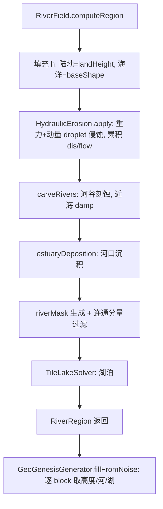

## 用户需求

基于实机截图诊断，修复当前河流生成的三处问题（用户已确认 1/2/3 都修，先出方案待确认）：

1. **海岸边界判定错误**：河流流到海岸线就突然断流，应适当向海里冲刷、形成河口而非硬截断。
2. **散落单点水**：地图上有孤立的单个水块，根因是 riverMask 无连通性过滤，孤立流量高峰被误判为河道并在 fillFromNoise 放孤立水。
3. **物理模拟增强**：在现有重力/动量/侵蚀沉积/蒸发/降水/流量累积/河谷刻蚀/湖泊之上，补齐河口沉积与河流连通性两项关键物理；季节性降水（需引入时间维、复杂度高）本次不做，记入后续待办。

## 核心特征

- 河流可延伸至海岸并淡入海洋（河口浅谷 + 三角洲沉积），不再硬断。
- 河网连贯成树状，散落单点/碎片水消失。
- 物理模型更完整：河口冲刷与沉积、河流连通性约束。
- 季节性降水明确列为后续项，本次不实现。

## 技术栈

- Java 17 + Minecraft Forge 1.20.1（Gradle `gradlew.bat`）
- 零 MC 依赖核心：`HydraulicErosion`（droplet 水力侵蚀）、`RiverField`（region 级装配）、`TileLakeSolver`（priority-flood 湖泊）、`GeoGenesisGenerator`（游戏填充）
- 复用现有 `HeightProvider.baseShape`（海洋 e∈[-1,0]）与 `GeoGenesisTerrain.getChunkRegion`

## 实现方案

### A. 修复海岸硬截断（问题1）

**A.1 移除两处 `seaNorm + 0.005f` 硬截断**

- `HydraulicErosion.simulateDrop` L136：删除 `h0 <= seaNorm + 0.005f` 的 return；改为水滴可继续流动到 `h0 <= seaNorm - COAST_MARGIN`（新增常量 `COAST_MARGIN = 0.05f`）；当 `h0 <= seaNorm` 段只累积流量 `dis`、不再侵蚀（避免挖穿海床）。
- `HydraulicErosion.carveRivers` L232：删除 `h[j][i] <= seaNorm + 0.005f` 的 continue，依赖已有 `damp = min(1, abv/0.1)`（L234-235）在近海自然减弱下切深度，使河口保留浅谷。

**A.2 海洋浅水格填充，让水滴可流入浅海**

- `RiverField.computeRegion` 当前对海洋格 `h[j][i] = Float.NaN`（L69-71）。改为：海洋格用 `land.baseShape(wx, wz)`（e∈[-1,0]，已有 baseE 同款来源）填充 `h`，使水滴能流入浅海并累积 `dis`，从而刻蚀/沉积出河口；`landMask` 仍标记 false（海洋不参与成湖/陆地判定）。`baseE` 数组维持原样（fillFromNoise 仍按陆地/海洋取高度）。
- 注意：`simulateDrop` 中 `Float.isNaN(h0)` 的 return 保留（仅当真正越界），但浅海格已有值故可流入。

**A.3 新增河口沉积（estuary deposition）**

- 在 `carveRivers` 之后新增 `estuaryDeposition(h, dis, gsz, seaNorm, valleyDepth, erodeMul)`：对 `h ∈ [seaNorm, seaNorm + COAST]` 且 `dis > 0` 的格，按流量轻微抬升 `h += deposition * t`（t = 归一化流量），模拟三角洲/河口湾堆积，让河流“淡入”海洋而非硬断。沉积量受 `damp` 同款近海因子约束，避免越界超过 `seaNorm + COAST`。

### B. 消除散落单点水（问题2）

**B.1 riverMask 连通分量过滤**

- `RiverField.computeRegion` 生成 `riverMask`（L108-115）后，新增连通分量扫描（4 邻域），孤立河流段（连通面积 < `MIN_RIVER_CELLS`，建议 4~6 格）不标为河道。消除孤立 dis 高峰导致的碎片单点水。
- 复杂度 O(gsz²)，region 内一次性扫描，无性能回归。

**B.2 兜底与去噪**

- `TileLakeSolver` 已有 `lakeMinArea`（默认 64）门槛，单点湖已被排除，优先级低；如需可加形态学去噪去除 < `MIN_LAKE_ISLAND` 的连通湖组分（可选，本次可不改）。
- `GeoGenesisGenerator.fillFromNoise` L236-237 的 `isRiver` 判定：若 B.1 过滤后仍有零星水，可加“邻域存在连续水域”判定兜底。B.1 落地后通常无需此步，留作防御。

### C. 物理增强（问题3，除季节性外）

- 河口冲刷/沉积：A.3 实现。
- 河流连通性约束：B.1 实现。
- （可选）最小水滴寿命过滤：`simulateDrop` 中 `life < MIN_LIFE`（如 20）的水滴不累积 `dis`，减少孤立噪声点；建议实现，成本低。
- **季节性降水：本次不做**，需在世界生成中引入时间维（实时变化驱动降水场），复杂度高，记入后续待办（building 阶段写入 `MEMORY.md` 当日日志）。

## 实现要点（防回归）

- 所有 `h` 数组访问保持 `Float.isNaN` 守卫；海洋格 `landMask=false` 不变，避免成湖逻辑受影响。
- `carveRivers` 与 `estuaryDeposition` 均用 `Math.max(seaNorm, ...)` / `Math.min(seaNorm+COAST, ...)` 兜底，陆地 e 不越界。
- `dis` 流量场在浅海段只累积不用于陆地河网阈值误判：riverMask 阈值判定仍仅对 `landMask=true` 生效（L110 已 `!landMask` 跳过）。
- 复用 `baseShape` 而非新增采样，避免额外 `populate` 开销（与方案 A 的 per-block 填充一致）。

## 架构与数据流



## 目录结构与待改文件

```
forge-1.20.1-47.4.10-mdk/src/main/java/com/geogenesis/worldgen/
├── river/
│   ├── HydraulicErosion.java   # [MODIFY] 移除两处海岸硬截断(L136/L232)；新增 COAST_MARGIN/estuaryDeposition；可选最小寿命过滤
│   ├── RiverField.java         # [MODIFY] computeRegion 海洋格用 baseShape 填 h(L69-71)；riverMask 后加连通分量过滤(L108-115)
│   └── TileLakeSolver.java     # [MODIFY 可选] 形态学去噪去除极小连通湖组分
└── generator/
    └── GeoGenesisGenerator.java # [MODIFY 防御] fillFromNoise isRiver 邻域兜底(L236-237)
```

## 验证

- `gradlew.bat compileJava` 编译通过。
- `runPreview` / `runClient` 目检：① 河流是否延伸到海岸并淡入海洋（非硬断）；② 散落单点水是否消失、河网连贯；③ 海洋海床仍连续无缝、湖逻辑未回归。