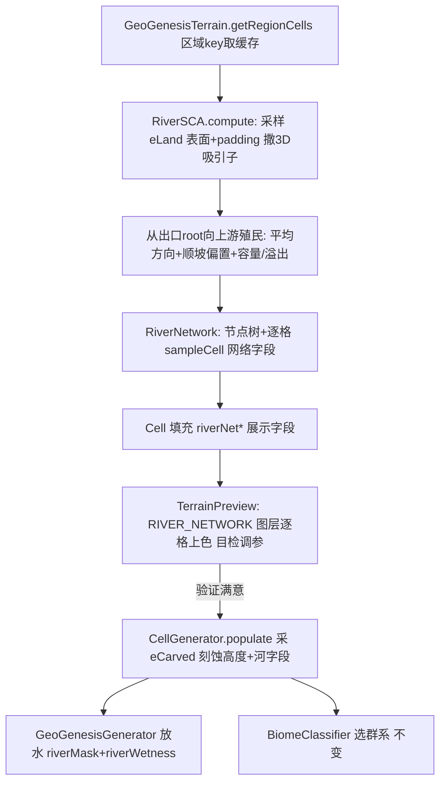

## 用户需求

用户否决「粗格点 D8 下坡汇流」妥协方案，要求完整、不妥协地实现真实河流。河流由新地质过程地形 `eLand` 高度场驱动，顺地形排水入海，与海陆同源。经讨论确定采用 **Space Colonization Algorithm（空间殖民算法，SCA，Runions 2007）** 生成树枝状河网，替代原「水滴累积场」路线。

## 产品概述

在 GeoGenesis 地形引擎中接入一套基于 SCA 的区域级河网生成系统：在三维地形表面撒「吸引子」散点，从区域出口/海洋沿最陡下降方向向上游「殖民」生长出连通的树枝状河网；节点父子链天然给出树状拓扑与流量代理（局部计算，无全局流场）。河网结果先在独立预览窗口可视化验证，确认合理后再接入 MC 地形生成。

## 核心特性

- **3D 空间散点成树**：吸引子与节点均为三维点 `(x, eLand, z)`，生长于地形表面；从海洋/区域出口 root 向上游殖民，每步朝感知半径内吸引子平均方向 + 顺坡向下偏置，再投影回 `eLand` 表面。
- **树状拓扑 + 流量代理**：节点父子链 → 每节点下游叶节点数 = discharge 代理（局部、无全局累积，天然解决「无限 vs 全局精确」矛盾）。
- **汇入溢出 / 木桶短板**：河段承载力如木桶——整条下游通道能过的流量由沿途**最窄/最低岸的「短板」(bottleneck) 最小值**决定，而非节点局部常数。节点累计下游叶数=discharge 代理；达容量后剩余吸引子催生同级新分支（tributary split）；当累积 discharge 超过某段**最短板容量**时，从最弱处溢出 → FLOODPLAIN/湿地（或封闭盆地填湖），而非无限下切。
- **平滑成样条**：节点折线 → Catmull-Rom/贝塞尔 → meander；后续沿线把 `eLand` 刻 U 形谷，宽/深由 discharge 代理与 branch order。
- **分型**：叶节点=源头（溪源/山泉/源湖），陡降段=瀑布；海洋裁剪（河不入海/不穿海）；padding 跨区续接（区域 seed 确定）。
- **预览优先**：先新增 `RIVER_NETWORK` 预览图层，在 Swing 预览窗口目检树状与溢出，验证满意后再做 MC 刻蚀集成。

## 技术栈

- Java 17 / Forge 1.20.1；零 MC 依赖纯 Java 引擎（`worldgen/river`、`worldgen/terrain`），与 `TerrainBlender`/`StructuralField` 同层。
- 复用 `CellGenerator` 已实现的 `HeightProvider`（返回未刻蚀 `eLand`、海洋 `NaN`）+ `terrain.getRegionCells(...)` 作为预览与 MC 共用的采样入口。
- 下游沿用 `GeoPalette`/`GeoPalette.PreviewLayer` 枚举注册图层、`TerrainPreview`（`values().length` 自动遍历）、`GeoGenesisGenerator`（放水）、`BiomeSource`（气候选群系，不变）。

## 实现方案

### 策略

将「河流生成」从「粗格点 D8 妥协」整体替换为 **3D SCA 空间殖民成树**：每区域（对齐 `TileCache` tile，含 padding）先由 `HeightProvider` 采样确定性 `eLand`，在其表面用种子噪声撒三维吸引子（密度按高程/降水加权），从区域出口/海洋 root 向上游殖民生长节点树；用节点容量机制防止过度汇聚并建模溢出；产出树状河网（节点链 + 逐格网络字段）。**第一步只在预览窗口渲染验证**，经 `getRegionCells` 把逐格河网字段喂给 `River_NETWORK` 图层；验证后再在 `CellGenerator.populate` 采 `eCarved` 刻蚀高度。

### 关键技术决策

1. **SCA 优于水滴场（范式 3 取代范式 1）**：水滴法是「撒大量散点→统计累积出场」，非局部、需全局流场、tile 边界痛；SCA 是「撒吸引子→几何生长出连通树」，局部、确定、CPU 极廉价、天然可分块，且**免费得到树状汇入拓扑**（水滴法要额外提取）。契合我们「无限 + 无 GPU + 确定性」三约束。
2. **3D 表面生长**：吸引子/节点存 `(x, eLand(x,z), z)`；生长方向 = 感知半径内吸引子平均方向，再叠加顺坡向下偏置（用 `HeightProvider.landHeight` 的 3D 法线/梯度），新节点高度重新采样 `landHeight` 投影回表面，保证河沿地形走、不穿山。
3. **容量触发分支而非过合并（用户核心关切 · 木桶短板）**：河段承载力如木桶——整条下游通道能过的流量由沿途**最窄/最低岸的「短板」(bottleneck) 最小值**决定，而非某节点常数。每节点累计下游叶数(=discharge 代理)；未超短板容量时正常吸收吸引子；达容量后，多余吸引子不再并入该节点，而是从其父节点催生一条同级新分支 → 自然分流 tributaries，杜绝「所有水灌入同一条河道」的过度汇聚。
4. **溢出发生在「短板」处 → FLOODPLAIN/湖**：多条支流汇入使累积 discharge 沿程增大；当某段累积 discharge 超过该段**最短板容量**(narrowest/lowest bank) 时，水从这块最弱短板**溢出**(overbank)，而非在汇口或处处溢出：渲染为宽谷+湿地色(overbank flooding 语义)；封闭盆地(所有方向都是短板、无法排干)按最低垭口填湖。避免无限下切或伪河道。
5. **确定性 PRNG**：吸引子位置用 `splitmix64(regionSeed, i)` 派生，整过程对区域 seed 完全确定，满足「把确定内容映射回 MC」。
6. **无缝 padding**：区域外扩 `±P`（默认 24 块）；root 设在含 padding 的边界最低处，生长跨 padding 续接邻居河段，消除 tile 边界断裂（沿用既有 padding 范式）。
7. **预览优先、共用数据路径**：SCA 计算放进 `GeoGenesisTerrain.getRegionCells`（预览已调用），预览与未来 MC 生成走同一条采样路径，风险最低；首阶段仅填逐格网络展示字段、不动 `cell.height`。
8. **下游契约不变**：`Cell.riverMask` 布尔语义、`riverDistance`/`valleyWidth`/`riverWetness` 字段、`heightAt` 不进刻蚀（`worldgen/river`、`worldgen/terrain` 不 import MC）全部保留。

### 性能与可靠性

- SCA 复杂度 ≈ `O(attractors × nodes × iter)`；吸引子数 = `density×area`，节点数 ≈ 河段数，远低于「水滴数×frames×maxAge」。区域结果按 seed 缓存，后续零成本；预览用更小区域 + 更少吸引子。
- 容量/溢出为 O(1) 每节点判定；树状 discharge 代理 = 一次后序遍历（局部）。
- `riverDistance` 类字段后续由对河网的 BFS 距离变换廉价得到。

### 防回归

- `riverMask` 布尔语义（放水/预览蓝/RIVER 类型/DRAINAGE 图层）必须保留。
- 删除 `RiverField`(粗格点 D8)/`RiverNode`，逻辑由 `RiverSCA`/`RiverNetwork` 取代，避免双份河网。
- 河蚀（后续阶段）只影响最终高度，不进入 `heightAt`（雨影契约不变）。
- 预览阶段不修改 `cell.height`，仅追加网络展示字段，零地形回归风险。

## 架构设计



## 目录结构

```
forge-1.20.1-47.4.10-mdk/src/main/java/com/geogenesis/worldgen/river/
├── HeightProvider.java   # [KEEP] 函数式接口：landHeight 返回未刻蚀 eLand（海洋 NaN）+ provinceWeights。供 SCA 采样与 RainShadow。
├── RiverSample.java      # [KEEP] MC 运行期采样载体（riverMask/riverDistance/valleyWidth/riverWetness/source/waterfall）。后续阶段由 eCarved 填充，预览阶段不动。
├── RiverSCA.java         # [NEW] 3D 空间殖民引擎：撒三维吸引子(x,eLand,z)→从出口root向上游殖民生长节点树→顺坡偏置+容量/溢出+确定性PRNG+padding。输出 RiverNetwork。
├── RiverNetwork.java     # [NEW] SCA 结果：节点树（父链/discharge代理/branchWidth/overflow/bottleneckCapacity(短板)+sampleCell(wx,wz) 逐格网络字段（riverNetDist/Width/Overflow/Discharge/Bottleneck）。
├── RiverSettings.java    # [MODIFY] 改写为 SCA 参数：attractorDensity/killDist/attractDist/stepLen/downBias/nodeCapacity/overflowMode + 保留 riverMinE/waterfallDrop/sourceRadius/sourceLakeChance/sourceLakeDepth/springPoolDepth/plungeDepth。
├── RiverField.java       # [DELETE] 粗格点 D8 妥协，逻辑并入 RiverSCA。
└── RiverNode.java        # [DELETE] 线段结构，被 SCA 节点树取代。

forge-1.20.1-47.4.10-mdk/src/main/java/com/geogenesis/worldgen/terrain/
├── GeoGenesisTerrain.java # [MODIFY] getRegionCells 计算并缓存区域 RiverNetwork，填充逐格河网展示字段；持有 RiverSCA（对齐 TileCache 范式）。
├── Cell.java              # [MODIFY] 追加河网展示字段：riverNetDist(0=河心,1=远)/riverNetWidth/riverNetOverflow(bool)/riverNetDischarge(代理)。不影响既有 riverMask 等字段。
├── CellGenerator.java     # [MODIFY, 后续阶段] populate 改采 RiverNetwork 的 eCarved 写 cell.height、采河字段；heightAt 保持未刻蚀（RainShadow 契约不变）。
├── LakeGenerator.java     # [MODIFY, 后续阶段] 由新地形低地（盆地 eLand 近 basinBase）+ SCA overflow 段驱动填水，与新地形对齐。
└── TerrainParams.java     # [KEEP] 不变（SCA 参数走 RiverSettings）。

forge-1.20.1-47.4.10-mdk/src/main/java/com/geogenesis/client/preview/
├── GeoPalette.java        # [MODIFY] PreviewLayer 枚举加 RIVER_NETWORK（Group.WATER）；color() switch 加 case：按 riverNetWidth 上色、overflow 段高亮湿地色。
├── TerrainPreview.java    # [KEEP] 自动经 values().length 遍历、getRegionCells 取 Cell；无需改代码即可显示新图层（仅依赖枚举+color case）。
└── PreviewDisplay.java    # [MODIFY, 后续阶段] 游戏内预览同步 RIVER_NETWORK 图层（与 Swing 对齐）。

forge-1.20.1-47.4.10-mdk/src/main/java/com/geogenesis/
├── config/GeoGenesisConfig.java            # [MODIFY, 后续阶段] COMMON 暴露 RiverSettings SCA 字段（"River Network" 段）。
└── worldgen/generator/GeoGenesisGenerator.java # [MODIFY, 后续阶段] 放水逻辑：riverMask(布尔) 照旧；riverWetness 平滑河湖边缘（沿用）。
```

## 关键代码结构（接口级）

```java
// 3D 空间殖民河网引擎：确定性，零 MC 依赖
public final class RiverSCA {
    public RiverSCA(long regionSeed, int ox, int oz, int size, int pad,
                    HeightProvider land, RiverSettings s) { /* ... */ }
    public RiverNetwork compute();   // 撒3D吸引子→殖民生长→容量/溢出→产出树+逐格字段
}

// SCA 结果：节点树 + 逐格查询
public final class RiverNetwork {
    public RiverNetworkSample sampleCell(int wx, int wz); // riverNetDist/Width/Overflow/Discharge
    // 内部：Node{ x,z, eLand, parent, descendantLeaves, branchWidth, overflow }
}
```

## Agent Extensions

### SubAgent

- **code-explorer**
- Purpose: 在 MC 集成阶段（后续阶段）跨文件核对下游契约——`GeoGenesisGenerator` 放水、`GeoGenesisTerrain` 字段拷贝、`LakeGenerator` 协同、`PreviewColor`/`GeoPalette`/`PreviewDisplay`/`TerrainPreview` 对 `riverMask`/`riverDistance`/`riverWetness`/`riverNet*` 的消费点，确认无遗漏且布尔语义保留。
- Expected outcome: 输出所有受影响消费点清单与需同步字段，避免破坏既有放水/预览/RIVER 类型契约。