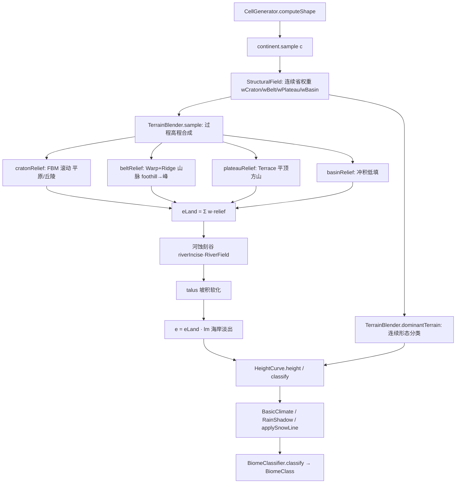

## 用户需求

用户明确拒绝"小修小补"，要求一个**依据地理学原理、并融合 Minecraft 特点**的真实地形模组。当前基本型（地形形态）本身错误——山不像山、高原不像高原、平原长小山丘、山脉在海岸小过渡骤升成墙、群系偶发椒盐小斑块。侵蚀只在基本型上加工，因此必须先把基本型做成真实地形。

## 核心目标（地理学正确性 + MC 融合）

- **平原**：近恒定低平、无随机小丘，可供建造。
- **丘陵**：温和滚动起伏。
- **高原/方山**：内部平顶、边缘陡降成台地崖壁（非平滑圆丘）。
- **山脉**：边缘 foothill 低平、向造山带核心平滑渐升为脊线与峰，非海岸处骤墙。
- **河流**：刻蚀出谷地，河床落在谷中。
- **海岸**：从海平面经数百格平滑渐升为陆地。
- **群系**：空间上连续成片，彻底消除单格级椒盐斑块。

## 关键约束

- 确定性、分块无缝：所有形态为 pure f(x,z)+seeded noise，无全局/跨块遍历（避免旧 flow-accumulation 的 tile 断裂根因）。
- 可建造：平顶平台 + 缓坡 + 坡积软化，无不可建造的悬空崖。
- 性能：单点 O(常数) 次噪声求值，无额外集合分配，与现状相当。
- 保留既有海洋 shelf/slope/abyss/trench 剖面（已合理）、HeightCurve 海岸映射、RiverField 河网、气候层、BiomeClassifier、预览 11 图层契约不变。

## 技术栈

- Java 17 / Minecraft Forge 1.20.1；零 MC 依赖纯 Java 地形引擎（`worldgen/terrain` 包）。
- 复用现有噪声工具箱：`Ridge`（脊线）、`Terrace`（阶梯方山）、`Warp`（域扭曲褶皱山带）、`Steps`、`Billow`、`Simplex`、`Frequency`、`Boost`、`Add`、`Blend`、`Curve`、`Map`、`Power`；复用 `CellGenerator.fractal(...)` 多倍频分形（含 ridged 选项）。
- 复用既有 `RiverField`（riverDistance/valleyWidth/riverMask）做河蚀刻谷，不新建流累积。

## 实现方案

### 策略

把现有"**区域网格 + 按地形高度带混合鼓包**"范式，**替换为地质过程范式**：先算连续无硬边界的"地质背景场"决定各省（克拉通/造山带/高原/盆地）占比，再按地理过程（FBM 滚动平原、域扭曲脊线山脉带、阶梯方山、河蚀谷）合成高程，最后从结果形态做连续分类（消除量化椒盐）。整个 `TerrainBlender` 内部重写，但对外 `sample(x,z)`/`dominantTerrain(x,z)` 签名不变，`CellGenerator`/`HeightCurve`/`GeoGenesisTerrain`/`RainShadow`/`BiomeClassifier` 契约不变。

### 关键技术决策与权衡

1. **StructuralField（地质背景场，连续无硬边界）** 取代原 `select()` 的 hash 随机选格：

- 4 个低频 simplex（freq≈0.0008–0.0015，省/山系尺度 ~700–1300 格，小于大陆尺度，使大陆内部出现平原省/山脉带/高原省之分）得 `nCraton/nBelt/nPlateau/nBasin∈[-1,1]`。
- 软归一化权重 `w_i = exp(K·(n_i − max)) / Σexp(...)`（K≈3 给清晰但平滑的省界，天然无椒盐），并叠加 `PreClimate` 轻偏置（influence 默认 0.25，沿用 `climateBias` 思路但不决定类型）。
- 彻底移除区域网格 + `Math.round` 量化（椒盐根因）。

2. **过程高程（TerrainBlender.sample 重写）** 对各省分量算形态后加权合成 `eLand = Σ w_i·relief_i`（权重和=1）：

- **cratonRelief**：`fbm=fractal(4,0.004,gain0.5)` 温和滚动；`hillsFactor` 低频噪声控制平原/丘陵比例；平原 `e=plainBase+fbm·plainRoughness(≈0.02)`（近恒定平），丘陵 `e=hillsMin+(hillsMax−hillsMin)·((fbm+1)/2)`。**去 detail 叠加**→平原无小丘。
- **beltRelief（山脉 foothill→峰）**：`ridge=fractal(ridged, mountainFreq≈0.0016, 5 octaves, ridgePower1.4)`→脊线；`prox=smoothstep(归一化 nBelt)` 造山带核心=1、边缘=0；用 `Warp` 扭曲坐标使山脉自然延伸为山岭。`beltRelief=foothillBase+(peak−foothillBase)·ridge·prox`。边缘 prox→0 自然 foothill 接平原，核心成峰 → 解决骤升。
- **plateauRelief（方山/高原）**：`base=fractal(3,0.003)`；`ter=Terrace(base, steps=plateauSteps)`→平顶+崖阶；`plateauRelief=plateauBase+(plateauTop−plateauBase)·ter`。平顶陡边。
- **basinRelief**：近海平面低填 `basinBase+fbm·0.05`，河流沉积处更低。
- **河蚀刻谷**：`eLand -= riverIncise·valleyProfile(riverDistance, valleyWidth)`（RiverField 已给）→ 河床落谷底。
- **坡积软化(talus)**：局部 `|e(x+h)−e(x)|` 钳制（防不可建悬崖/悬空，MC 单高度列友好），确定性邻域采样、无跨块依赖。
- 海岸：`e = eLand · lm`，`lm` 带宽适度加宽（仍 pure），保证从海平面平滑渐升。

3. **dominantTerrain 改为连续形态分类**（消除量化椒盐）：不取最近格点，而从结果形态判——e<0→OCEAN/DEEP_OCEAN（沿用 continentEdge）；近岸→BEACH；近河→RIVER；近湖→LAKE；e 低且局部起伏小→PLAIN；e 中且起伏中→HILLS；plateau 背景权重高且平顶→PLATEAU；e≥mountainThreshold→MOUNTAINS；e≥peakThreshold→PEAK；盆地→BASIN。全部由连续场驱动 → 群系沿等值线平滑过渡。

4. **配置 schema（TerrainParams）改为过程参数**：新增 `cratonW/beltW/plateauW/basinW`、`provinceScale`、`beltProximityFalloff`、`beltRidgePower`、`plateauSteps`、`plateauStepHeight`、`plainRoughness`、`riverInciseDepth`、`talusStrength`；保留 `seaLevel/minY/maxY/mountainCap/verticalScale`、海洋 shelf/slope/trench 深度、`continentFrequency/continentWarp`、`snowLine/snowLatitudeInfluence`、`horizontalScale`；删除 `plainsMinE..plateauMaxE` 等纯高度带字段（被过程参数取代）。同步改 Forge `GeoGenesisConfig` 与 `HeightCurve` 构造取用字段。

### 性能

- 单点 O(常数) 次噪声求值（与现状相当），无新集合分配；StructuralField 软归一化与 4 类 relief 均为纯函数。
- talus 软化仅做 1 次邻近采样差值钳制，开销可忽略。
- 河蚀刻谷复用既有 RiverField 查询，无新增遍历。

### 实现要点（防回归）

- 对外接口 `TerrainBlender.sample/dominantTerrain`、`CellGenerator.populate/computeShape/heightAt`、`GeoGenesisTerrain` 全部契约不变 → `RainShadow`(依赖 heightAt)、`BiomeClassifier`、`HeightCurve` 无需改契约。
- 删除 `LandForms.java`/`TerrainType.java`（角色被 StructuralField + 过程形态取代）；`TerrainClass` 保留为分类输出枚举。
- `HeightCurve` 海洋 shelf/slope/abyss/trench 与陆地 `landShape` spline 映射逻辑**完全保留**，仅适配构造参数字段。
- 山峰仍由 `e≥peakThresholdE` 判定（新形态下峰出现在山脉核心高 e 处，行为一致）。
- 配置 schema 变更会使现有"调音台"mixer UI 对 `*MinE/*MaxE` 的绑定失效 → 列为 follow-up 重绑，不阻塞首版地形。

## 架构设计



## 目录结构

```
forge-1.20.1-47.4.10-mdk/src/main/java/com/geogenesis/worldgen/terrain/
├── StructuralField.java   # [NEW] 地质背景场：4 低频 simplex 得省噪声，软归一化权重 wCraton/wBelt/wPlateau/wBasin
│                         #       （exp 软归一，叠加 PreClimate 轻偏置），连续无硬边界，取代 hash 选格。
├── TerrainBlender.java   # [MODIFY] 重写 sample 为过程高程（craton/belt/plateau/basin relief 加权 + 河蚀 + talus）；
│                         #          dominantTerrain 改连续形态分类；删除区域网格 + Math.round + select/climateBias。
├── LandForms.java        # [DELETE] 角色被 StructuralField + 过程形态取代。
├── TerrainType.java      # [DELETE] 同上。
├── TerrainParams.java    # [MODIFY] schema 改为过程参数（省权重/provinceScale/belt*/plateau*/plainRoughness/
│                         #          riverInciseDepth/talusStrength）；删 *MinE/*MaxE 高度带字段；保留海/陆映射字段。
├── CellGenerator.java    # [MODIFY] 注入 StructuralField + 新 TerrainBlender；computeShape 中 lm 海岸带宽化/解耦。
├── HeightCurve.java      # [MODIFY] 仅适配构造参数字段；海洋 shelf/slope/abyss/trench 与陆地 landShape 映射保留。
└── config/GeoGenesisConfig.java  # [MODIFY] COMMON 配置字段同步为新过程参数。
```

## 关键代码结构（接口级）

```java
// 新建地质背景场：连续省权重，无量化硬边界
public final class StructuralField {
    public StructuralField(long seed, TerrainParams p, PreClimate preClimate) { /* 4 低频 simplex + 软归一化 */ }
    /** 返回查询点各省权重（连续，和=1）：[craton, belt, plateau, basin] */
    public void weights(double x, double z, double[] out) { /* exp 软归一 + 气候轻偏置 */ }
}

// TerrainBlender 对外签名保持不变，内部改为过程高程
public final class TerrainBlender {
    public double sample(double x, double z);              // 过程高程 eLand∈[0,1]
    public TerrainClass dominantTerrain(double x, double z); // 连续形态分类（非最近格点）
}
```