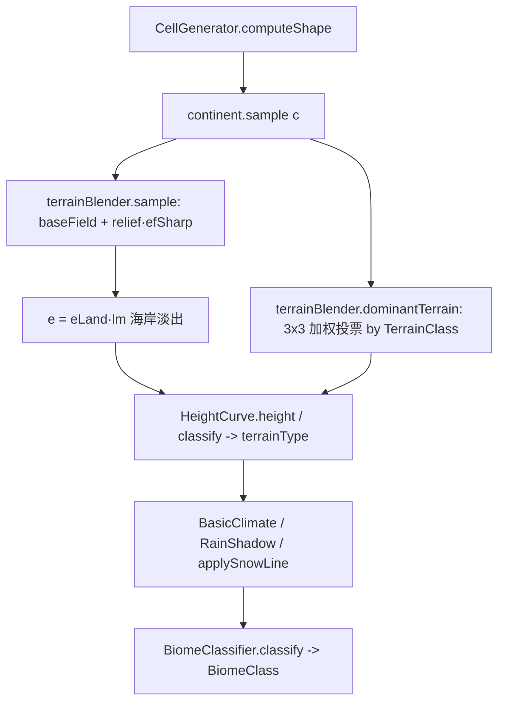

## 用户需求

1. **修复「椒盐小斑块」群系**：确认该问题一直存在（非雨影导致）。根因是 `TerrainBlender.dominantTerrain` 用 `Math.round` 对区域网格硬量化（且第 165 行 `wz` 误用 `warpX`），导致地形类型/群系在区域边界呈 1 格级阶梯跳变，表现为「局部很小块的不一致群系」。

2. **修正基本型地形形态（地理学正确性）**：当前基本型不对——平原不该有小山丘、高原该是「平顶+陡边」而非平滑圆丘、山体该从山脚（foothill）平滑渐升到峰，而非在海平面上一小段过渡就骤升成山。侵蚀只在基本型上加工，因此必须先修好基本型。

## 核心目标

- 群系/地形类型在空间上连续成片，彻底消除单格级椒盐。
- 平原：近恒定低平，无随机小丘。
- 高原：内部平顶、边缘陡降（台地/方山形态）。
- 山脉：边缘 foothill 低平、向核心渐升到峰（渐变山系，非突墙）。
- 海岸：从海平面平滑、可控宽度地爬升为陆地（解除对大陆噪声局部陡梯度的依赖）。

## 技术栈

- Java 17 / Minecraft Forge 1.20.1；零 MC 依赖的纯 Java 地形引擎（`worldgen/terrain` 包）。
- 复用现有 `TerrainBlender` 的 3×3 距离平方加权混合几何（`dist`/`nearest`/`borderDistance`/`blendRadius`），不引入新依赖、不新增集合分配。

## 实现方案

### 策略

分两层落地：
① **去椒盐**：把 `dominantTerrain` 从 `Math.round` 硬量化改为**与 `sample` 同几何的 3×3 距离平方加权按 TerrainClass 投票**（取权重最大的地形类），并修复 `wz` bug。地形类型因此沿平滑等值线过渡，群系不再单格跳变。
② **重塑基本型**：重写 `TerrainBlender.sample` 的高度合成，把「直接混合各地形最终 e」改为**「基础场(baseField) + 被 edgeFade 门控的地形起伏(relief)」**两段式，使每种地形获得正确的几何形态。

### 关键决策与权衡

- **baseField / relief 分离**：对每个邻域地形 i，记其 `baseE`（ foothill/崖底基准低值）与 `topE`（平顶/峰顶高值），及其 landForm 产出的归一化纹理 `n_i∈[0,1]`。
- `baseField = Σ w_i·baseE_i / Σw`（连续基础面，定义崖/ foothill 的连续底面）
- `relief   = Σ w_i·(topE_i−baseE_i)·n_i / Σw`（混合起伏幅度）
- `e = baseField + relief · efSharp`
- 边界处 `efSharp→0` ⇒ `e=baseField`（低、连续，自然 foothill/崖底）；核心处 `efSharp→1` ⇒ `e=baseField+relief`（完整地形高度+内部纹理）。

- **edgeFade 派生**：复用混合几何：`borderDistance=(nearest+nearest2)/2`，`blendRadius=borderDistance·blending`，`blendStart=borderDistance−blendRadius`；`ef = (nearest≤blendStart)?1 : clamp((borderDistance−nearest)/(borderDistance−blendStart),0,1)`，再经 smoothstep。`ef` 在区域核心=1、边界=0。

- **地形差异化的边缘锐度**：`efSharp = pow(ef, edgePower)`，按主导地形类取幂——`PLATEAU` 用较大幂（≈3.0，崖边陡、成方山）、`MOUNTAINS` 用 ≈1.0（缓 foothill）、其余 ≈1.0。主导类由同一套投票得出，故崖侧在高原一侧自动变陡。

- **各地形形态落地**（baseE/topE 取 Config 的 `*MinE`/`*MaxE`，并更新 mountainsMinE 默认低值以给 foothill）：
- 平原 baseE≈0.00 / topE≈0.12，landForm 近恒定（去 detail 叠加）→ 平。
- 高原 baseE≈0.30 / topE≈0.55，landForm 近恒定 0.5（平顶）→ 平顶+由 baseField 混合与 efSharp 形成的陡边。
- 山脉 baseE≈0.06（低 foothill）/ topE≈1.00，landForm 产 [0,1] 分形纹理 → 边界低、核心到峰，渐变。
- 丘陵 baseE≈0.08 / topE≈0.35，landForm 滚动 → 温和丘陵。

- **海岸平滑爬升**：`computeShape` 中 `e = eLand·lm` 的 `lm=smooth(clamp(c/0.75))` 宽度依赖大陆噪声局部梯度（可过窄→骤升）。改为更宽、更平滑且解耦的爬升带（加大 ramp 宽度，使陆地从海平面经数百格渐升），保证沿海山脉/陆地均为平缓 foothill 起势，不再「一小段过渡骤升」。

- **landForm 改为产出归一化纹理**：`LandForms` 各地形不再直接映射到绝对 e 区间，而是产出 `n∈[0,1]` 纹理；实际高度由 `TerrainType.baseE/topE` 驱动。平原/高原纹理近恒定（平），山脉纹理为分形起伏。

### 实现要点（防回归 / 性能）

- `dominantTerrain` 投票与 `sample` 复用同一 `dist`/`w` 计算，单格 O(1)、零额外分配；`TerrainClass` 权重累加用定长数组（按枚举序数）。
- 不动 `BiomeClassifier` / `RainShadow` / 预览渲染。`HeightCurve.classify` 仍用 `dominantTerrain` 与 e 阈值（PEAK 由 e≥peakThresholdE 判定，新形态下峰仍出现在山脉核心高 e 处，行为一致）。
- `baseE/topE` 取自现有 Config（`*MinE`/`*MaxE`），仅将 `mountainsMinE` 默认由 0.55 改为低值（≈0.06）以承载 foothill，避免新增配置面。
- 海岸 ramp 改动只放宽过渡、不改变 `e` 在陆地内部取值。

### 架构设计

`TerrainBlender` 仍是「区域网格 → 主导地形 + 平滑高程」的唯一决策点；本次仅重构其内部 `sample`/`dominantTerrain` 的高度合成与类型判定逻辑，对外接口（`sample(x,z)`、`dominantTerrain(x,z)`）签名不变，`CellGenerator`/`HeightCurve` 无需改动契约。



## 目录结构

```
forge-1.20.1-47.4.10-mdk/src/main/java/com/geogenesis/worldgen/terrain/
├── TerrainBlender.java   # [MODIFY] dominantTerrain 改 3×3 按 TerrainClass 加权投票 + 修 wz bug；
│                         #           sample 重构为 baseField + relief·efSharp（edgeFade 门控、PLATEAU 陡边）；
│                         #           新增 baseE/topE 按类查表与 edgeFade 辅助。
├── TerrainType.java      # [MODIFY] 增加 baseE / topE 字段（驱动形态带，取自 *MinE/*MaxE 语义）。
├── LandForms.java        # [MODIFY] 各地形 landForm 改为产出归一化 [0,1] 纹理；
│                         #           plains 去 detail 近恒定；plateau 近恒定平顶；mountains 分形起伏纹理。
├── TerrainParams.java    # [MODIFY] mountainsMinE 默认 0.55→0.06（foothill 基准低值）。
└── CellGenerator.java    # [MODIFY] computeShape 中 lm 海岸爬升带宽化/解耦，保证从海平面平滑渐升。
```

## 关键代码结构

```java
// TerrainType.java 增加形态带字段
public final class TerrainType {
    public final String name;
    public final double weight;
    public final Noise landForm;          // 产出归一化纹理 n∈[0,1]
    public final TerrainClass terrainClass;
    public final double baseE;            // foothill / 崖底基准（低）
    public final double topE;             // 平顶 / 峰顶高值
    // ctor 增加 baseE, topE
}

// TerrainBlender.sample 核心合成（伪代码）
//   baseField = Σ w_i·baseE[tc_i] / Σw
//   relief    = Σ w_i·(topE[tc_i]-baseE[tc_i])·n_i / Σw
//   e = baseField + relief * pow(edgeFade(x,z), edgePower(dominantClass))
```