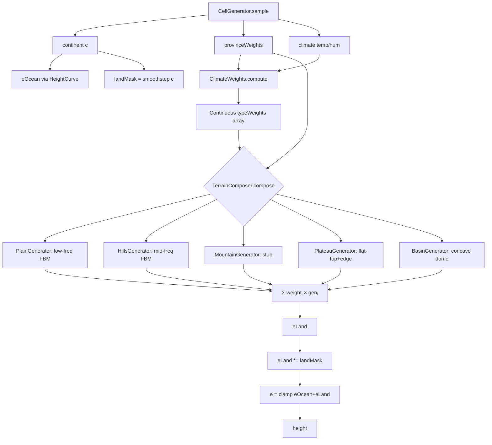

## 问题回顾

当前 Voronoi+Catmull-Rom 方案在胞边界（64 块间距）出现硬类型切换：`findNearestSeed` 返回离散类型，类型专属 relief 振幅从 0.08（HILLS）跳到 0.20（MOUNTAINS），叠加 `TYPE_OFFSET` 跳变 0.22，总高度跳变可达 0.5e → ~50 方块悬崖。同时 `eLand` 在海洋区域被强制 clamp ≥0，海岸逻辑混乱。

## 重新设计方案：连续权重组 + 类型专属生成器加权合成

### 核心原则

**绝不离散分配类型。所有类型在所有点都有连续权重。**

1. **ClimateProximity**（气候邻近度）：每种地形类型定义"理想气候"（温度/湿度/大陆性），每点按高斯基函数计算"到该理想的邻近度"→ 连续权重场。类型之间**自然渐变、无硬边界**。
2. **TypeGenerator 接口 + 5 个实现**：每类型独立噪声配方（频率/振幅/形态），完全不同的形态质感。
3. **加权合成**：`eLand = Σ(weight_i × generator_i(wx, wz))`。所有权重连续 + 所有生成器连续 = eLand 处处 C∞ 连续、无断裂。
4. **海洋遮罩**：`landMask = smoothstep(c, -0.1, 0.1)`，海洋区 eLand→0。
5. **山脉脊线（Phase B 占位）**：`MountainGenerator` 先 stub，后续接入空间殖民骨架。

### 架构对比

```
旧（断裂）：
  气候 → 离散查表 → TerrainClass（硬边界）
  → 类型专属 relief（跳变）→ eLand 断裂

新（无断裂）：
  气候 → 高斯距离 → 连续权重(w₀,w₁,...,wₙ)
  → 加权合成 Σ(wᵢ × Generatorᵢ) → eLand 处处连续
```

## 技术栈

- Java 17+、Minecraft Forge 1.20.1
- 项目现有 Simplex/Frequency/Noises 工具链
- 无新外部依赖

## 实现架构

### 整体数据流



### ClimateWeights 计算

每种地形类型定义理想气候锚点：

| 类型 | 温度理想 | 湿度理想 | 大陆性理想 |
| --- | --- | --- | --- |
| SNOW | -0.80 | 0.0 | 0.5 |
| PLAIN | 0.0 | 0.0 | 0.5 |
| HILLS | 0.2 | -0.3 | 0.5 |
| PLATEAU | -0.30 | 0.40 | 0.5 |
| BASIN | 0.40 | 0.50 | 0.3 |
| MOUNTAINS | 0.0 | 0.0 | 0.5 |


权重 = `exp(-distance² / (2×σ²))`，σ=0.35 控制过渡带宽度。省权重做地质增益（wBelt>0.4 将 MOUNTAINS 权重乘 3），不参与逐点计算。

### TypeGenerator 接口

```java
interface TypeGenerator {
    double sample(double wx, double wz, double[] provinceWeights);
}
```

各实现噪声配方：

| 实现 | 频率 | 振幅 | Simplex 种子 | 形态特征 |
| --- | --- | --- | --- | --- |
| PlainGenerator | 1/550 FBM(2层) | 0.04 | 600-601 | 低频平坦起伏 |
| HillsGenerator | 1/350 FBM(3层) | 0.12 | 610-612 | 中频圆润丘陵 |
| MountainGenerator | stub(0.01) | - | - | Phase B 脊线骨架 |
| PlateauGenerator | flat top + 1/500 edge | 0.06 | 620-621 | 台地+边缘陡崖 |
| BasinGenerator | concave 1/500 | 0.05 | 630 | 内凹盆地 |


### Ocean Mask

```java
double landMask = NoiseUtil.smoothstep(c, -0.1, 0.1);
// c < -0.1 → 0 (pure ocean, no land contribution)
// c >  0.1 → 1 (pure land)
// between → smooth blend
eLand *= landMask;
```

## 目录结构

```
forge-1.20.1-47.4.10-mdk/src/main/java/com/geogenesis/worldgen/terrain/
├── CellGenerator.java              # [MODIFY] 替换 voronoiTerrain → terrainComposer
├── ClimateWeights.java             # [NEW] 气候→连续类型权重（高斯邻近度）
├── TerrainComposer.java            # [NEW] 编排：权重 × 生成器 = 加权合成 eLand
├── generators/
│   ├── TypeGenerator.java          # [NEW] 接口：double sample(wx, wz, weights)
│   ├── PlainGenerator.java         # [NEW] 低频 FBM(550, 2层) 振幅 0.04
│   ├── HillsGenerator.java         # [NEW] 中频 FBM(350, 3层) 振幅 0.12
│   ├── MountainGenerator.java      # [NEW] Stub（返回 0.01，Phase B 替换）
│   ├── PlateauGenerator.java       # [NEW] 平顶+边缘噪声 振幅 0.06
│   └── BasinGenerator.java         # [NEW] 内凹 dome 振幅 0.05
├── VoronoiTerrain.java             # [DELETE] 断裂根因
├── TerrainColormap.java            # [DELETE] 离散查表，合并入 ClimateWeights
├── TerrainParams.java              # [MODIFY] 移除 voronoiCellSize
└── GeoGenesisConfig.java           # [MODIFY] 移除 voronoiCellSize 字段+builder+buildParams+defaultParams
```

## 实现要点

### 连续性保证

- `ClimateWeights` 用高斯基函数（C∞），无 if/else 分支
- 所有权重归一化（和为 1），同一点所有权重平滑变化
- `TypeGenerator.sample()` 全部用 Simplex 连续噪声
- 加权合成：`eLand = Σ wᵢ × gᵢ`，两个连续函数的组合仍连续
- `oceanMask` 用 smoothstep（C1 连续），无硬阈值

### 性能

- 每点需评估 6 种类型权重 → 6 次 `exp()` 调用（可预计算 LUT）→ O(1)
- 每点约 2 种类型有显著权重（>0.01），跳过剩下 4 种 → 关键路径 2 个 Generator.sample()
- 每个 Generator.sample() 约 1 次 Simplex 采样 → 总约 2 次/点，比旧 LandShape.sample 的 ~8 次少

### 种子分配

Simplex 种子范围 600-639，不与现有噪声冲突（ContinentField:0-2, LandShape:100-226, SeaBedDetail:300-301）

### 同步铁律

移除 `voronoiCellSize` 须同步 4 处：

- `TerrainParams.java` record + defaults()
- `GeoGenesisConfig.java` 字段 + builder + buildParams + defaultParams
- `geogenesis-common.toml` 移除 `[Voronoi Terrain]` 段