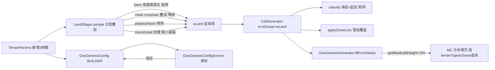

## 用户需求

用户明确对当前"四省 softmax 混合"类型地形完全不满意，要求基于参考项目（TerraForged/ReTerraForged）重新设计地形，并确认三项关键决策：

1. 地形核心算法采用**分层叠加范式**（对标 TerraForged：大陆基底 + 山脉叠加层 + 高原/盆地修饰 + 侵蚀），山脉 additive 叠加不被其他省稀释。
2. 噪声**大幅降频**（周期 600-1200 块），消除当前 180-400 块周期导致的高频密纹感。
3. 白色方块是云（地形长到 MC 云高度 Y≈192 穿过山体，是预期 MC 行为），**非 bug、不修**。

同时需一并修复已确诊的两个独立渲染 bug（否则重构后地形仍残缺）：

- **刀切平顶**：`GeoGenesisGenerator` 未覆写 `getMaxBuildHeight()`，MC 默认 256 截断山体（WORLD_MAX_Y=320 但实际被截）。
- **山体全 dirt**：`fillTerrainColumn` 陆地分支无脑 GRASS+DIRT，忽略 `cell.isSnow`/`cell.terrainType`。

## 核心特性

- **分层叠加地形模型**：`eLand = base(省基面混合) + mask·mountain(叠加) + plateau(平顶修饰) + basin(凹盆修饰) + microDetail(纹理)`，山脉成真尖峰、高原成平顶、盆地成凹盆。
- **山脉叠加层**：`mask · (beltPeak - beltFoothill) · pow(|r|, beltSharpness)`，配合 domain warp 蜿蜒；`mask` 为低频团块噪声限定山脉带状/团块分布（真实感关键），山脉不再被平原/盆地权重稀释。
- **大幅降频**：基底/省省场 600-1200 块、山脉主体 350-600 块、warp 800 块、细节 400+ 块（振幅<0.03 纹理级）。
- **零交叉否决保持**：山脉用 `pow(|r|,k)`（峰在 |r|=1、谷在 r=0），绝不用 `1-|2n-1|` 零交叉脊函数。
- **Y 截断修复**：覆写 `getMaxBuildHeight()=320`，山体可完整长到世界顶。
- **方块多样化**：`fillTerrainColumn` 按 (terrainType, isSnow) 选 GRASS/SNOW_BLOCK/STONE/PACKED_ICE。
- **契约不变**：`CellGenerator.sample` 仍 `e = eOcean + eLand`，`classify`/`applySnowLine`/`HeightCurve`/`BiomeClassifier` 全不动。

## 技术栈

- 语言：Java 17（Forge 1.20.1 / Minecraft 1.20.1）
- 地形引擎：纯 Java 零 MC 依赖（`LandShape` / `CellGenerator` / `TerrainParams` / `Cell`）
- 配置：`ForgeConfigSpec`（COMMON + `run/config/geogenesis-common.toml`）
- 配置 UI：Minecraft `Screen` + 既有 `ParamSlider`（复用，不新建框架）
- 验证：`gradlew compileJava` + `runDiag`（陆地比） + `runPreview`（地形类型图层）

## 实现思路

把"四省完整形态 softmax 混合"（`eLand = Σ wᵢ·provEᵢ`，山脉被稀释、高原被拉扯、细节错位叠加）重构为**分层叠加**：

```
// 1. 基底（省权重混合"基面"，非完整形态；低频）
base = wC·baseCraton + wB·beltFoothill + wP·lerp(platBase,platTop,platShape) + wBa·basinBase

// 2. 山脉叠加层（mask 限定区域 + pow(|r|,k) 峰在极值 + warp 蜿蜒，additive 不被稀释）
mask   = saturate((maskNoise.compute(wx,wz) + 1) * 0.5)        // 低频团块 0..1，scale=mountainMaskScale
r      = 零中心 FBM(beltLow/Mid/High @ 降频)                   // 峰在 |r|=1
mountain = mask · (beltPeak - beltFoothill) · pow(|r|, beltSharpness)

// 3. 高原平顶修饰（仅 plateau 权重高时把基面抬到 platTop 封顶）
plateau = wP · (platTop - basePlat) · platShape

// 4. 盆地凹盆修饰
basin   = wBa · (plainBase + 0.08 - basinBase) · basinShape   // 下凹

// 5. 表面纹理（极小振幅、大周期）
detail  = microDetailAmp · microDetailNoise.compute(wx,wz)     // 振幅<0.03

eLand = clamp(base + mountain + plateau + basin + detail, 0, 1)
```

**关键设计决策**

- **山脉 additive 叠加**而非混合：峰 = foothill + (beltPeak-foothill) = beltPeak（复用现有 `beltPeak`/`beltFoothill`，不新增 mountainAmp 参数）。
- **mountainMask 低频团块**（`1/mountainMaskScale` 默认 2200）：山脉成带状/团块分布，是真实感关键（TerraForged 同范式）。
- **零交叉否决保持**：`pow(|r|,k)` 峰在 |r|=1、谷在 r=0；warp 产生蜿蜒，绝不用 `1-|2n-1|`。
- **大幅降频**：LandShape 构造器硬编码频率整体放大——beltLow 1/400→1/600、beltMid/High 1/180→1/400、warp 1/500→1/800、platLow 1/350→1/600、platMid 1/150→1/400、basinField 1/400→1/600、cratonNoise 1/300→1/500、cratonDetail/beltDetail/platDetail/basinDetail 1/220→1/400+；新增 maskNoise(1/2200) + microDetail(1/450, 振幅 0.025)。
- **新增参数仅 3 个**（复用 beltPeak/beltFoothill/beltSharpness/beltWarpAmp/provMixSharpness）：`mountainMaskScale`(2200)、`microDetailScale`(450)、`microDetailAmp`(0.025)。

## 实现备注

- **性能**：每格约 22 次噪声（新增 mask+microDetail 2 次、warp 2 次），仍 O(1)/格，产线复杂度不变。新噪声节点必须在 `seed()` 显式播种（参照现有 platLow 不在 root 内须显式播种，避免 NPE 卡死）。
- **回归控制**：`OCEAN/DEEP_OCEAN/BEACH` 前置与 `e<0` 判洋逻辑不动；海岸线仍由 `e` 自然过零涌现；`eLand` 连续 + 省权重连续 → 类型平滑过渡、无硬边、无 tile 接缝；`height` 映射与方块填充链路不变；`classify`/`applySnowLine`/`BiomeClassifier` 不动。
- **Y 截断修复**：`GeoGenesisGenerator` 新增 `@Override getMaxBuildHeight()` 返回 `WORLD_MAX_Y`(320)；`mountainCap` 字段仅作图例顶，不改语义。
- **方块多样化**：`fillTerrainColumn` 陆地分支改为按 `(terrainType, isSnow)` 选顶层块——MOUNTAINS+isSnow→STONE、PEAK+isSnow→SNOW_BLOCK、MOUNTAINS/PEAK 无雪→STONE、HILLS/PLAIN/BASIN→GRASS、SNOW→SNOW_BLOCK；填充仍 DIRT。
- **配置同步铁律（六处）**：`GeoGenesisConfig`(BUILDER+defaultParams+buildParams) + `TerrainParams`(record+defaults) + `geogenesis-common.toml` + `GeoGenesisConfigScreen.buildParams` + `GeoGenesisGenerator` 接线 + 预览 `defaultParams()`；改默认须同步已存在 toml。
- **日志**：不改日志；标定阶段可临时在 `classify` 打各 `TerrainClass` 占比直方图，确认后删除。

## 架构设计



## 目录结构与修改清单

```
forge-1.20.1-47.4.10-mdk/
├── src/main/java/com/geogenesis/worldgen/terrain/LandShape.java        # [MODIFY] sample 改分层叠加：base+mask·mountain+plateau+basin+microDetail；新增 maskNoise/microDetail 噪声节点与 seed()；构造器大幅降频（周期600-1200块）；山脉保持 pow(|r|,k)+warp，mask 限定区域。
├── src/main/java/com/geogenesis/worldgen/terrain/TerrainParams.java    # [MODIFY] record 加 mountainMaskScale()/microDetailScale()/microDetailAmp() 字段 + defaults() 同步默认（2200.0/450.0/0.025）。
├── src/main/java/com/geogenesis/config/GeoGenesisConfig.java           # [MODIFY] "Terrain Shape" 段 BUILDER 加3参数默认；defaultParams()/buildParams() 同步（六处铁律）。
├── run/config/geogenesis-common.toml                                   # [MODIFY] [Terrain Shape] 同步3参数；运行时生效来源。
├── src/main/java/com/geogenesis/worldgen/generator/GeoGenesisGenerator.java  # [MODIFY] 覆写 getMaxBuildHeight()=WORLD_MAX_Y(320) 修 Y 截断；fillTerrainColumn 陆地分支按 (terrainType,isSnow) 选 GRASS/SNOW_BLOCK/STONE/PACKED_ICE。
├── src/main/java/com/geogenesis/client/GeoGenesisConfigScreen.java     # [MODIFY] 地形页加 mountainMaskScale/microDetailScale/microDetailAmp 滑块（复用 ParamSlider），接 buildParams 本地副本实时预览。
└── src/main/java/com/geogenesis/worldgen/terrain/CellGenerator.java    # [复用] 构造器 new LandShape(p) 自动透传新参数，契约 e=eOcean+eLand 不变，无需改逻辑。
```