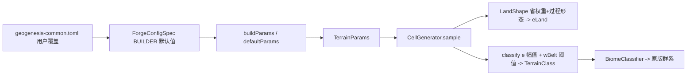

## 用户需求

玩家在游戏中观察到陆地地形类型占比异常：预期应有平原/丘陵/高原/山脉/山峰/雪峰等多种地形，实际看到"都差不多、类型单一"。

## 产品概述

GeoGenesis 程序化地形生成器的陆地形态由"四省（克拉通/造山带/高原/盆地）softmax 权重 × 过程形态"合成连续高度场 `eLand`，再由 `CellGenerator.classify` 按高度/`e` 与省权重判定 `TerrainClass`，最终经 `BiomeClassifier` 映射为原版群系。当前因配置数值标定错误，山脉/峰/雪峰分类分支在数学上不可达，陆地塌缩为平原/丘陵 + 海洋/海滩。

## 核心特性

- 同步配置文件振幅：把 `run/config/geogenesis-common.toml` 的陆地过程振幅同步为已存在于代码 builder 默认值的高值（修正 toml 覆盖 builder 默认导致的旧低振幅生效问题）。
- sharpen 省权重：提高造山带/克拉通权重，让各 terrain 区域更分明、造山带区域能主导出高峰与雪峰。
- 重标定 classify 阈值：将 `e` 与 `wBelt` 判定阈值下调到 softmax 可达区间，使山脉/峰/雪峰按合理稀有度出现（平原多、丘陵次之、山脉/高原少量、雪峰极稀有）。
- 目视验证：用 `runPreview` 地形类型图层与 `runClient` 飞行目检，确认类型分布合理并迭代微调数值。

## 技术栈

- 语言：Java 17（Forge 1.20.1，Minecraft 1.20.1）
- 配置：Forge `ForgeConfigSpec`（COMMON 配置 + `run/config/geogenesis-common.toml` 用户文件覆盖）
- 地形引擎：纯 Java 零 MC 依赖（`CellGenerator`/`LandShape`/`TerrainParams`）
- 验证：`gradlew compileJava` + `runPreview`（独立 Swing 预览，地形类型图层）+ `runClient`

## 实现思路

纯数值重标定（不引入硬边界、不改 classify 架构）。根因有两层：

1. **toml 过期低振幅覆盖 builder 默认值（主因）**：`GeoGenesisConfig` 的 BUILDER 默认值早已把 land 段改为高值（`beltPeak=0.95`、`plateauBase=0.55`、`plateauTop=0.72`、`hillsHigh=0.25`、`beltFoothill=0.15`），意图就是支持高山；但 `run/config/geogenesis-common.toml` 仍是旧低值（`beltPeak=0.6` 等）。Forge 加载时 toml 优先于 builder 默认，运行时实际用旧低振幅 → 山脉生成不了。修复：把 toml 同步为高值。
2. **classify 阈值数学上不可达（次因）**：四省 softmax 等权时单省权重上限 ≈0.475（分母含其他三省），而原 `classify` 要求 `wBelt>0.5/0.6` 才判 PEAK/SNOW，永远不可达；且凸组合把 `eLand` 上限压到 ≈0.6，原 `e>0.70/0.80/0.90` 也基本不可达 → 山脉/峰/雪峰分支全死。修复：sharpen 省权重（让 belt 区域 `wBelt` 可到 0.3+、`eLand` 推到 0.75–0.85+），并把 classify 阈值下调到可达区间。

关键决策：

- 不重写 classify 为"省权重主导"架构（用户已选纯数值方案）。
- 不接线 `mountainCap`：`e` 已由 `clamp(e,-1,1)` 封顶，`beltPeak=0.95` → `Y≈307 < 320`，不超界。
- 不恢复植被装饰（`applyBiomeDecoration` 空操作维持，属后续项）。

## 实施备注

- **六处同步铁律**：改 land 振幅/省权重须同步 `GeoGenesisConfig`(BUILDER 默认) + `TerrainParams.defaults()` + `geogenesis-common.toml` 三处数值一致；并核对 `GeoGenesisConfigScreen.buildParams` 是否另有独立 `TerrainParams` 构造（若有硬编码须同步，避免预览与游戏漂移）。
- **性能**：仅改数值常量与阈值比较，无新增计算、无额外采样，地形产线复杂度不变（仍为 O(1) 每格）。
- **回归控制**：`classify` 仅调整常量阈值，保持原有 BEACH/OCEAN 判定顺序与兜底 `HILLS` 不变；海平面 `e<0` 判洋逻辑不动，海岸线仍由 `e` 场自然过零涌现（符合 terrain-rebuild §1.4）。
- **日志**：不改日志；若需辅助标定，可在 `classify` 临时打 histogram 统计各 `TerrainClass` 占比，确认后删除（不进最终提交）。

## 架构设计

数值配置单向流入地形引擎，分类链路不变：



修改只发生在配置数值与 `classify` 阈值常量，不改变节点结构与数据流。

## 目录结构与修改清单

```
forge-1.20.1-47.4.10-mdk/
├── run/config/geogenesis-common.toml                       # [MODIFY] "Land Process Parameters" 段同步高振幅；"Province Weights" 段 sharpen 权重。运行时实际生效来源，主修复点。
├── src/main/java/com/geogenesis/config/GeoGenesisConfig.java # [MODIFY] 确认 BUILDER 默认 land 振幅已是高值；将 cratonWeight/beltWeight/plateauWeight 改为 1.5/2.5/1.2（basinWeight 0.8 不变），与 toml 一致。
├── src/main/java/com/geogenesis/worldgen/terrain/TerrainParams.java # [MODIFY] defaults() 中 land 振幅 6 项 + provinceSoftmaxWeights 4 项同步为上述高值，消除与 builder/toml 的漂移副本。
└── src/main/java/com/geogenesis/worldgen/terrain/CellGenerator.java # [MODIFY] classify(...) 内 BASIN/PLAIN/HILLS/PLATEAU/MOUNTAINS/PEAK/SNOW 的 e 与 wBelt 阈值重标定到可达区间（见下）。
```

## 关键代码结构（重标定后的 classify 阈值）

仅调整常量阈值，方法签名与判定顺序不变：

```java
// CellGenerator.classify(...) 陆地段（保持 BEACH/OCEAN 前置判定不变）
if (eLand < 0.06 && wBasin > 0.45) return TerrainClass.BASIN;
if (eLand < 0.12) return TerrainClass.PLAIN;
if (eLand < 0.35) return TerrainClass.HILLS;
if (wPlateau > 0.30 && eLand > 0.45) return TerrainClass.PLATEAU;
if (e > 0.88 && wBelt > 0.32) return TerrainClass.SNOW;
if (e > 0.75 && wBelt > 0.28) return TerrainClass.PEAK;
if (e > 0.55 && wBelt > 0.22) return TerrainClass.MOUNTAINS;
return TerrainClass.HILLS; // 兜底
```

同步的 land 振幅（toml / TerrainParams.defaults() / 确认 GeoGenesisConfig BUILDER）：
`hillsLow=0.10, hillsHigh=0.25, beltFoothill=0.15, beltPeak=0.95, plateauBase=0.55, plateauTop=0.72`（plainBase=0.01、plainRough=0.03、basinBase=0.02 不变）。
省权重：`cratonWeight=1.5, beltWeight=2.5, plateauWeight=1.2, basinWeight=0.8`。